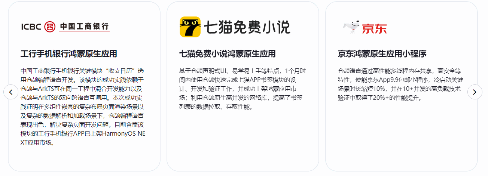
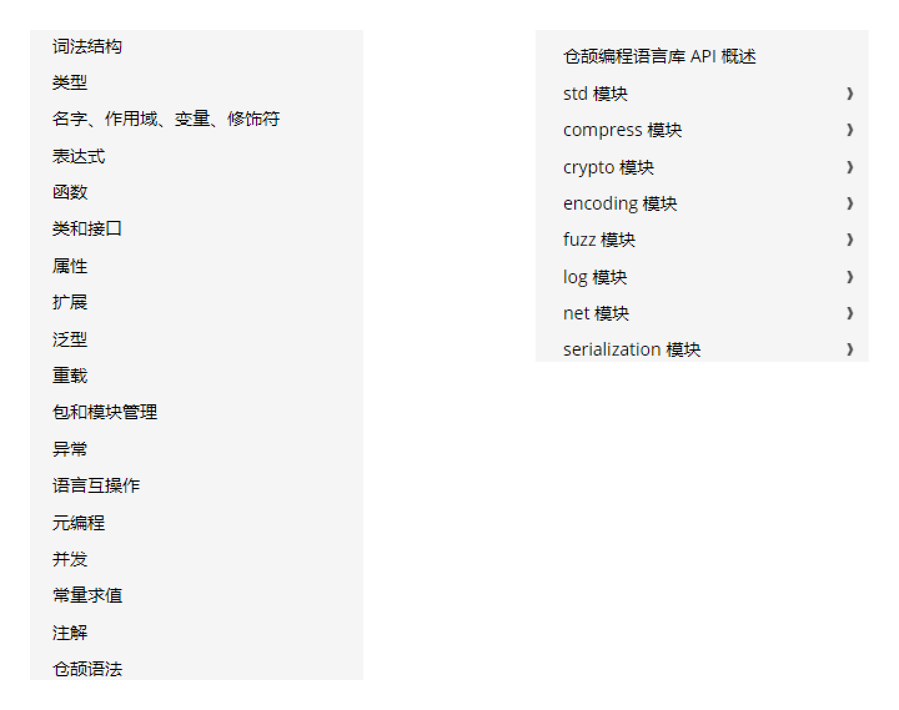

# 01-Cangjie Introduction

## Official Website

[Link](https://cangjie-lang.cn/)

## Cangjie Programming Language: Huawei's Innovation

Cangjie, this name comes from a mythical figure in ancient China, legendary as the creator of Chinese characters. Huawei named its programming language after him with profound meaning—aiming to create a completely new way of programming. The official website of Cangjie programming language provides rich documentation resources, allowing us to glimpse its mysterious nature.

> The gentleman below is Cangjie

## The Story of Cangjie

Cangjie, described in ancient texts as "having a dragon-like appearance with four eyes, born with intelligent virtue." Legend has it that he was the left historian of Emperor Huangdi during the late primitive society of China (at that time, Cangjie served as the left historian while Ju Song served as the right historian). According to historical records: After the rise of Xuanyuan Huangdi, Huangdi's historians Cangjie and Ju Song were inspired by bird and beast footprints, gathered the wisdom of working people, spent decades painstakingly collecting and organizing pictographic character symbols circulated among the people, and promoted their use. Previously, people used knots to record events, but although knots had different sizes and shapes, they became difficult to distinguish clearly over time. Later, Cangjie looked up to observe the winding movements of the Kuixing constellation, looked down at the patterns on turtle shells, the claw marks of birds and beasts, the shapes of mountains and rivers, and the fingerprints on palms, drawing inspiration from these to create pictographic characters based on the shapes of things.

## New Features of Cangjie Language

Cangjie programming language is a modern programming language oriented towards full-scenario application development. With its integration of modern language features, comprehensive compilation optimization and runtime implementation, and convenient IDE toolchain support, it provides developers with a good development experience and excellent program performance.

- **Efficient Programming**: Application development-oriented, reducing difficulty for developers in getting started and during development, supporting multiple development paradigms and programming models. It is a multi-paradigm programming language covering functional, imperative, object-oriented and other paradigms, with many features such as value types, classes and interfaces, generics, type inference to reduce type annotation burden, concise syntax to improve efficiency, syntactic sugar and macros to help develop domain-specific languages and build domain abstractions.

- **Safe and Reliable**: Adheres to the concept of "coding is security," leveraging static type systems and automatic memory management to ensure program type and memory safety, providing runtime checks such as array index bounds and type conversion for timely error correction, along with tools like code scanning, obfuscation, and sanitizers to ensure cross-language interoperability and code asset security.

- **Easy Concurrency**: Implements lightweight user-space threads and concurrent object libraries for more efficient concurrency. Under its user-space thread model, threads are lightweight and share memory, used in the same way as traditional system threads, with runtime managing threads more efficiently and using fewer resources. Concurrent object libraries avoid data races, with core libraries having lock-free or fine-grained lock algorithms to reduce thread blocking and improve concurrency.

- **Excellent Performance**: Cangjie compiler and runtime full-stack optimization compilation, with high-level optimization based on CHIR in the frontend, various optimizations in the backend, and lightweight locks and other optimizations in the runtime, fully utilizing processor performance. Runtime native lightweight design, modular layering and defining common object models and basic components, reducing redundancy, loading packages on demand to reduce application startup memory overhead, friendly to resource-sensitive devices.

## Application Scenarios for Cangjie

1. HarmonyOS Application Scenarios: Supports using Cangjie language when developing HarmonyOS applications
2. Server/Cloud Scenarios: Supports developing backend applications

## Success Stories

## Cangjie Language Development

1. August 2019: Released and open-sourced the Ark Compiler. In the same year, initiated the development project for an autonomous programming language
2. February 2021: Huawei registered the **Cangjie Language** trademark
3. First half of 2024: Cangjie language was launched
4. November 11, 2024: Cangjie public beta version is now available for download

## Quick Experience

Currently, the official website provides an online experience portal, allowing learners to quickly learn and get started with [Cangjie programming language](https://cangjie-lang.cn/playground) at minimal cost.

## API Syntax Overview

## Future Prospects

Although Huawei's Cangjie programming language is still in the development stage, it has already shown tremendous potential. With Huawei's continued investment in technology research and development and the continuous improvement of its ecosystem, Cangjie programming language is expected to play an increasingly important role in the future technology field. It may attract more developers to join, forming a vibrant technical community that jointly promotes technological innovation and application expansion. Perhaps in the near future, we will see various excellent software and systems developed based on Cangjie programming language, changing our ways of life and work.

In summary, Huawei's Cangjie programming language is an emerging programming language worthy of our attention and learning. It has unique characteristics and advantages, with broad application prospects in multiple fields. Let's look forward to it creating more exciting possibilities in the future!

## Next Steps

We will subsequently publish articles introducing how to set up the development environment.
