# 02-Cangjie Development Environment Setup

This chapter mainly introduces how to set up a development environment for running Cangjie.

We can divide the development environment for running Cangjie language into 3 types:

1. Online execution provided by the official Cangjie website, the lowest-cost way to experience and run Cangjie programs.
2. Download and install Cangjie SDK, use VSCode to install Cangjie syntax highlighting plugin, develop Cangjie programs
3. Install Cangjie plugin in **DevEco Studio**, develop Cangjie programs

## Cangjie Language Online Experience

Open [https://cangjie-lang.cn/](https://cangjie-lang.cn/), click **Online Experience**


---

---

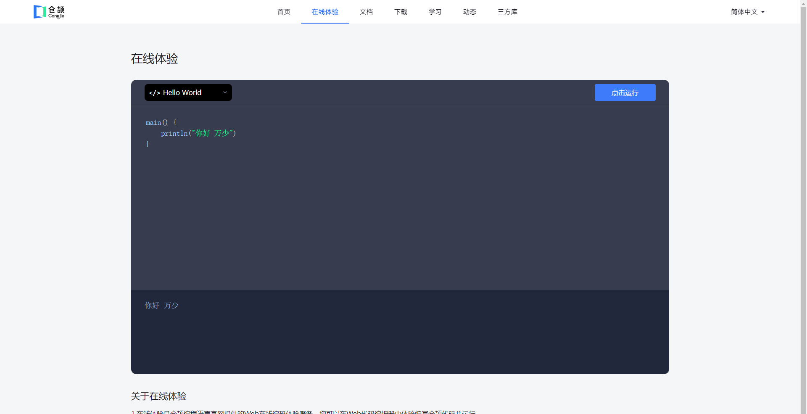

## Install Cangjie Plugin in VSCode

### Download and Install VSCode

First, we need to download the VSCode editing tool. Visual Studio Code (abbreviated as "VS Code") was officially announced by Microsoft at the Build developer conference on April 30, 2015. It is a cross-platform source code editor running on Mac OS X, Windows, and Linux, designed for writing modern Web and cloud applications.

[Download Link](https://code.visualstudio.com/)

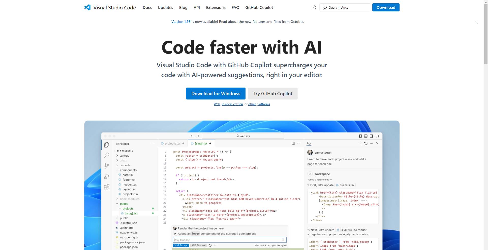

After successful installation, this is what it looks like when opened.

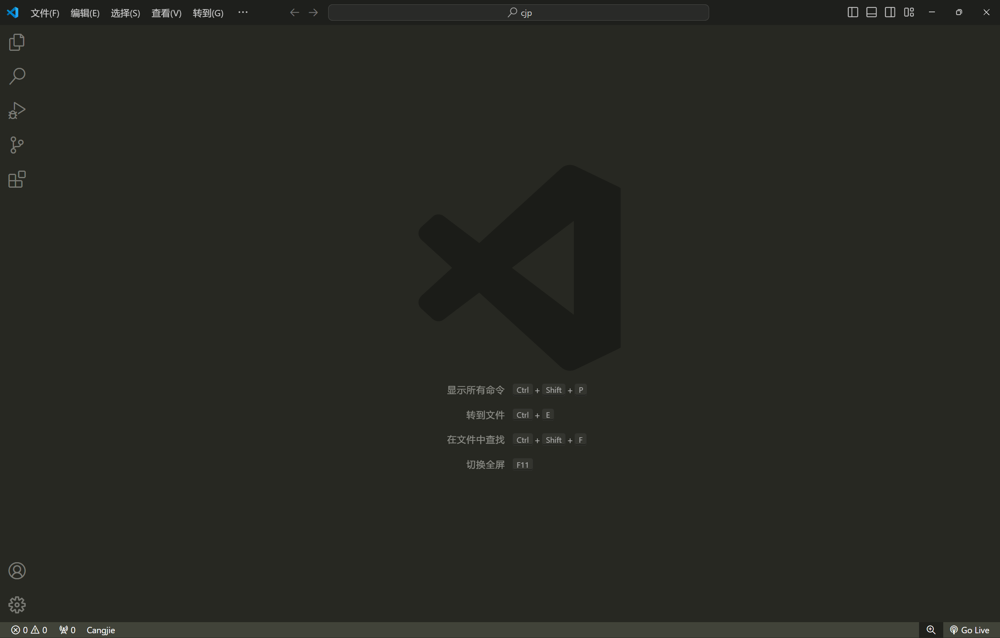

### Download and Install Cangjie Plugin

[Download Link](https://cangjie-lang.cn/download)

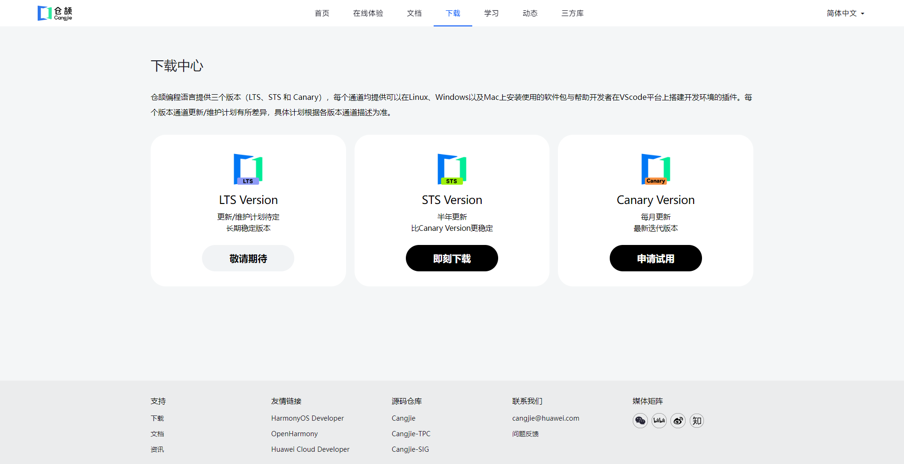

It's recommended to download the stable version to avoid some pitfalls.

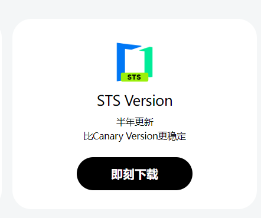

There are two items to download:

1. SDK
2. VSCode plugin

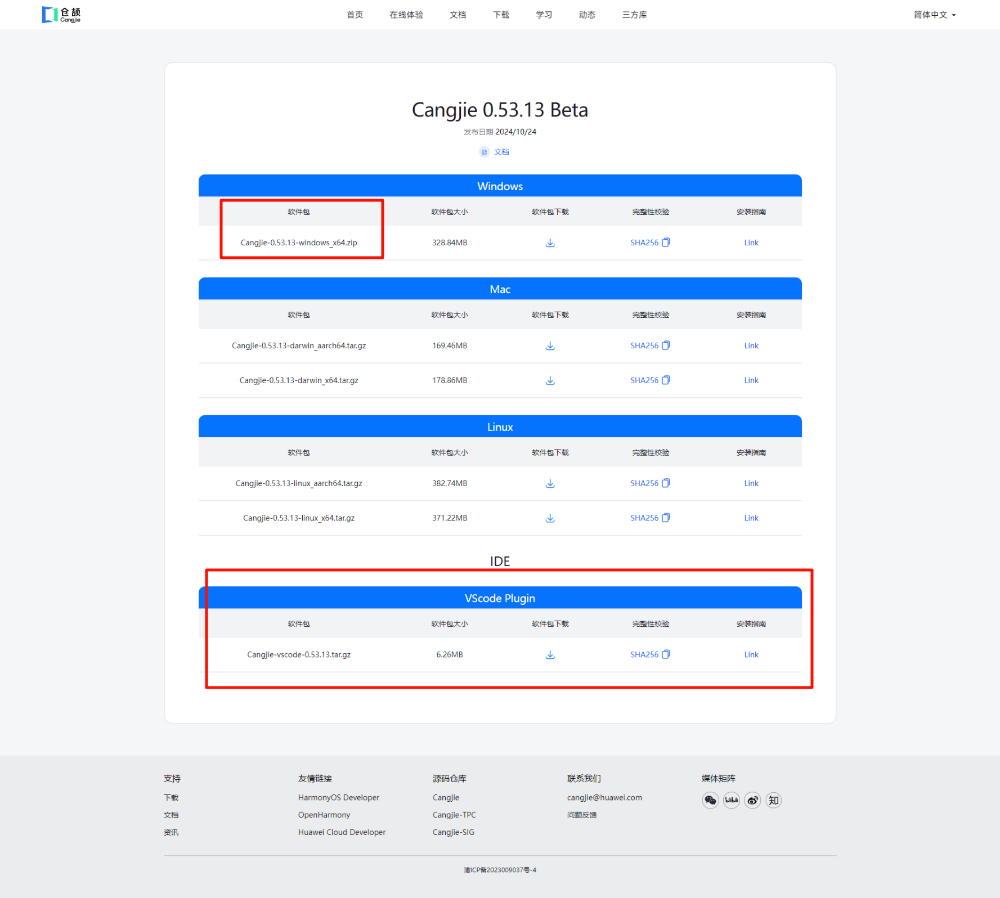

### Install Cangjie SDK

After downloading the Cangjie SDK, double-click to install it directly.

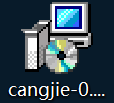

Open your terminal and enter the command to check if the Cangjie SDK is installed successfully:

```
cjc -v
```

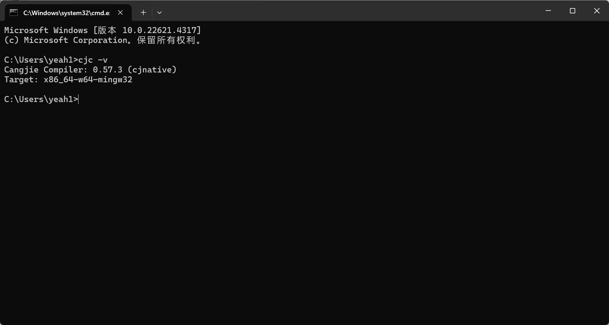

### Install VSCode Cangjie Plugin

This plugin is used to make VSCode recognize Cangjie syntax and run Cangjie programs.

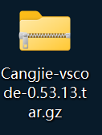

Extract it to get the following program.

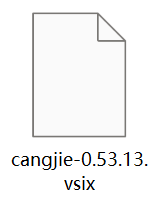

---

Install offline plugin in VSCode

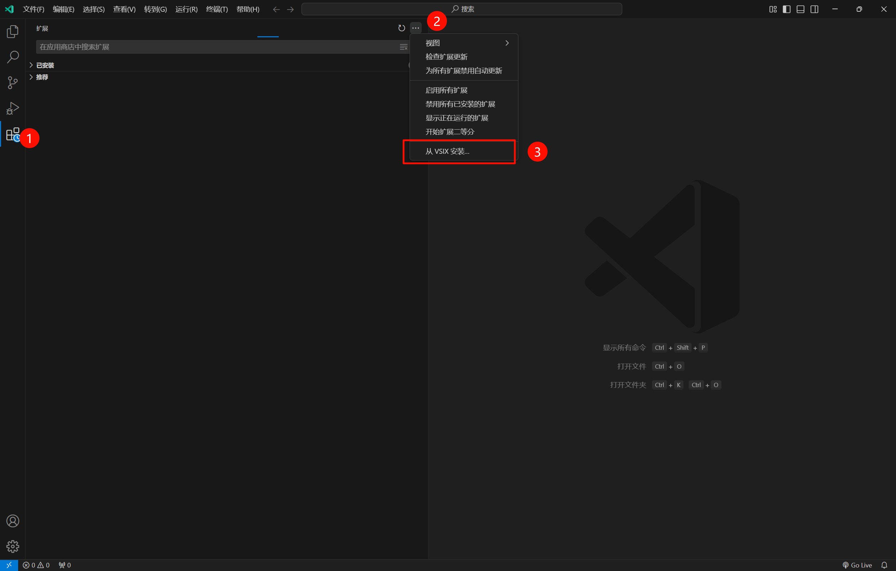

Installation successful

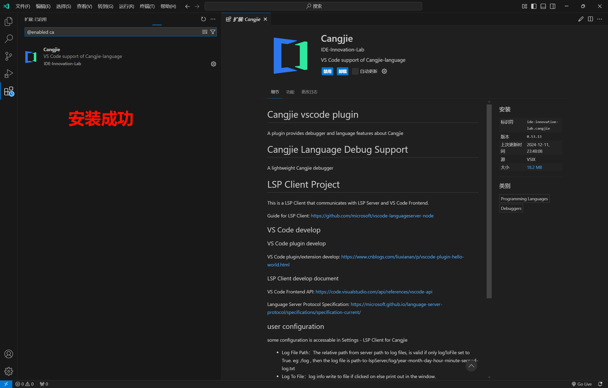

At this point, you need to configure Cangjie SDK in VSCode, otherwise you won't be able to run Cangjie programs directly later.

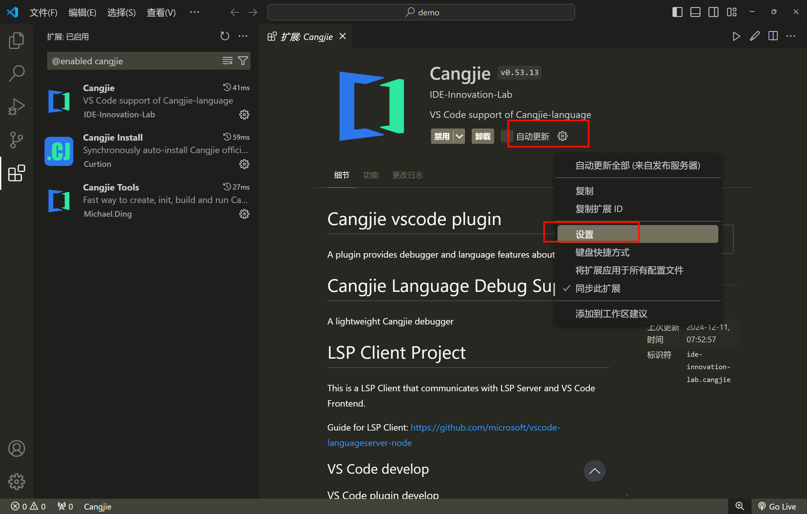

---

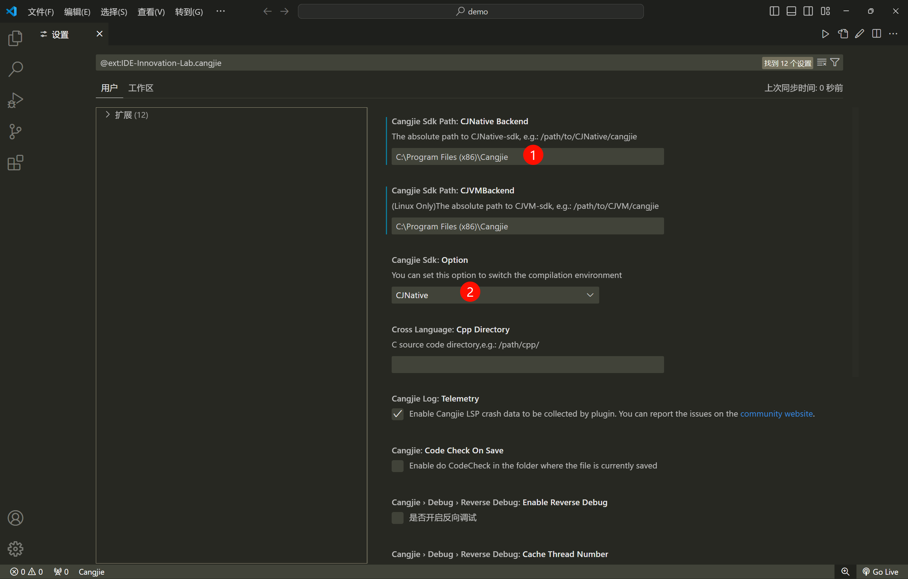

So far, our VSCode development environment is all set up.

## Install Cangjie Plugin in **DevEco Studio** to Develop Cangjie Programs

If you want to install the Cangjie plugin in **DevEco Studio** to develop Cangjie programs, you need to apply first. [Application Link](https://developer.huawei.com/consumer/cn/activityDetail/cangjie-beta/)

After approval, an email will be sent to your mailbox. Follow the email instructions. Since this process is confidential, the specific steps won't be demonstrated.

After successful installation, the Cangjie plugin option will be displayed in **DevEco Studio**.

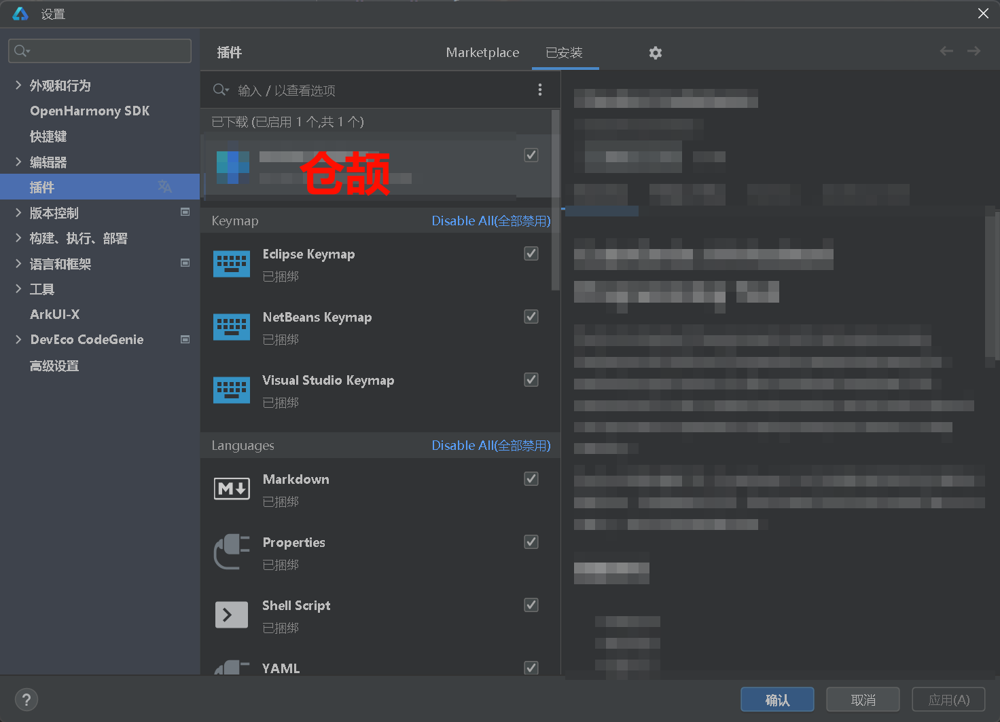

## Our First Cangjie Program

Next, let's use VSCode to develop our first Cangjie program!

1. Create a new Cangjie file with the extension **.cj**

   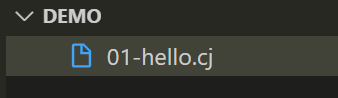

2. Enter basic code

   ```c
   main() {
       println("Hello World")
   }
   ```

3. Compile the Cangjie program

   Open the terminal and enter the following command

   > cjc represents using the built-in command of the installed SDK to compile Cangjie programs
   >
   > .\01-hello.cj is the file to be compiled
   >
   > -o hello.exe means the compiled content is generated to hello.exe

   ```js
    cjc .\01-hello.cj  -o hello.exe
   ```

   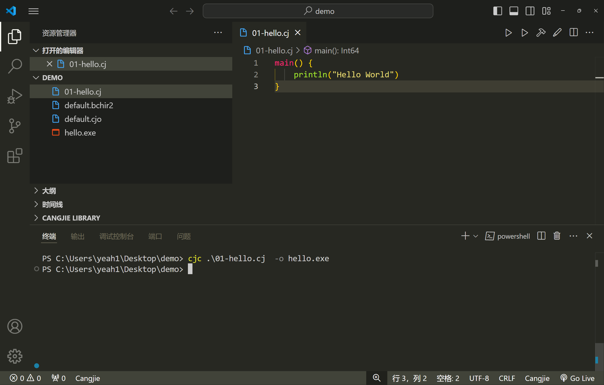

4. Run the Cangjie program. At this point, enter the command in the terminal to run our Cangjie program:

   ```
    .\hello.exe
   ```

   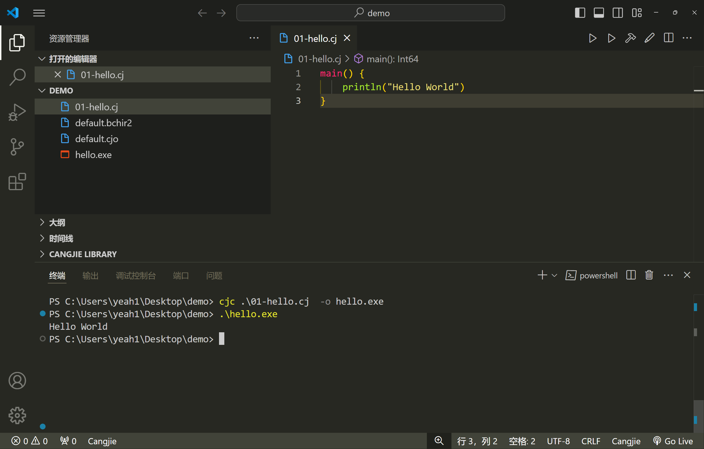

5. You can also directly use VSCode's built-in run function for one-click compilation and execution

   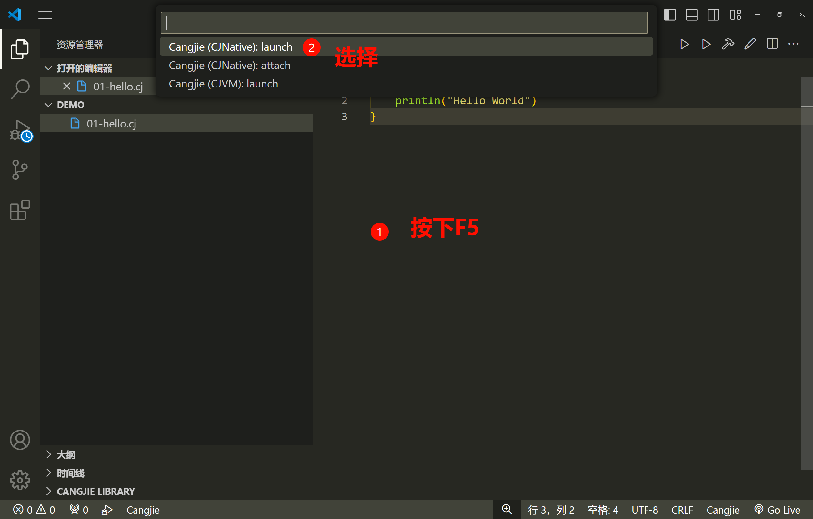

---

​ Build and debug single file

​ 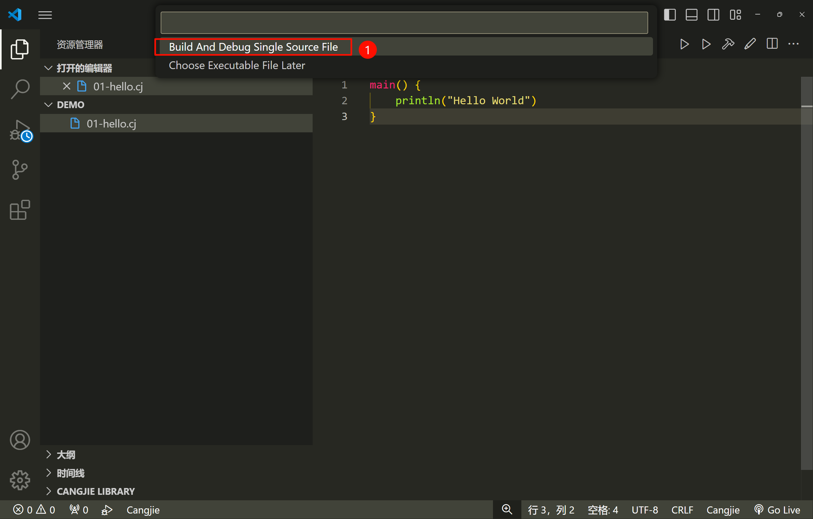

---

Run successfully

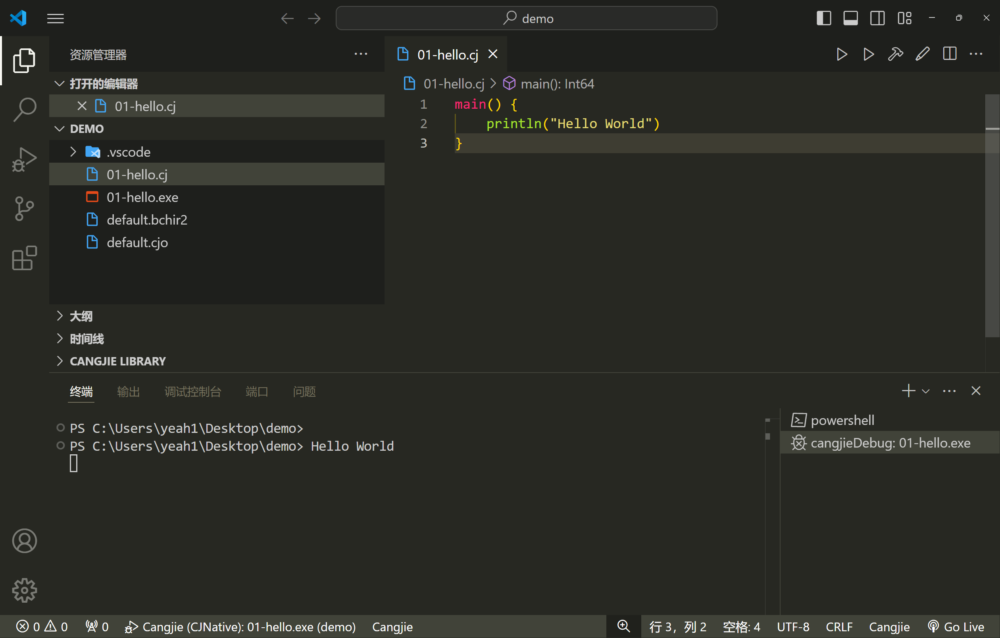

## Summary

The above are our 3 ways to set up the Cangjie development environment. The next chapter will start introducing basic syntax. Stay tuned.
