# 03-Quick Creation of Cangjie Projects

## Introduction

Cangjie projects have their own directory structure and file naming restrictions. If they are not created according to specifications, syntax highlighting and other plugins will be ineffective during development. Compilation and packaging may also fail.

## Creating Cangjie Projects

The Cangjie plugin previously installed on VSCode has built-in functionality for quickly creating Cangjie projects. There are two ways to create them:

### Visual Method

> In VSCode, press F1 or Ctrl + Shift + P (Command + Shift + P on Mac) to open the command palette, then follow these steps to create a Cangjie project:

1. Enter the keyword **Create Cangjie ..** to find the menu for creating new projects

   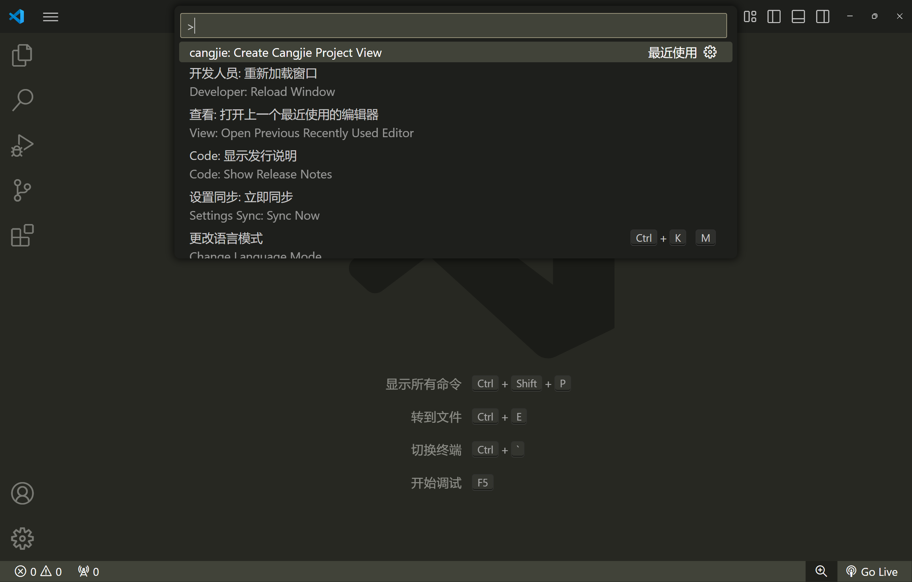

2. Enter project information

   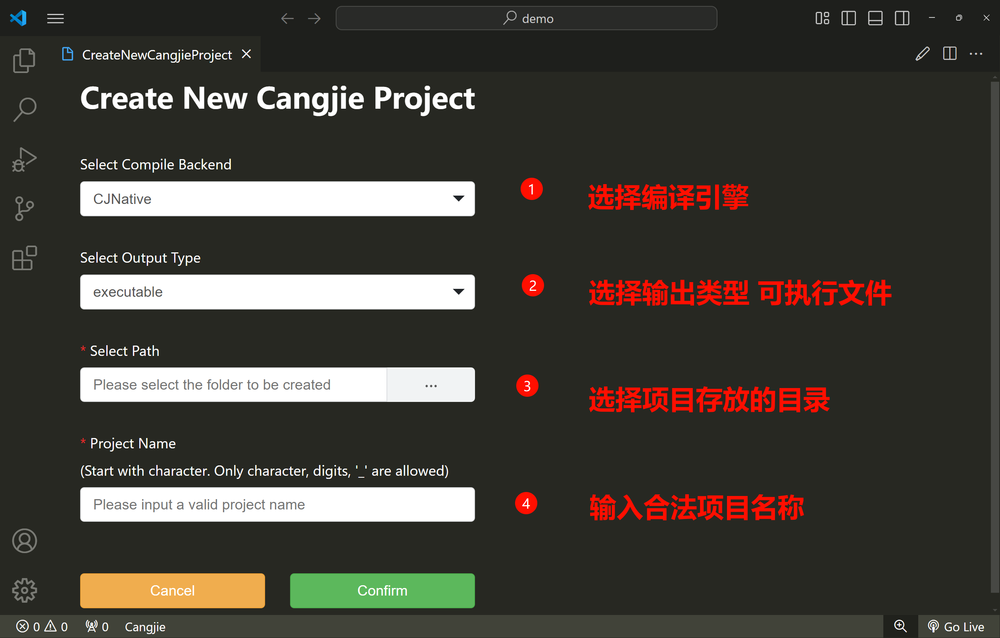

3. Successfully created

   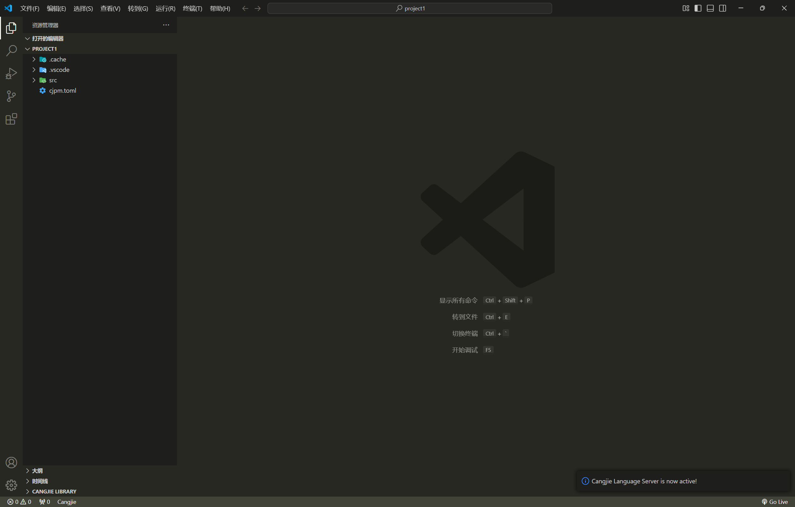

### VSCode Terminal Command

> In VSCode, press F1 or Ctrl + Shift + P (Command + Shift + P on Mac) to open the command palette, then follow these steps to create a Cangjie project:

1. Select the create project command **cangjie:Create Cangjie Project** _without Project View_

   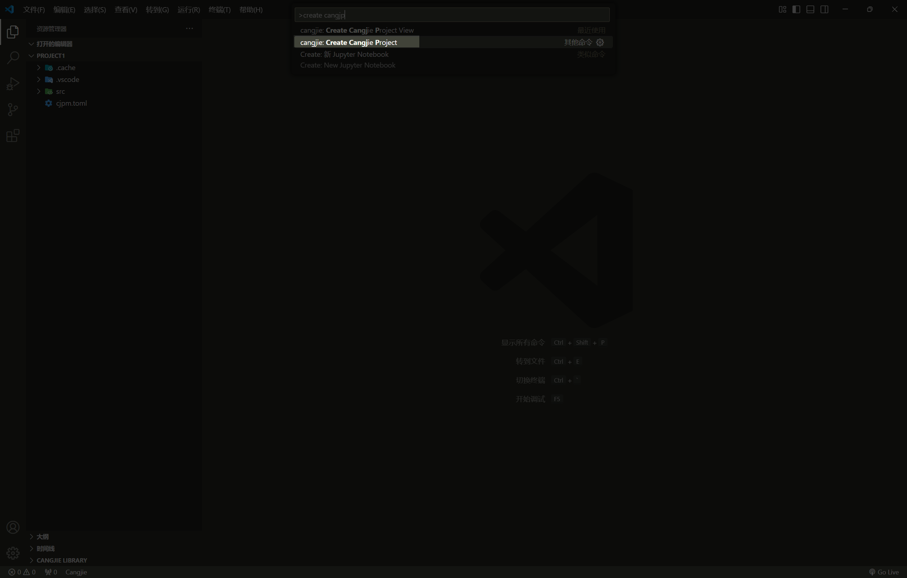

2. Select compilation engine

   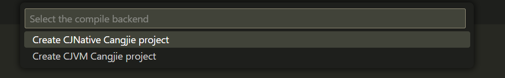

3. Select output type

   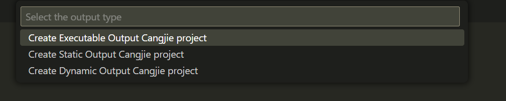

4. Select directory to store the project

   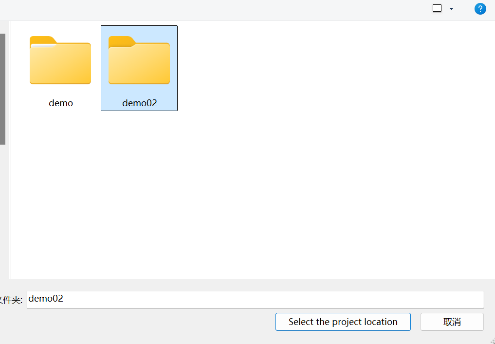

5. Enter project name

   

6. Successfully created

   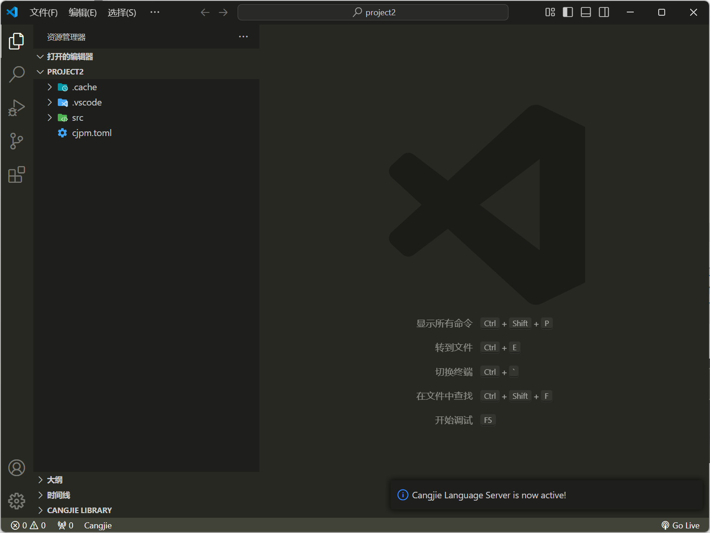

## Project Directory Introduction

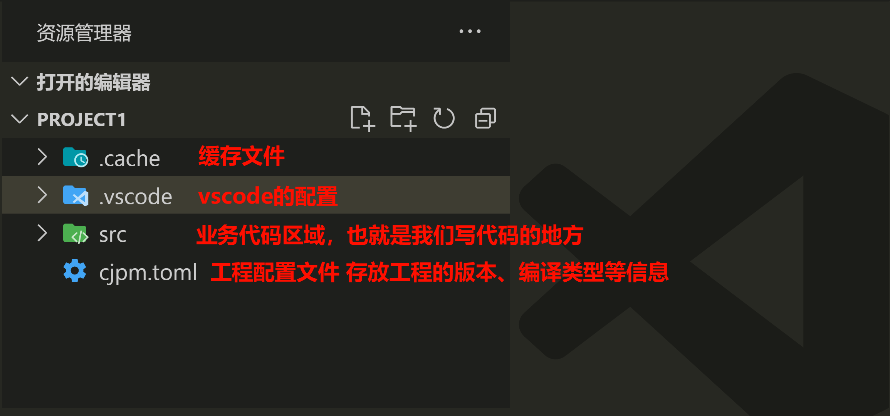

1. **.cache** - Automatically generated cache files
2. **.vscode** - Automatically generated editor settings files, only effective in the workspace
3. **src** - Business code area where we write code to import Cangjie's built-in libraries and get code suggestions
4. **cjpm.toml** - Project configuration file that records and sets project-related information

## Code Suggestions

Writing code in a legitimate project enables corresponding code suggestions:

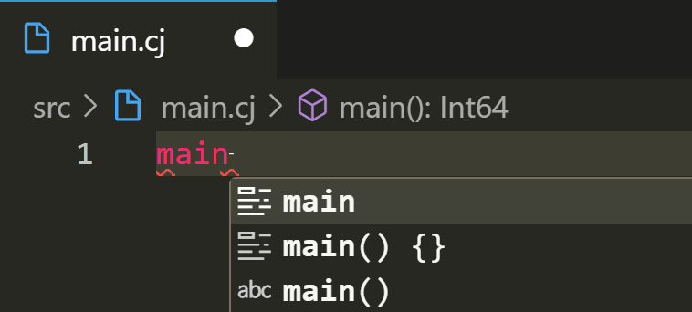

## Compiling Projects

Quick project compilation:

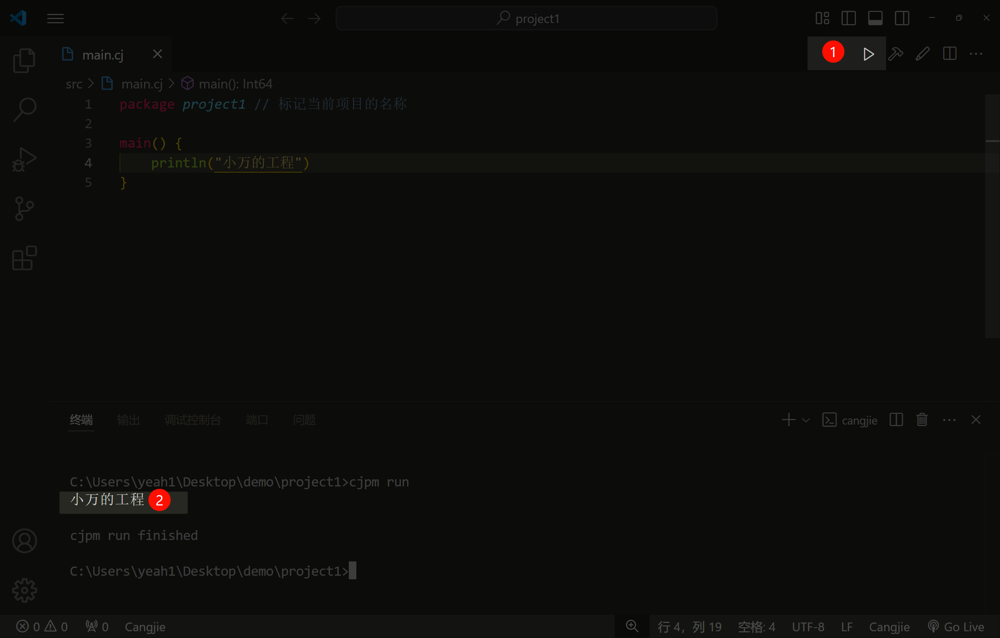

## Summary

Cangjie development components have well-integrated functionality for creating and running projects. By following standard specifications, we can smoothly begin our first step in programming!
