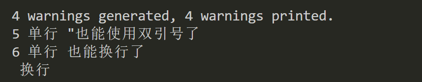
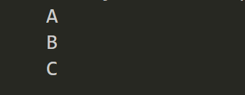
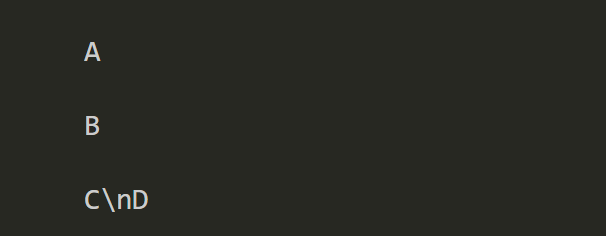
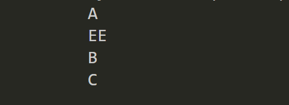

# 12-String Type

The string type is represented by `String` and is used to express complete text data. It is essentially composed of a series of Unicode characters.

String literals in Cangjie are divided into three categories: single-line string literals, multi-line string literals, and multi-line raw string literals.

## String Literals

### Single-line String Literals

Single-line string literals mean that the defined string is **single-line**. Both single quotes and double quotes can be used, and the content also supports **escape characters**.

```javascript
package pro

main() {
    //   single-line 
    let str1 = "1 single-line" // double quotes
    let str2 = '2 single-line' // single quotes

    // single quotes can contain double quotes 
    let str3 = '3 single-line and "double-line"'
    // vice versa
    let str4 = "4 single-line and 'double-line'"

    // using escape characters
    let str5 = "5 single-line \"can now use double quotes \n"
    print(str5)
    let str6 = "6 single-line can now line break \n line break "
    print(str6)
}

```




### Multi-line String Literals

Multi-line string literals can support multi-line display, which is the biggest difference between them and single-line string literals.

There are two forms:

1. Three single quotes  

   ```
   '''
   content
   '''
   ```

2. Three double quotes

   ```
   """
   content
   """
   ```

   


**Example code**

```javascript
    let str7 = """
    A 
    B 
    C
"""
    print(str7)
```



### Multi-line Raw String Literals

The characteristic of multi-line raw string literals is that the content inside will be output as is, including escape characters.

It is defined by starting with one or more # followed by a single quote or a double quote. For example:

```javascript
#'abc'#
#"
a
b
c
"#

######'a\nb'######
```

Example:

```javascript
    // multi-line raw
    let str8 = #'
    A

    B

    C\nD
    '#
    print(str8)
```



## String Interpolation

String interpolation allows us to insert content we want into single-line and multi-line strings, helping us process strings.

```
'a ${variable} bc'

'a ${"hello"} bc'
```

Example:

```javascript
        // multi-line
        let str7 = """
        A 
        ${'EE'}
        B 
        C
    """
        print(str7)
```



## Operations Supported by String Type

The string type supports comparison using relational operators and concatenation using `+`. The following example demonstrates string equality checking and concatenation:

```javascript
main() {
    let s1 = "abc"
    var s2 = "ABC"
    let r1 = s1 == s2
    println("The result of 'abc' == 'ABC' is: ${r1}")
    let r2 = s1 + s2
    println("The result of 'abc' + 'ABC' is: ${r2}")
}
```

Compiling and executing the above code, the output is:

```javascript
The result of 'abc' == 'ABC' is: false
The result of 'abc' + 'ABC' is: abcABC
```

Strings also support other common operations, such as splitting, replacing, etc.


## Common Escape Characters 

| Escape Character | Meaning                                                      | ASCII Code Value (Decimal) |
| -------- | ------------------------------------------------------------ | ------------------- |
| \a       | Bell (BEL)                                                    | 007                 |
| \b       | Backspace (BS), moves the current position to the previous column | 008                 |
| \f       | Form feed (FF), moves the current position to the beginning of the next page | 012                 |
| \n       | Line feed (LF), moves the current position to the beginning of the next line | 010                 |
| \r       | [Carriage return](https://baike.baidu.com/item/回车/459029?fromModule=lemma_inlink) (CR), moves the current position to the beginning of the current line | 013                 |
| \t       | Horizontal tab (HT) (jumps to the next TAB position)          | 009                 |
| \v       | Vertical tab (VT)                                             | 011                 |
| \\       | Represents a backslash character "\"                          | 092                 |
| \'       | Represents a single quote character                           | 039                 |
| \"       | Represents a double quote character                           | 034                 |
| \?       | Represents a question mark                                    | 063                 |
| \0       | Null character (NUL)                                          | 000                 |
| \ddd     | Any character represented by 1 to 3 [octal](https://baike.baidu.com/item/八进制/4230825?fromModule=lemma_inlink) digits | Three octal digits   |
| \xhh     | Any character represented by [hexadecimal](https://baike.baidu.com/item/十六进制/4162457?fromModule=lemma_inlink) | Hexadecimal         |