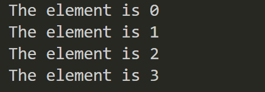

# 16-Range Type

The range type is used to represent sequences with fixed step sizes. Its purpose is to make it convenient for developers to obtain content within a specific range. Its usage includes three values:

1. start represents the beginning
2. end represents the ending
3. step represents the step size

For example:

```javascript
0..4=1  // 0, 1, 2, 3, 4
```

1. 0 represents the start
2. 4 represents the end
3. 1 represents the step size

So the result represents `0, 1, 2, 3, 4`

There are two forms of range type literals:

1. Half-open range (inclusive start, exclusive end)
2. Closed range (inclusive start, inclusive end)

Here, **inclusive** means included, and **exclusive** means not included.


## Half-open Range

```javascript
let range1 = 0..4 : 1  // range1 = 0, 1, 2, 3
```

It's important to note that range types are not arrays, they cannot be accessed directly, nor can they be accessed directly through indices.

```javascript
    let range1 = 0..4 : 1 // range1 = 0, 1, 2, 3
    println(range1) // expected 'Struct-String', found 'Struct-Range<Int64>'
```

---

```javascript
    let range1 = 0..4 : 1 // range1 = 0, 1, 2, 3

    println(range1[0]) // you may want to implement 'operator func [](index0: Int64)' for type 'Struct-Range<Int64>'
```

**At this point, we can access the elements in the range through iteration**

```javascript
    let range1 = 0..4 : 1 // range1 = 0, 1, 2, 3
    for (i in range1) {
        println("The element is ${i}")
    }
```



## Closed Range

```javascript
let range1 = 0..4 = 1  // range1 = 0, 1, 2, 3, 4
```


## Summary

1. Half-open range `0..4 : 1`   **0, 1, 2, 3**

2. Closed range `0..4 = 1`   **0, 1, 2, 3, 4**