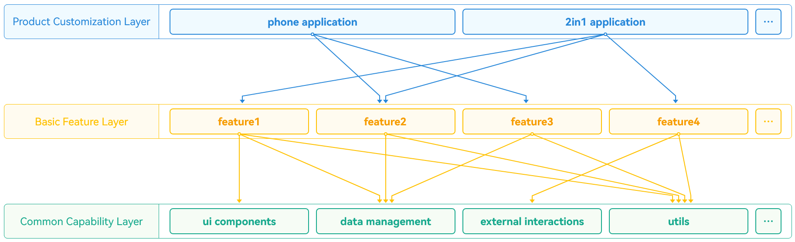

# Layered Architecture Design - Application Architecture

HarmonyOS application layered architecture design is based on a single code project that supports Huawei phones, PC/2-in-1, and other 1+8 full-scenario devices, implementing the "[develop once, deploy anywhere](https://developer.huawei.com/consumer/cn/doc/harmonyos-guides/foreword)" development philosophy.

HarmonyOS application layered architecture includes the product customization layer, basic feature layer, and common capability layer, building a clear, efficient, and scalable design architecture.

This article introduces the application layered architecture design rules from the [logical model](https://developer.huawei.com/consumer/cn/doc/best-practices/bpta-layered-architecture-design#section2075132511213), [development model](https://developer.huawei.com/consumer/cn/doc/best-practices/bpta-layered-architecture-design#section1191910571522), and [deployment model](https://developer.huawei.com/consumer/cn/doc/best-practices/bpta-layered-architecture-design#section1117721715317) perspectives.

## Logical Model

**Figure 1** Layered Architecture Logical Model  

- **Product Customization Layer**

  The product customization layer focuses on meeting personalized needs for different devices or usage scenarios, including UI design, resources and configurations, as well as specific scenario interaction logic and functional features.

  Functional modules in the product customization layer operate independently, relying on the basic feature layer and common capability layer to implement specific functions.

  As the application entry point, the product customization layer is the interface users directly interact with. To meet specific requirements, the product customization layer can be flexibly adjusted and extended to adapt to various usage scenarios.

- **Basic Feature Layer**

  The basic feature layer sits above the common capability layer and stores relatively independent functional UI and business logic implementations. Each functional module has high cohesion, low coupling, and customizable characteristics, supporting flexible product deployment.

  The basic feature layer provides robust and rich basic function support for the product customization layer, including UI components and basic services. The common capability layer provides general functions and services for it.

  To enhance system scalability and maintainability, the basic feature layer modularizes functions. For example, each option in the application's bottom navigation bar is an independent business module.

- **Common Capability Layer**

  The common capability layer stores common basic capabilities, including shared functions such as common UI components, data management, external interaction, and utility libraries. Applications can call these common capabilities.

  The common capability layer provides stable and reliable functional support, ensuring application stability and maintainability.

  The common capability layer includes the following components:

  - Common UI Components: Common UI components are designed to be universal and highly reusable, ensuring consistent user experience across different application modules. These components provide standardized, user-friendly interfaces that help developers quickly implement common user interaction needs such as prompts, warnings, and loading status displays, thereby improving development efficiency and user satisfaction.
  - Data Management: Responsible for data storage and access in applications, including application data, system data, etc., providing a unified data management interface to simplify data read and write operations. This centralized data management approach not only makes data maintenance simpler but also ensures data consistency and security.
  - External Interaction: External interaction handles application interaction with external systems, including network requests, file I/O, device I/O, etc., providing unified external interfaces to simplify application interaction with external systems. Developers can conveniently implement network communication, data storage, and hardware access, thereby accelerating the development process and ensuring program stability and performance.
  - Utility Libraries: Utility libraries provide a series of commonly used utility functions and classes, such as string processing, date and time processing, encryption and decryption, data compression and decompression, etc., helping developers improve efficiency and code quality.

## Development Model

**Figure 2** Layered Architecture Development Model  

- **Product Customization Layer**

  Various subdirectories in the product customization layer are compiled into an [Entry-type HAP](https://developer.huawei.com/consumer/cn/doc/harmonyos-guides/hap-package), serving as the main application entry. This layer targets multiple devices, integrating corresponding functions and features. The product customization layer is divided into multiple functional modules, each designed for specific devices or usage scenarios, with customized development of functions and interactions according to product requirements.

  Note

  - In the product customization layer, developers can select one compilation to generate [the same or different HAPs (or their combinations)](https://developer.huawei.com/consumer/cn/doc/harmonyos-guides/introduction#%E9%83%A8%E7%BD%B2%E6%A8%A1%E5%9E%8B) from the two dimensions of application UX design and functionality corresponding to different devices, combined with specific business scenarios.
  - By using the customization function of [customized multi-target build products](https://developer.huawei.com/consumer/cn/doc/harmonyos-guides/ide-customized-multi-targets-and-products-guides), HAPs corresponding to applications can be compiled into respective .app files for distribution to app markets.

- **Basic Feature Layer**

  In the basic feature layer, functional modules are divided into two categories according to deployment requirements. For functions that need to be carried by Ability, they can be designed as [Feature-type HAPs](https://developer.huawei.com/consumer/cn/doc/harmonyos-guides/hap-package), while for functions that don't need to be carried by Ability, they can be designed as [HAR](https://developer.huawei.com/consumer/cn/doc/harmonyos-guides/har-package) modules or [HSP](https://developer.huawei.com/consumer/cn/doc/harmonyos-guides/in-app-hsp) modules based on whether on-demand loading needs to be implemented, corresponding to HAR packages or HSP packages after compilation.

- **Common Capability Layer**

  Various subdirectories in the common capability layer are compiled into HAR packages, which can only be depended on by the product customization layer and basic feature layer, with reverse dependencies not allowed. This layer extracts modular common basic capabilities, providing standard interfaces and protocols for upper layers, improving reuse rates and development efficiency.

## Deployment Model

**Figure 3** Layered Architecture Deployment Model (Customization for Different Devices)  

Applications (.app files) are unpacked into n Entry-type HAPs and n Feature-type HAPs on pipelines or app markets, deployed to different devices according to device type and usage scenario, achieving unified user experience across multiple endpoints.

Note

When Entry-type HAPs and Feature-type HAPs are distributed and deployed to corresponding devices, the HSPs they depend on are also distributed and deployed to the corresponding devices together.

In the deployment model, each Entry-type HAP represents an application entry point, while Feature-type HAPs contain specific functional modules of the application. This allows applications to adapt and deploy in a modular manner, meeting the needs of different devices and scenarios.

The deployment model optimizes application organization structure, ensuring application consistency across various devices and scenarios. By distinguishing and deploying different HAPs according to device type and usage scenario, users can obtain a unified and high-quality experience on any device or scenario.
