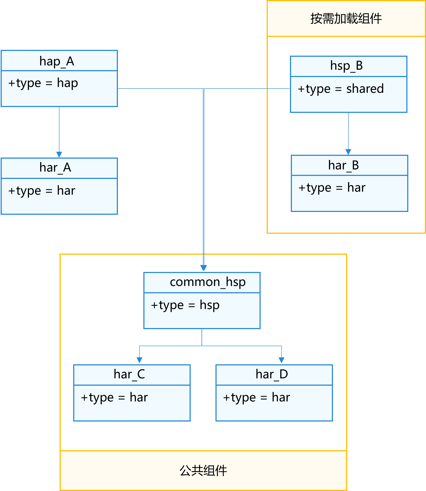

## Modular Design Concepts

In large software engineering projects, multiple teams typically participate in development. Teams interact with each other through weak coupling, defining interactions between businesses through contractual interfaces, defining interfaces between businesses, ensuring independent development of each team's business without mutual interference, achieving rapid iterative evolution. Business modularization is one of the core principles of modern software engineering. By decomposing large complex systems into smaller, more manageable and understandable functional modules, it improves system maintainability and scalability. Each functional module is an independent unit with clearly defined interfaces and responsibilities, capable of interacting with other modules to complete complex tasks.

In HarmonyOS application development, modularization is both a design principle and a development practice. This principle requires splitting applications into multiple functional modules, with each module responsible for specific functions or features. These modules can be independently developed, compiled, and deployed, and can also be flexibly combined and called on different devices.

## Application Package Structure Concepts

When conducting modular design, it's necessary to consider HarmonyOS application package structure selection. HarmonyOS application package structure is used to define application organization methods. Through the application package forms in development, compilation, and release phases, you can understand the specific usage scenarios and rules of different package types. For details, please refer to [Stage Model Application Package Structure](https://developer.huawei.com/consumer/cn/doc/harmonyos-guides/application-package-structure-stage).

## Ability Application Component Design

HarmonyOS application business logic needs to be carried by [Ability components](https://developer.huawei.com/consumer/cn/doc/harmonyos-guides/uiability-overview). According to different business devices and business requirements, it's necessary to consider the selection and design of Ability components. In a multi-device context, application forms are not necessarily single-task single-window forms on traditional mobile devices. In some scenarios, multi-task multi-window forms can provide users with better user experience and improve usage efficiency.

For example, on mobile devices:

- Note-taking applications can allow users to copy information from one page of notes to another.
- Document editing applications can allow users to simultaneously open and edit multiple documents, enabling users to copy or move content from one document to another.
- Navigation/ride-hailing applications can allow navigation to run in the background, return to the homepage to search for new location information or other information.
- Shopping temporary customer service interfaces can allow users to quickly switch from product browsing pages back to customer service conversation interfaces through task management, avoiding users having to search layer by layer.
- On application payment/login pages, users can switch to other pages to find and copy relevant information.

On large screen devices, multiple tasks within applications can exist in multi-window forms, allowing users to operate different application functions in parallel.

- Video player applications can allow users to browse other potentially interesting video lists while watching playback content.
- Email applications can allow users to view received email lists while composing emails.
- Address book applications can allow users to compare contact information of multiple people side by side.
- Reading applications can allow users to open multiple articles for later reading after reviewing all title summaries.

For such independent application-like tasks, each task corresponds to one UIAbility component instance, and each task can independently display one window. Users can switch between different tasks of the same application, just like separate applications. On large screen devices, application windows can be independently moved, resized, shown, and hidden. Therefore, when conducting functional design, it's necessary to consider whether applications support multi-task multi-window, which affects the overall project modular structure.

- For single Ability scenarios, it can correspond to single-window type applications, or multi-task applications implemented through multiple instances or specified instances. For example, ordinary game applications are recommended to use single HAP to carry UIAbility.
- For multiple Ability scenarios, there are two situations:
  - For multi-window type applications, each window corresponds to different functions, carried by different UIAbility. As in the navigation/ride-hailing application example above, the navigation function interface and homepage belong to different functions and are presented as two tasks to users. This module can be carried as a Feature-type HAP with corresponding UIAbility components.
  - For application extension functions, such as cards and sharing business, these functions won't run as separate tasks and window forms. Since these functions are relatively independent and carried by independent [ExtensionAbility](https://developer.huawei.com/consumer/cn/doc/harmonyos-guides/extensionability-overview) provided by the system, from the perspective of better business splitting, it's recommended to carry separate ExtensionAbility components through Feature-type HAP.

## Application Modular Selection

Application architecture aims to implement business services, thinking about business implementation methods from a technical perspective; engineering modular models are based on technical architecture, conducting modular selection for code engineering, needing to consider how technology lands in code engineering. Only when the technical selection of code engineering models is reasonable can optimal comprehensive performance be achieved in package size, performance, product deployment, etc.

Business is usually divided into multiple modules. For example, a shopping software includes homepage navigation, product details, shopping cart, payment, orders, personal information, and other modules. From a technical architecture perspective, these business modules are expressed as high-cohesion, low-coupling modules. In the technical selection of code engineering modularization, since Entry-type HAP is the default existence in projects and cannot have multiple instances, the main module types to consider are: Feature-type HAP modules, HAR modules, and HSP modules.

When selecting code module types in technical architecture, comprehensive evaluation is needed based on business characteristics and module functions. Based on common application modular models, here are several situations that might be encountered in actual business:

1.  [Shared modules](https://developer.huawei.com/consumer/cn/doc/best-practices/bpta-modular-design#section72105319817): A functional module (business module or capability module) needs to share its code logic and resources among multiple applications.
2.  [On-demand loading modules](https://developer.huawei.com/consumer/cn/doc/best-practices/bpta-modular-design#section28312051291): A functional module where users decide the installation timing when using it, dynamically downloading and installing from app markets for use.
3.  [Impact of multiple HAP/HSP referencing the same HAR package](https://developer.huawei.com/consumer/cn/doc/best-practices/bpta-modular-design#section9492615385): From a performance perspective, it's necessary to reduce multiple HAP/HSP references to the same HAR package.

### Shared Modules

For large software, different businesses and basic capabilities are developed by multiple teams, requiring code repository isolation between teams. If one or several HAR engineering modules are managed by a team and want code repository isolation, these HARs can be developed in independent projects and published and integrated compilation products through company private OHPM repositories. As shown in the figure below.

**Figure 1** Multi-Project Cooperation Mode  

This part that can be published to OHPM repositories is called shared modules, which can share common capabilities for multiple applications, such as multiple applications within a company using a common capability network library; or this common capability can be packaged as a library contributed to the community for other applications to integrate and use. In this case, this module can only be a HAR module.

### On-Demand Loading Modules

As application business expands, applications provide more and more functions for users. However, not all functions are frequently used by users. According to analysis of user operation reports, functions with low monthly activity can be designed as on-demand loading modules. When users first install from app markets, only content without on-demand loading modules is downloaded. When users need to use specific functions, they can choose to download and install corresponding functional modules.

On-demand loading modules have the following benefits:

- Reduce package size: Applications downloaded by users from app markets for the first time don't include on-demand loading modules, reducing the package size users see, thereby reducing user download and installation time and user waiting time.
- Reduce system resources: Applications occupy less space after installation (saving ROM space), and applications load fewer features when starting (saving RAM space).
- Architecture evolution: Features defined as on-demand loading are clear, module coupling relationships are clear, which is conducive to application architecture evolution.

If a feature is made into an on-demand loading module, this module can be designed as Feature-type HAP or HSP. Both HAP and HSP can implement on-demand loading. The difference is that Feature-type HAP can contain Ability components. Combined with the previous [Ability Application Component Design](https://developer.huawei.com/consumer/cn/doc/best-practices/bpta-modular-design#section591504125510) and whether business needs on-demand loading, two major scenarios can be divided overall as follows:

- Single HAP scenario: If it only contains one UIAbility component (including UIAbility multiple instances/specified instances) and doesn't need to use ExtensionAbility components, priority should be given to using single HAP (Entry-type HAP) to implement application development. Among these, whether to choose HSP or HAR as modules is decided based on whether on-demand loading needs to be implemented.
- Multiple HAP scenario: To implement multi-task carrying multiple UIAbility components and using ExtensionAbility components to implement extension functions, multiple HAPs (i.e., one Entry-type HAP and multiple Feature-type HAPs) can be used to develop applications. Each HAP contains one UIAbility component or one ExtensionAbility component. In the multiple HAP situation, module types are chosen based on whether there are common capabilities.

Application component design determines whether modular design adopts single HAP engineering or multiple HAP engineering. During the design phase, it's necessary to consider application task forms to determine appropriate modular structures.

### Impact of Multiple HAP/HSP Referencing the Same HAR Package

During application development, [HSP](https://developer.huawei.com/consumer/cn/doc/harmonyos-guides/in-app-hsp) or [HAR](https://developer.huawei.com/consumer/cn/doc/harmonyos-guides/har-package) shared package methods can be used to integrate similar modules for sharing ArkUI components, resources, and related code among multiple modules or multiple projects.

When multiple HAP/HSP reference the same HAR package, due to dynamic and static differences in shared packages, singletons in HAR packages may become invalid, affecting application cold start performance.

**Figure 2** HAP Package and HSP Package Respectively Referencing the Same HAR Package  

As shown in the figure above, the project contains three modules: HAP package as the application main entry module, HSP package as the application main interface display module, and HAR_COMMON integrating all common utility classes, where funcResult is the execution result of the func method.

When HAP and HSP modules simultaneously reference the HAR_COMMON module, it will break HAR's singleton pattern. Therefore, when HAP and HSP modules use funcResult in HAR_COMMON, it will cause the func method to execute once during loading of each of the two modules, thereby increasing file execution time.

From a performance perspective only, the following modifications can be adopted to shorten cold start phase time consumption.

**Figure 3** Switch to HAP Package and HAR Package Respectively Referencing the Same HAR Package  

Note

- In situations where multiple HAP/HSP reference the same HAR package, if both HSP package and HAR package can meet business requirements, it's recommended to change HSP package to HAR package.
- If the HSP used is [integrated HSP](https://developer.huawei.com/consumer/cn/doc/harmonyos-guides/integrated-hsp), this optimization scheme can be skipped.

1.  Write functional examples in the referenced HAR_COMMON package.
2.  Compare performance by using HSP package and HAR package respectively to reference functions in the HAR_COMMON package.

    - Use HAP package and HSP package to reference functions in the HAR_COMMON package.

      HAP package references functions in HAR_COMMON package.

    - Use HAP package and HAR package to reference functions in the HAR_COMMON package.

      HAP package references functions in HAR_COMMON package.

Use [Launch template](https://developer.huawei.com/consumer/cn/doc/harmonyos-guides/ide-insight-session-launch) to conduct comparative analysis of startup performance before and after optimization.

The starting point of the analysis phase is starting Ability (i.e., the beginning of H:void OHOS::AppExecFwk::MainThread::HandleLaunchAbility), and the phase endpoint is when the application first receives vsync (i.e., the beginning of H:ReceiveVsync dataCount:24Bytes now:timestamp expectedEnd:timestamp vsyncId:int).

**Figure 4** Before optimization, using HSP package

**Figure 5** After optimization, using HAR instead of HSP

Comparison data before and after optimization:

|
Solution

|

Phase Duration (milliseconds)

| |
| |

|

(Before optimization) Using HSP package

|

3125

|
|

(After optimization) Using HAR instead of HSP

|

853.9

|

Note

The above example has func execution function loop count of 100000000 to highlight the difference. The actual benefits after developer modifications need to be tested according to actual situations.

Test data shows that after replacing HSP with HAR package, application startup time is significantly shortened.

## Single HAP Engineering

For single-window application APP engineering, it only contains one Entry-type HAP. Divided modules are considered to use HAR modules and HSP modules based on whether there are on-demand loading requirements.

### Not Including On-Demand Loading Modules

For Apps that don't need on-demand loading and only contain one Entry-type HAP, HAR can be directly used for development and design. As shown in the figure below:

Note

The "only one HAP" mentioned here refers to one device type containing only one HAP, not referring to only one HAP in .app file packages. .app file packages can contain HAP packages for other devices, such as watch and large screen device HAP packages, to support multi-device distribution.

**Figure 6** Non-On-Demand Loading Engineering Model  

In the engineering architecture shown above, except for device-related HAPs in the product module layer, other modules are all HARs. These dependent HARs are ultimately compiled into HAPs.

Designing as HAR packages has the following advantages:

1.  All compiled into HAP, no additional HSP, saving HSP installation and loading costs.
2.  When HAR is compiled into HAP, it can utilize ArkTS language features and compiler functions for type inference and compilation optimization.
3.  Simple code engineering architecture, with relatively flexible subsequent evolution.

### Including On-Demand Loading Modules

When implementing on-demand loading functions in single HAP engineering, corresponding components need to use HSP as on-demand loading modules. HAR is a static shared library. If multiple HAPs or HSPs depend on the same HAR, this HAR will be repeatedly stored within applications. HSP is a dynamic shared library. Its installation and loading will have performance losses. Too many HSPs may affect installation efficiency and App startup performance. It's necessary to consider whether App space occupation is limited and startup performance sensitivity, making a good balance between App Size and startup performance according to business requirements.

Note

App Size here refers to the overall size of applications after users install on-demand loading modules.

**App Size Priority**

For App Size priority, consider packaging common dependent modules in one HSP module shell, as shown in the figure below:

**Figure 7** Common Dependent Modules Carried by HSP Module Shell  

hap_A depends on exclusive shared library har_A, while also needing to depend on har_C and har_D; while on-demand loading module hsp_B depends on exclusive shared library har_B, while also needing to depend on har_C and har_D.

Note

The shared libraries har_A, har_B, har_C, har_D here are not necessarily local projects, but may be dependencies downloaded from ohpm repositories.
