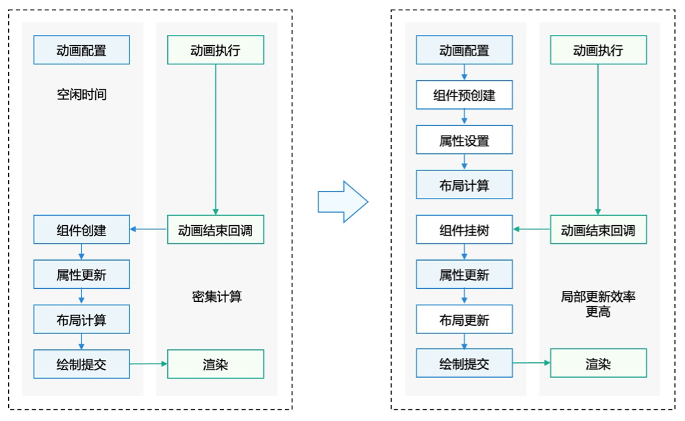
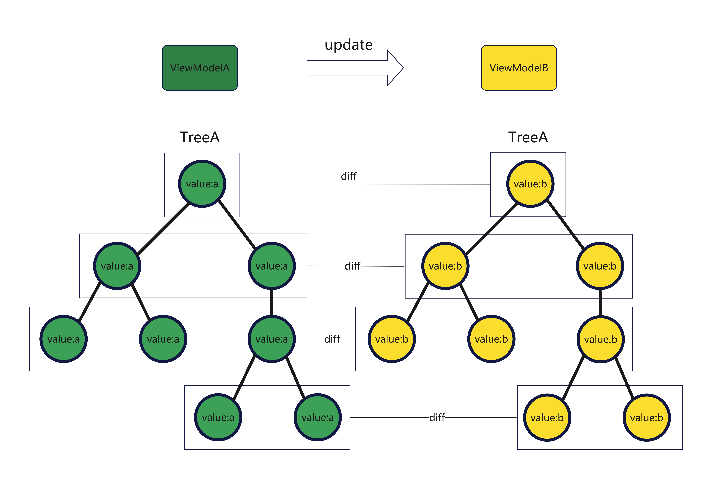

# HarmonyOS Dynamic Component Creation Complete Guide: From Beginner to Practice

> This article will provide an in-depth understanding of dynamic component creation technology in HarmonyOS through practical cases and detailed explanations, helping you master this powerful development skill.

## 🚀 Opening: Why Do We Need Dynamic Component Creation?

In traditional HarmonyOS development, we usually create components in the `build()` method. But imagine these scenarios:

- 📱 **News App**: Need to dynamically insert different advertisement components based on ad types returned from the server
- 🎬 **Video App**: Homepage carousel needs to update dynamically based on real-time data
- 💬 **Chat App**: Different message types require dynamically creating different chat bubble components
- 🛒 **E-commerce App**: Product detail page layout needs to adjust dynamically based on product types

These scenarios all have one common point: **Component types and structures cannot be determined during development and need to be created dynamically at runtime based on data**.

## 📚 Basic Concepts: What is Dynamic Component Creation?

### Traditional Approach vs Dynamic Creation

**Traditional Approach**:

```typescript
// Can only create components in build()
build() {
  Column() {
    Text('Fixed content')
    Image($r('app.media.fixed_image'))
  }
}
```

**Dynamic Creation Approach**:

```typescript
// Can create components at any time, not limited to build()
private createDynamicComponent(data: any) {
  // Dynamically create different components based on data type
  if (data.type === 'text') {
    return createTextComponent(data)
  } else if (data.type === 'image') {
    return createImageComponent(data)
  }
  // ... more types
}
```

### Official Definition

To solve problems of slow page and component loading, the ArkUI framework provides dynamic operations to implement component pre-creation, allowing applications to load and render corresponding components at runtime according to actual needs. Dynamic operations include dynamic component creation (dynamic component addition), dynamic component unloading (dynamic component deletion), and other related operations. Dynamic component creation refers to creating components outside the build lifecycle, i.e., creating components in advance before the build lifecycle. Through dynamic component creation, not only can component creation time be saved and user experience improved, but independent logic can also be encapsulated, facilitating modular application development. Dynamic component unloading is the unloading and deletion of dynamically created components.

### Core Advantages of Dynamic Creation

1. **⚡ Performance Improvement**: Components can be pre-created during idle time, improving page response speed
2. **🔄 Flexibility**: Dynamically load different components according to actual needs
3. **📦 Modularization**: Encapsulate independent logic for easier maintenance and reuse
4. **💾 Memory Optimization**: Create and destroy components on demand, avoiding memory waste

## 🎯 Core Principles: Component Pre-creation Mechanism

### Working Principle Analysis

In declarative paradigm, components are only created during the build phase, and developers cannot create components in other lifecycle stages, leading to problems like slow page loading. Different from declarative paradigm, the UI dynamic operations provided by the ArkUI framework support component pre-creation. Component pre-creation can meet developers' needs to create components outside the build lifecycle. After creation, components can perform operations like property setting and layout calculation. They can then be used during page loading, greatly improving page response speed.

As shown in the figure below, using the component pre-creation mechanism, component pre-creation and property setting can be performed during idle time in animation execution. After animation ends, property and layout updates are performed, saving component creation time and thus accelerating page rendering.

**Figure 1** Component Pre-creation Principle Diagram  


> 💡 **Key Point**: Traditional methods can only create components during the build phase, while dynamic creation can pre-create components during idle time like animation execution, and use them directly when needed, greatly improving response speed.

### Lifecycle Comparison

**Traditional Component Lifecycle**:

```
Data preparation → build() → Component creation → Layout calculation → Rendering display
```

**Dynamic Creation Component Lifecycle**:

```
Idle time → Component pre-creation → Data preparation → Quick layout update → Rendering display
```

## 🛠️ Technical Deep Dive: The Power of FrameNode

### What is FrameNode?

FrameNode is a low-level node operation interface provided by HarmonyOS that bypasses some limitations of traditional declarative development, allowing you to:

- Directly manipulate component tree structure
- Avoid overhead of creating custom components and state variables
- Achieve efficient on-demand updates

### Three Major Advantages of FrameNode

#### 1. 🚀 Reduce Custom Component Creation Overhead

In declarative development paradigm, if ArkUI custom components are used to define each node in the node tree, low efficiency in node creation is often encountered.

This is mainly because each node needs to allocate memory space in the ArkTS engine to store application custom components and state variables. During node creation, operations like component ID, component closure, and dependency relationship collection between state variables must also be executed.

In contrast, using ArkUI's [FrameNode](https://developer.huawei.com/consumer/cn/doc/harmonyos-guides/arkts-user-defined-arktsnode-framenode) can avoid creating custom component objects and state variable objects, eliminating the need for dependency collection, thus significantly improving component creation speed.

**Problems with Traditional Approach**:

- Each component needs memory allocation in ArkTS engine
- Need to execute component ID, closure, state variable dependency collection operations
- Large creation overhead, especially for complex components

**FrameNode Advantages**:

- Avoid creating custom component objects
- No need for state variable objects and dependency collection
- Significantly improve creation speed

#### 2. ⚡ Faster Component Updates

In dynamic layout framework update scenarios, there usually exists a UI component tree TreeA created by tree data structure ViewModelA. When needing to use new data structure ViewModelB to update TreeA, although declarative development paradigm can achieve data-driven automatic updates, this process involves extensive diff operations, as shown in the figure below. For the ArkTS engine, when executing diff algorithms on complex component trees (depth over 30 layers, containing 100 to 200 components), it's almost impossible to maintain full-frame operation at 120Hz refresh rate. However, using ArkUI's FrameNode extension, the framework can autonomously control the update process, achieving efficient on-demand pruning. Especially for those dynamic layout frameworks that only serve a few specific businesses, using this extension can achieve rapid update operations.



**Problems with Traditional Declarative Updates**:

- Require extensive diff operations
- Complex component trees (30 layers deep, 100-200 components) difficult to maintain full frame at 120Hz

**FrameNode Advantages**:

- Autonomous control of update process
- Efficient on-demand pruning
- Fast update operations

#### 3. 🎯 Direct Component Tree Manipulation

Using declarative development paradigm also has the pain point of difficult component tree structure update operations. For example, completely moving a subtree from current child nodes to another child node in the component tree. Using declarative development paradigm cannot directly adjust structural relationships of component instances, and can only achieve the above operation by re-rendering the entire component tree. Using ArkUI's FrameNode extension, this subtree can be easily controlled by operating FrameNode, transplanting it to another node. This only involves local rendering refresh with better performance.


**Traditional Approach Limitations**:

- Cannot directly adjust structural relationships of component instances
- Moving subtrees requires re-rendering entire component tree

**FrameNode Flexibility**:

- Can directly manipulate component tree structure
- Local rendering refresh with better performance
- Flexible node movement and reorganization

## 🔧 Practical Tutorial: Detailed Component Dynamic Operations

### Dynamic Component Addition: Four Core Steps

Dynamic component addition includes the following steps:

1. Create custom nodes.
2. Implement [NodeController](https://developer.huawei.com/consumer/cn/doc/harmonyos-references/js-apis-arkui-nodecontroller), used for managing custom node creation, display, update and other operations, and responsible for mounting custom nodes to [NodeContainer](https://developer.huawei.com/consumer/cn/doc/harmonyos-references/ts-basic-components-nodecontainer#nodecontainer-1).
3. Implement NodeController's makeNode method. makeNode will be called back when NodeController instance binds to NodeContainer, mounting the returned node to NodeContainer.
4. Use NodeContainer to display custom nodes.

#### Step 1: Create Custom Nodes

First, prepare the nodes to be mounted, as shown in the code below.

```typescript
// Create a simple text node
@Builder
function buildText(text: string) {
  Text(text)
    .fontSize(16)
    .fontColor(Color.Black)
    .padding(10)
}
```

#### Step 2: Implement NodeController

NodeController is an abstract class that needs to be inherited and implemented, as shown in the code below.

```typescript
class TextNodeController extends NodeController {
  private textContent: string = "";
  private builderNode: BuilderNode<[string]> | null = null;

  constructor(text: string) {
    super();
    this.textContent = text;
  }

  // Must implement method: create node
  makeNode(uiContext: UIContext): FrameNode | null {
    // Create BuilderNode
    this.builderNode = new BuilderNode(uiContext);

    // Build component tree
    this.builderNode.build(wrapBuilder(buildText), this.textContent);

    // Return root node
    return this.builderNode.getFrameNode();
  }

  // Update node content
  updateText(newText: string) {
    this.textContent = newText;
    if (this.builderNode) {
      this.builderNode.update(newText);
    }
  }
}
```

#### Step 3: Use NodeContainer to Display

```typescript
@Entry
@Component
struct DynamicComponentDemo {
  private textController: TextNodeController = new TextNodeController("Hello World");

  build() {
    Column() {
      // Display dynamic component
      NodeContainer(this.textController)
        .width('100%')
        .height(50)

      // Control buttons
      Button('Update Text')
        .onClick(() => {
          this.textController.updateText("Updated Content");
        })
    }
    .padding(20)
  }
}
```

#### Step 4: Advanced Dynamic Creation

For more complex scenarios, you can create different types of components:

```typescript
// Image component controller
class ImageNodeController extends NodeController {
  private imageResource: ResourceStr;
  private builderNode: BuilderNode<[ResourceStr]> | null = null;

  constructor(imageRes: ResourceStr) {
    super();
    this.imageResource = imageRes;
  }

  makeNode(uiContext: UIContext): FrameNode | null {
    this.builderNode = new BuilderNode(uiContext);
    this.builderNode.build(wrapBuilder(buildImage), this.imageResource);
    return this.builderNode.getFrameNode();
  }
}

// Image builder function
@Builder
function buildImage(imageRes: ResourceStr) {
  Image(imageRes)
    .width(100)
    .height(100)
    .borderRadius(8)
}
```

## 🎨 Practical Case: Dynamic News Feed

Let's implement a practical case - a news feed that dynamically creates different types of content based on data:

```typescript
// News item data interface
interface NewsItem {
  id: string;
  type: 'text' | 'image' | 'video';
  title: string;
  content?: string;
  imageUrl?: string;
  videoUrl?: string;
}

// Dynamic news item controller
class NewsItemController extends NodeController {
  private newsData: NewsItem;
  private builderNode: BuilderNode<[NewsItem]> | null = null;

  constructor(data: NewsItem) {
    super();
    this.newsData = data;
  }

  makeNode(uiContext: UIContext): FrameNode | null {
    this.builderNode = new BuilderNode(uiContext);
    this.builderNode.build(wrapBuilder(buildNewsItem), this.newsData);
    return this.builderNode.getFrameNode();
  }
}

// News item builder
@Builder
function buildNewsItem(data: NewsItem) {
  Column() {
    Text(data.title)
      .fontSize(18)
      .fontWeight(FontWeight.Bold)
      .margin({ bottom: 8 })

    // Dynamically display different content based on type
    if (data.type === 'text' && data.content) {
      Text(data.content)
        .fontSize(14)
        .fontColor(Color.Gray)
    } else if (data.type === 'image' && data.imageUrl) {
      Image(data.imageUrl)
        .width('100%')
        .height(200)
        .borderRadius(8)
    } else if (data.type === 'video' && data.videoUrl) {
      // Video component placeholder
      Stack() {
        Image($r('app.media.video_placeholder'))
          .width('100%')
          .height(200)

        Image($r('app.media.play_button'))
          .width(50)
          .height(50)
      }
    }
  }
  .alignItems(HorizontalAlign.Start)
  .padding(16)
  .backgroundColor(Color.White)
  .borderRadius(12)
  .margin({ bottom: 12 })
}

// Main page
@Entry
@Component
struct NewsFeedPage {
  @State newsControllers: NewsItemController[] = [];

  aboutToAppear() {
    // Simulate loading news data
    this.loadNewsData();
  }

  private loadNewsData() {
    const mockData: NewsItem[] = [
      { id: '1', type: 'text', title: 'Breaking News', content: 'This is a text news item...' },
      { id: '2', type: 'image', title: 'Photo News', imageUrl: 'https://example.com/image.jpg' },
      { id: '3', type: 'video', title: 'Video News', videoUrl: 'https://example.com/video.mp4' }
    ];

    this.newsControllers = mockData.map(item => new NewsItemController(item));
  }

  build() {
    Scroll() {
      Column() {
        ForEach(this.newsControllers, (controller: NewsItemController, index: number) => {
          NodeContainer(controller)
            .width('100%')
        })
      }
    }
    .padding(16)
    .backgroundColor('#F5F5F5')
  }
}
```

## 💡 Best Practices and Tips

### 1. Performance Optimization

- **Pre-create during idle time**: Use system idle time to pre-create commonly used components
- **Reuse component instances**: Avoid frequently creating and destroying components
- **Batch operations**: Batch multiple component operations together

### 2. Memory Management

- **Timely cleanup**: Clean up unnecessary component references in time
- **Control cache size**: Limit the number of pre-created components to prevent memory leaks
- **Monitor memory usage**: Regularly check application memory usage

### 3. Error Handling

```typescript
class SafeNodeController extends NodeController {
  makeNode(uiContext: UIContext): FrameNode | null {
    try {
      // Component creation logic
      return this.createComponent(uiContext);
    } catch (error) {
      console.error("Failed to create component:", error);
      return null;
    }
  }

  private createComponent(uiContext: UIContext): FrameNode {
    // Actual component creation implementation
    // ...
  }
}
```

## 📋 Summary

Dynamic component creation is a powerful feature in HarmonyOS that can significantly improve application performance and user experience. Key points to remember:

1. **Understand the principles**: Master the FrameNode working mechanism
2. **Proper use cases**: Choose dynamic creation for scenarios that truly need it
3. **Performance optimization**: Use pre-creation and reuse strategies reasonably
4. **Error handling**: Ensure application stability

Through the introduction and practice in this article, you should now be able to implement dynamic component creation functionality in your HarmonyOS applications. Start with simple cases and gradually master more complex scenarios!
