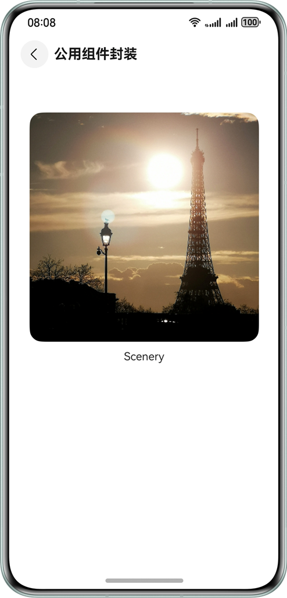

# HarmonyOS Component Encapsulation: From Beginner to Practice

## 📖 Table of Contents

1. [What is Component Encapsulation?](#what-is-component-encapsulation)
2. [Why Do We Need Component Encapsulation?](#why-do-we-need-component-encapsulation)
3. [Three Main Encapsulation Approaches](#three-main-encapsulation-approaches)
4. [Common Component Encapsulation Deep Dive](#common-component-encapsulation-deep-dive)
5. [Dialog Component Encapsulation Practice](#dialog-component-encapsulation-practice)
6. [Component Factory Class Encapsulation Advanced](#component-factory-class-encapsulation-advanced)
7. [Best Practice Recommendations](#best-practice-recommendations)
8. [Common Questions and Answers](#common-questions-and-answers)

## What is Component Encapsulation?

In HarmonyOS application development, **component encapsulation** is like putting a "jacket" on commonly used UI elements to make them easier to reuse. Imagine if you need to use the same style button on multiple pages - instead of rewriting the style code every time, it's better to encapsulate this button as a component and use it directly when needed.

### 🎯 Core Concepts

- **Encapsulation**: Package related code and styles together
- **Reuse**: Write once, use everywhere
- **Maintenance**: Unified modification, global effect

## Why Do We Need Component Encapsulation?

### 🚀 Improve Development Efficiency

Suppose you're developing an e-commerce application and need to use an "Add to Cart" button on multiple pages. Without encapsulation:

```typescript
// Page A
Button("Add to Cart")
  .fontSize(16)
  .fontColor(Color.White)
  .backgroundColor("#FF6B35")
  .borderRadius(8);

// Page B
Button("Add to Cart")
  .fontSize(16)
  .fontColor(Color.White)
  .backgroundColor("#FF6B35")
  .borderRadius(8);

// Page C... duplicate code
```

With component encapsulation:

```typescript
// All pages just need
ShoppingCartButton();
```

### 🛠️ Easy Maintenance

When the product manager says "change all shopping cart button colors to blue", encapsulated components only need one change, while non-encapsulated code needs N changes.

### 🎨 Maintain Consistency

During team collaboration, encapsulated components ensure all team members use unified UI elements, avoiding "why is this button different from others" issues.

## Three Main Encapsulation Approaches

HarmonyOS provides three main component encapsulation approaches, each with its applicable scenarios:

### 1. 🔧 Common Component Encapsulation

**Applicable Scenario**: Basic components that need unified styling

**Example**: All main buttons in pages use the same color, font, and rounded corners

### 2. 💬 Dialog Component Encapsulation

**Applicable Scenario**: Various custom dialogs

**Example**: Confirmation delete dialogs, information prompt dialogs, custom form dialogs

### 3. 🏭 Component Factory Class Encapsulation

**Applicable Scenario**: Need to dynamically create different components based on parameters

**Example**: Display different form controls based on data type (text box, dropdown, radio button, etc.)

## Common Component Encapsulation Deep Dive

### 🤔 Problems with Traditional Approach

Let's first look at problems with traditional encapsulation approaches. Suppose we want to encapsulate a custom button:

```typescript
// ❌ Traditional approach - many problems
@Component
struct MyButton {
  text: string = ''
  fontSize: number = 16
  fontColor: ResourceColor = Color.White
  backgroundColor: ResourceColor = Color.Blue
  // ... need to enumerate all Button properties

  build() {
    Button(this.text)
      .fontSize(this.fontSize)
      .fontColor(this.fontColor)
      .backgroundColor(this.backgroundColor)
      // ... need to set all properties
  }
}
```

**Problem Analysis**:

1. **Parameter explosion**: Button has dozens of properties, all need to be defined once in MyButton
2. **Inconvenient usage**: Cannot use chained calls like native Button
3. **Difficult maintenance**: When Button updates with new properties, MyButton also needs changes

### ✅ AttributeModifier Solution

HarmonyOS provides `AttributeModifier` to elegantly solve this problem:

#### Approach 1: Provide Encapsulated Components

**Applicable Scenario**: Combine multiple system components (like image + text)

```typescript
// Provider: Encapsulate image-text combination component
@Component
export struct CustomImageText {
  @Prop imageModifier: AttributeModifier<ImageAttribute> = new ImageModifier()
  @Prop textModifier: AttributeModifier<TextAttribute> = new TextModifier()
  @Prop imageSrc: ResourceStr = ''
  @Prop text: string = ''

  build() {
    Column() {
      Image(this.imageSrc)
        .attributeModifier(this.imageModifier)

      Text(this.text)
        .attributeModifier(this.textModifier)
    }
  }
}

// User: Create modifier classes
class MyImageModifier implements AttributeModifier<ImageAttribute> {
  applyNormalAttribute(instance: ImageAttribute): void {
    instance.width(100)
           .height(100)
           .borderRadius(8)
  }
}

class MyTextModifier implements AttributeModifier<TextAttribute> {
  applyNormalAttribute(instance: TextAttribute): void {
    instance.fontSize(14)
           .fontColor(Color.Gray)
           .textAlign(TextAlign.Center)
  }
}

// Use component
CustomImageText({
  imageSrc: $r('app.media.icon'),
  text: 'Product Name',
  imageModifier: new MyImageModifier(),
  textModifier: new MyTextModifier()
})
```

**Effect Display**:



#### Approach 2: Provide Modifier Classes

**Applicable Scenario**: Unified styling for single components (like buttons, text)

```typescript
// Provider: Create button modifier
export class PrimaryButtonModifier
  implements AttributeModifier<ButtonAttribute>
{
  applyNormalAttribute(instance: ButtonAttribute): void {
    instance
      .fontSize(16)
      .fontColor(Color.White)
      .backgroundColor("#007AFF")
      .borderRadius(8)
      .padding({ left: 20, right: 20, top: 10, bottom: 10 });
  }
}

// User: Direct usage
Button("Confirm").attributeModifier(new PrimaryButtonModifier());

Button("Cancel")
  .attributeModifier(new PrimaryButtonModifier())
  .backgroundColor(Color.Gray); // Can continue chained calls to override styles
```

### 🎯 Selection Recommendations

- **For component combinations**: Use Approach 1 to provide complete encapsulated components
- **For single component styling**: Use Approach 2 to provide modifier classes
- **For complex interactions**: Combine both approaches based on actual needs

## Best Practice Recommendations

### 1. 📝 Naming Conventions

- **Component names**: Use PascalCase, e.g., `CustomButton`, `ImageTextCard`
- **Modifier names**: Use descriptive names, e.g., `PrimaryButtonModifier`, `SuccessButtonModifier`
- **Property names**: Use camelCase, maintain consistency with system components

### 2. 🎨 Design Principles

- **Single Responsibility**: Each component should have only one clear purpose
- **High Reusability**: Consider usage across different scenarios during design
- **Easy Extension**: Allow users to customize styles based on basic functionality

### 3. 📚 Documentation and Examples

````typescript
/**
 * Primary button component with standard styling
 * @param text - Button text content
 * @param onClick - Click event handler
 * @example
 * ```typescript
 * PrimaryButton({
 *   text: 'Submit',
 *   onClick: () => console.log('Button clicked')
 * })
 * ```
 */
@Component
export struct PrimaryButton {
  @Prop text: string = ''
  @Prop onClick: () => void = () => {}

  build() {
    Button(this.text)
      .attributeModifier(new PrimaryButtonModifier())
      .onClick(this.onClick)
  }
}
````

## Summary

Component encapsulation is a fundamental skill in HarmonyOS development. Key points to remember:

1. **Choose the right approach**: AttributeModifier provides more flexibility than traditional encapsulation
2. **Balance reusability and customization**: Design components that are both easy to use and customizable
3. **Maintain good practices**: Follow naming conventions, write documentation, provide examples
4. **Continuous iteration**: Optimize component design based on actual usage feedback

Through the introduction in this article, you should now be able to implement efficient component encapsulation in HarmonyOS applications, improving development efficiency and code maintainability.
