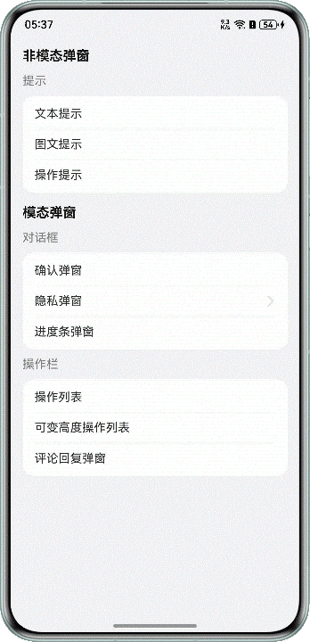

# HarmonyOS Custom Dialog Type Selection and Development - Beginner's Guide

## What is a Dialog?

A dialog is a window component that temporarily appears above the application interface to display information to users, gather user input, or confirm user actions. Common examples include:

- Notification messages (e.g., "Save successful")
- Confirmation dialogs (e.g., "Are you sure you want to delete?")
- Menu options (e.g., share, edit, etc.)
- Input forms (e.g., login, registration)

## Why Do We Need to Understand Dialog Type Selection?

HarmonyOS provides multiple ways to implement dialogs, each with different characteristics and applicable scenarios. Choosing the right dialog type can make your application:

- Provide better user experience
- Have more maintainable code
- Function more stably

## Main Types of HarmonyOS Dialogs

### 🚀 Recommended Dialog Types

#### 1. UIContext Dialogs (Recommended ⭐⭐⭐⭐⭐)

This is currently the most recommended dialog implementation approach, including three specific implementations:

**a) UIContext.openBindSheet() - Bottom Sheet Dialog**

- **When to use**: Bottom action menus, option lists
- **Features**: Slides up from bottom, occupies part of the screen
- **Advantages**: Conforms to user habits, convenient operation

**b) UIContext.getPromptAction().openCustomDialog() - Custom Dialog**

- **When to use**: Notification messages, operation confirmation, form input
- **Features**: Centered display, highly customizable
- **Advantages**: Powerful functionality, flexible styling

**c) UIContext.getOverlayManager() - Floating Components**

- **When to use**: Global notifications, floating buttons
- **Features**: Can be displayed at any position
- **Advantages**: Not restricted by page layout

#### 2. Navigation.Dialog - Routing Dialog

- **When to use**: Dialogs that need to persist after page navigation
- **Features**: Essentially a transparent page
- **Advantages**: Well integrated with the routing system

### ❌ Not Recommended Dialog Types

#### 1. CustomDialog (Basic Custom Dialog)

**Why not recommended**:

- Can only be used within components, not flexible enough
- Does not support dynamic creation
- Code redundancy when multiple dialogs are needed

#### 2. @ohos.promptAction

**Why not recommended**:

- May display on the wrong window
- Limited style customization capabilities

## Core Functionality Comparison of Dialogs

To help beginners choose, I've simplified the functionality comparison table:

| Functionality Requirements    | openBindSheet | openCustomDialog | Navigation.Dialog |
| ----------------------------- | ------------- | ---------------- | ----------------- |
| 🔄 Swipe-to-dismiss Control   | ✅            | ✅               | ✅                |
| 👆 Tap Outside to Close       | ✅            | ✅               | ❌                |
| 🎬 Custom Animation           | ❌            | ✅               | Need to implement |
| 📱 Persist Through Navigation | ✅            | ✅               | ✅                |
| ⌨️ Keyboard Avoidance         | ❌            | ✅               | Need to implement |

**Beginner Suggestions**:

- 🏁 **Just starting to learn**: Prioritize using `openCustomDialog`, most comprehensive functionality
- 📋 **Bottom menus**: Use `openBindSheet`
- 🔄 **Page-level dialogs**: Use `Navigation.Dialog`

## Practical Development Cases

### Case 1: Text and Image Notification Dialog (Enhanced Toast-like)

**Use case**: Operation success/failure notifications with icons



**Why choose this approach**:
The system's built-in `showToast` can only display plain text, we need mixed text and image notifications.

**Implementation steps**:

```typescript
// 1. Define dialog content
@Builder
function buildToastContent(message: string, iconRes: Resource) {
  Column() {
    Image(iconRes)
      .width(40)
      .height(40)
      .margin({ bottom: 8 })

    Text(message)
      .fontSize(16)
      .fontColor(Color.White)
  }
  .padding(16)
  .backgroundColor(Color.Black)
  .borderRadius(8)
}

// 2. Show dialog
showCustomToast(message: string, iconRes: Resource) {
  // Get UI context
  let uiContext = this.getUIContext()

  // Create dialog content
  let contentNode = new ComponentContent(uiContext, wrapBuilder(buildToastContent), message, iconRes)

  // Configure dialog options
  let options: BaseDialogOptions = {
    isModal: false,           // Non-modal, doesn't block page operations
    autoCancel: true,         // Tap outside to close
    focusable: false,         // Don't steal focus
    alignment: DialogAlignment.Center
  }

  // Show dialog
  uiContext.getPromptAction().openCustomDialog(contentNode, options)

  // Auto close after 3 seconds
  setTimeout(() => {
    uiContext.getPromptAction().closeCustomDialog(contentNode)
  }, 3000)
}
```

**Beginner Notes**:

- `focusable: false` prevents the dialog from stealing focus, avoiding keyboard dismissal
- Remember to set auto-close time to avoid persistent display

### Case 2: Privacy Agreement Dialog

**Use case**: App first launch, requiring user agreement to privacy policy


**Special requirements**:

1. Clicking agreement links navigates to pages, dialog remains when returning
2. Users cannot dismiss dialog by swiping, must choose agree/decline

**Implementation steps**:

```typescript
// 1. Define privacy dialog content
@Builder
function buildPrivacyDialog() {
  Column() {
    Text('Privacy Agreement')
      .fontSize(18)
      .fontWeight(FontWeight.Bold)
      .margin({ bottom: 16 })

    Text('Please read and agree to the following agreements:')
      .fontSize(14)
      .margin({ bottom: 8 })

    // Clickable agreement links
    Text('《User Agreement》《Privacy Policy》')
      .fontSize(14)
      .fontColor(Color.Blue)
      .onClick(() => {
        // Navigate to agreement page
        router.pushUrl({ url: 'pages/PrivacyPage' })
      })
      .margin({ bottom: 20 })

    // Button group
    Row() {
      Button('Decline')
        .onClick(() => {
          // Handle decline logic
          this.closePrivacyDialog()
        })
        .margin({ right: 12 })

      Button('Agree')
        .onClick(() => {
          // Handle agree logic
          this.closePrivacyDialog()
        })
    }
  }
  .padding(20)
  .backgroundColor(Color.White)
  .borderRadius(12)
}

// 2. Show privacy dialog
showPrivacyDialog() {
  let uiContext = this.getUIContext()

  // Get page node ID (Important: enables persistence through navigation)
  let frameNode = uiContext.getFrameNodeById('mainPage')
  let uniqueId = frameNode?.getUniqueId()

  let contentNode = new ComponentContent(uiContext, wrapBuilder(buildPrivacyDialog))

  let options: BaseDialogOptions = {
    isModal: true,              // Modal dialog, blocks page operations
    autoCancel: false,          // Don't allow tap outside to close
    levelMode: LevelMode.PAGE,  // Page-level dialog
    levelUniqueId: uniqueId,    // Bind to specific page

    // 3. Swipe interception implementation
    onWillDismiss: (reason: DismissReason) => {
      if (reason === DismissReason.PRESS_BACK || reason === DismissReason.SLIDE) {
        // Intercept swipe and back button, don't close dialog
        return false
      }
      return true
    }
  }

  this.privacyDialogNode = contentNode
  uiContext.getPromptAction().openCustomDialog(contentNode, options)
}
```

**Key concepts for beginners**:

- `levelMode` and `levelUniqueId`: Bind dialog to specific page, dialog persists during navigation
- `onWillDismiss`: Intercept dismiss operations, implement swipe interception
- Page node ID retrieval: Ensure dialog is correctly bound

### Case 3: Progress Display Dialog

**Use case**: File downloads, data loading, and other time-consuming operations


**Key point**: After dialog is shown, the page needs to be able to update progress within the dialog

**Implementation steps**:

```typescript
// 1. Progress dialog component
@Component
struct ProgressDialog {
  @State progress: number = 0
  @State status: string = 'Preparing...'

  build() {
    Column() {
      Text(this.status)
        .fontSize(16)
        .margin({ bottom: 16 })

      Progress({ value: this.progress, total: 100, type: ProgressType.Linear })
        .width(200)
        .height(6)
        .margin({ bottom: 8 })

      Text(`${this.progress}%`)
        .fontSize(14)
        .fontColor(Color.Gray)
    }
    .padding(20)
    .backgroundColor(Color.White)
    .borderRadius(8)
  }
}

// 2. Show and update progress
showProgressDialog() {
  let uiContext = this.getUIContext()

  // Create updateable content node
  this.progressContentNode = new ComponentContent(uiContext, wrapBuilder(buildProgressDialog))

  let options: BaseDialogOptions = {
    isModal: true,
    autoCancel: false,  // Don't allow manual close to avoid interrupting task
    // Custom fade in/out animation
    transition: TransitionEffect.asymmetric(
      TransitionEffect.opacity(0).animation({ duration: 300 }),
      TransitionEffect.opacity(0).animation({ duration: 300 })
    )
  }

  uiContext.getPromptAction().openCustomDialog(this.progressContentNode, options)

  // Start task
  this.startTask()
}

// 3. Key method for updating progress
updateProgress(progress: number, status: string) {
  // Key point: Use update() method to update dialog content
  this.progressContentNode.update(progress, status)
}

// 4. Simulate task execution
startTask() {
  let progress = 0
  let timer = setInterval(() => {
    progress += 10

    if (progress <= 100) {
      this.updateProgress(progress, `Downloading... ${progress}%`)
    } else {
      clearInterval(timer)
      this.updateProgress(100, 'Download complete')

      // Close dialog after 1 second
      setTimeout(() => {
        this.closeProgressDialog()
      }, 1000)
    }
  }, 500)
}
```

**Key points for beginners**:

- `contentNode.update()`: This is the key method for updating dialog content
- `autoCancel: false`: Prevents users from accidentally closing dialog and interrupting task
- Custom animation: Makes dialog display smoother

### Case 4: Bottom Action Dialog

**Use case**: Share menus, more actions, etc.


**Why use openBindSheet**: Bottom slide-up conforms to user operation habits

**Implementation steps**:

```typescript
// 1. Define action item data
interface ActionItem {
  icon: Resource
  title: string
  action: () => void
}

// 2. Bottom action dialog component
@Builder
function buildActionSheet(actions: ActionItem[]) {
  Column() {
    // Top handle
    Divider()
      .width(40)
      .height(4)
      .backgroundColor(Color.Gray)
      .borderRadius(2)
      .margin({ top: 8, bottom: 16 })

    // Action list
    ForEach(actions, (item: ActionItem) => {
      Row() {
        Image(item.icon)
          .width(24)
          .height(24)
          .margin({ right: 12 })

        Text(item.title)
          .fontSize(16)
          .layoutWeight(1)
      }
      .width('100%')
      .height(56)
      .padding({ left: 16, right: 16 })
      .onClick(() => {
        item.action()
        this.closeActionSheet()  // Close dialog after executing action
      })
    })

    // Cancel button
    Button('Cancel')
      .width('90%')
      .height(44)
      .margin({ top: 16, bottom: 16 })
      .onClick(() => {
        this.closeActionSheet()
      })
  }
  .width('100%')
  .backgroundColor(Color.White)
  .borderRadius({ topLeft: 16, topRight: 16 })
}

// 3. Show bottom dialog
showActionSheet() {
  // Define action items
  let actions: ActionItem[] = [
    {
      icon: $r('app.media.share'),
      title: 'Share',
      action: () => { console.log('Share action') }
    },
    {
      icon: $r('app.media.edit'),
      title: 'Edit',
      action: () => { console.log('Edit action') }
    },
    {
      icon: $r('app.media.delete'),
      title: 'Delete',
      action: () => { console.log('Delete action') }
    }
  ]

  let uiContext = this.getUIContext()
  let contentNode = new ComponentContent(uiContext, wrapBuilder(buildActionSheet), actions)

  // Configure bottom dialog options
  let options: SheetOptions = {
    height: SheetSize.MEDIUM,  // Fixed height
    dragBar: false,            // Don't show drag bar (we customized it)
    backgroundColor: Color.Transparent,
    onAppear: () => {
      console.log('Dialog appeared')
    },
    onDisappear: () => {
      console.log('Dialog disappeared')
    }
  }

  this.actionSheetNode = contentNode
  uiContext.openBindSheet(contentNode, options)
}

// 4. Variable height version (advanced usage)
showFlexibleActionSheet() {
  let options: SheetOptions = {
    // Use detents to implement variable height
    detents: [SheetSize.MEDIUM, SheetSize.LARGE],
    backgroundColor: Color.Transparent,
    showClose: true  // Show close button
  }

  // Other code same...
}
```

**Beginner tips**:

- `SheetSize.MEDIUM`: Fixed height, cannot be dragged
- `detents`: Set multiple height levels, support drag switching
- Remember to close dialog after action execution

## Best Practice Recommendations for Beginners

### 🎯 Simple Decision Tree for Choosing Dialog Types

```
Start
├─ Need bottom slide-up menu?
│  └─ Yes → Use openBindSheet
└─ No
   ├─ Need to persist after navigation?
   │  └─ Yes → Use Navigation.Dialog
   └─ No → Use openCustomDialog
```

### 📝 Code Organization Recommendations

1. **Create dialog utility class**:

```typescript
export class DialogUtils {
  static showToast(message: string) {
    // Encapsulation of text and image notification dialog
  }

  static showConfirm(title: string, content: string, onConfirm: () => void) {
    // Encapsulation of confirmation dialog
  }

  static showActionSheet(actions: ActionItem[]) {
    // Encapsulation of action dialog
  }
}
```

2. **Unified dialog styles**:

```typescript
export const CommonDialogStyles = {
  background: Color.White,
  borderRadius: 12,
  padding: 20,
  shadow: { radius: 10, color: Color.Gray, offsetX: 0, offsetY: 4 },
};
```

### ⚠️ Common Errors to Avoid

1. **Forgetting to save dialog node reference**:

```typescript
// ❌ Wrong: Cannot close dialog
showDialog() {
  let contentNode = new ComponentContent(...)
  uiContext.openCustomDialog(contentNode, options)
  // contentNode variable lost, cannot close
}

// ✅ Correct: Save reference
private dialogNode: ComponentContent | null = null

showDialog() {
  this.dialogNode = new ComponentContent(...)
  uiContext.openCustomDialog(this.dialogNode, options)
}

closeDialog() {
  if (this.dialogNode) {
    uiContext.closeCustomDialog(this.dialogNode)
    this.dialogNode = null
  }
}
```

2. **Dialog stealing focus causing keyboard dismissal**:

```typescript
// ✅ Add focusable: false
let options: BaseDialogOptions = {
  focusable: false, // Prevent stealing focus
  // ...other configurations
};
```

3. **Dialog disappearing during navigation**:

```typescript
// ✅ Use page-level dialog
let options: BaseDialogOptions = {
  levelMode: LevelMode.PAGE,
  levelUniqueId: frameNode?.getUniqueId(),
  // ...other configurations
};
```

### 🚀 Performance Optimization Recommendations

1. **Reuse dialog nodes**: Avoid frequent creation and destruction
2. **Lazy loading**: Complex dialog content can be built lazily
3. **Timely cleanup**: Clear references after dialog closes to avoid memory leaks

## Summary

Dialogs are important components in HarmonyOS application development. Choosing the right implementation approach can greatly improve development efficiency and user experience.

**Beginners remember these points**:

1. Prioritize using UIContext series APIs
2. Choose appropriate dialog types based on use cases
3. Pay attention to dialog node lifecycle management
4. Practice more, start with simple cases

Hope this guide helps you better master HarmonyOS dialog development!

---

> 💡 **Tip**: Beginners are recommended to first master the basic usage of `openCustomDialog`, then gradually learn other types of dialog implementations.
