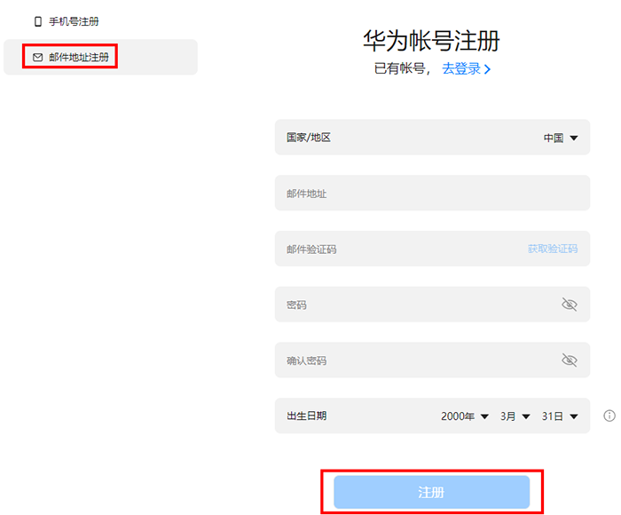
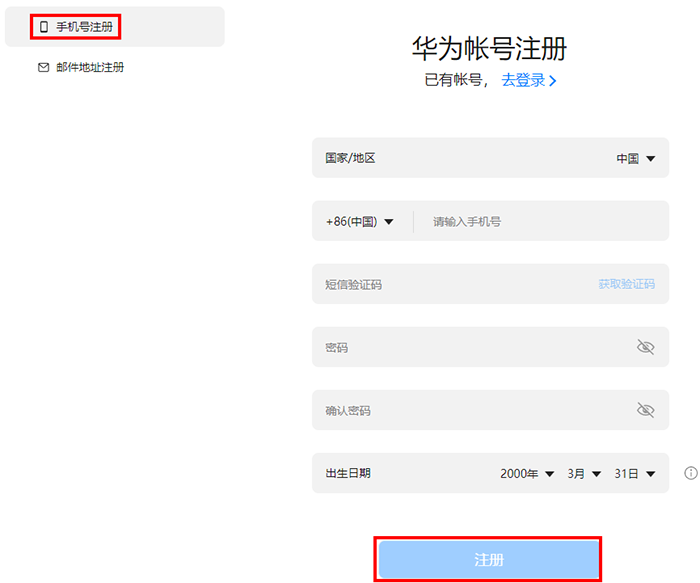
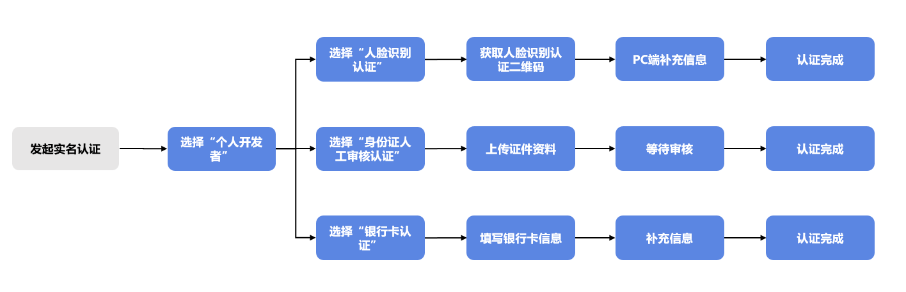
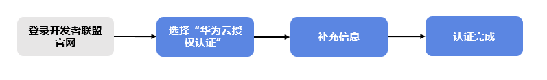
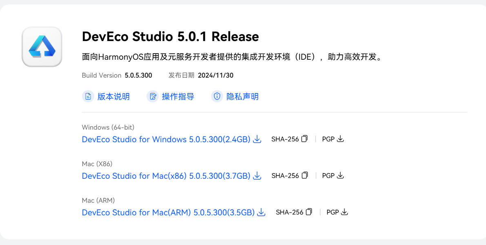
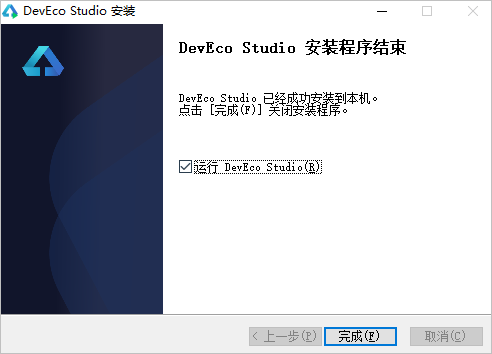

# 02-Development Environment Setup

The preparation of HarmonyOS development environment mainly consists of the following steps:

1. Register as a developer
2. Real-name authentication
3. Create application
4. Download and install development tools
5. Create new project

# Register as a Developer

On the Huawei Developer Alliance website, [register as a developer](https://developer.huawei.com/consumer/cn/doc/start/registration-and-verification-0000001053628148) and complete [real-name authentication](https://developer.huawei.com/consumer/cn/doc/start/rna-0000001062530373).

1. Open [Huawei Developer Alliance official website](https://developer.huawei.com/consumer/cn/), click "Register" to enter the registration page.

2. You can register for a Huawei Developer Alliance account using an email address or mobile phone number.

If you register with an email address, please enter the correct email address and verification code, set a password, and click "**Register**".

If you register using a mobile phone number, please enter the correct mobile phone number and verification code, set a password, and click "**Register**".

3. If you agree to the [Huawei Account and Cloud Space Privacy Statement](https://id1.cloud.huawei.com/AMW/portal/agreements/accPrivacyStatement/zh-CN_accPrivacyStatement.html) and [Huawei Account and Cloud Space User Agreement](https://id1.cloud.huawei.com/AMW/portal/agreements/userAgreement/zh-CN_userAgreement.html?version=china), click "Agree". After successful registration, the real-name authentication page will be displayed.

# Real-Name Authentication

Real-name authentication is divided into individual authentication and enterprise authentication. The differences are as follows:

Enterprise developers enjoy more services than individual developers, as detailed in the following table:

| **Developer Type**   | **Services/Benefits Enjoyed**                                                                                                                                                                                                                                       |
| :------------------- | :------------------------------------------------------------------------------------------------------------------------------------------------------------------------------------------------------------------------------------------------------------------ |
| Individual Developer | App Gallery, Themes, Product Management, Account, PUSH, New Game Reservation, Interactive Comments, Social, HUAWEI HiAI, Watch App Gallery, etc.                                                                                                                    |
| Enterprise Developer | App Gallery, Themes, First Release, Payment, Game Gift Packs, App Gallery Promotion, Product Management, Games, Account, PUSH, New Game Reservation, Interactive Comments, Social, HUAWEI HiAI, Watch App Gallery, Sports & Health, Cloud Testing, Smart Home, etc. |

## How Individual Developers Complete Real-Name Authentication

Individual developer real-name authentication is divided into four methods: personal bank card authentication, ID card manual review authentication, Huawei Cloud authorization authentication, and facial recognition authentication. The overall process for personal bank card authentication, ID card manual review authentication, and facial recognition authentication is as follows:

The overall process for Huawei Cloud authorization authentication is as follows:

- Choose facial recognition authentication method, see: [Facial Recognition Authentication](https://developer.huawei.com/consumer/cn/doc/start/facial-0000001271652446).
- Choose personal bank card authentication method, see: [Personal Bank Card Authentication](https://developer.huawei.com/consumer/cn/doc/start/ibca-0000001062388135).
- Choose manual review authentication method, see: [ID Card Manual Review Authentication](https://developer.huawei.com/consumer/cn/doc/start/micraa-0000001062276335).
- Choose Huawei Cloud authorization authentication method, see: [Huawei Cloud Authorization Authentication](https://developer.huawei.com/consumer/cn/doc/start/cloudrz-0000001200842383).

# Create Application

On [AppGallery Connect](https://developer.huawei.com/consumer/cn/service/josp/agc/index.html) (AGC), refer to [Create Project](https://developer.huawei.com/consumer/cn/doc/distribution/app/agc-help-createproject-0000001100334664) and [Create Application](https://developer.huawei.com/consumer/cn/doc/app/agc-help-createharmonyapp-0000001945392297) to complete the creation of **HarmonyOS** applications, enabling the use of various services.

One project can create multiple applications. This step is essential for later publishing and launching. If it's in the development stage, it can be omitted (development of AtomicServices also requires creating an application first).

## Create Project

1. Log in to [AppGallery Connect](https://developer.huawei.com/consumer/cn/service/josp/agc/index.html#/), click "My Projects".

2. On the project page, click "Add Project".

   

3. On the "Create Project" page, enter the project name and click "Create and Continue".

   

4. After the project is created, you will enter the "Enable Analytics Service" page. The "Enable analytics service for this project" switch is turned on by default.

   - If your created project does not need to use Huawei Analytics service, turn off "Enable analytics service for this project" and click "Done" to complete the project creation.

     

## Create Application

You can create applications and AtomicServices here.

To publish HarmonyOS applications/AtomicServices on AGC, you first need to create HarmonyOS applications/AtomicServices to generate a unique APP ID for HarmonyOS applications/AtomicServices.

1. Select **Certificates, APP ID and Profile**

   

2. In the left navigation bar, select "Certificates, APP ID and Profile > APP ID", enter the "APP ID" page, and click "New" in the upper right corner.

   

3. Enter the "Set Application Development Basic Information" page, fill in the application basic information, and click "Next" after completion.

   

# Download and Install Development Tools

[Download development tools here](https://developer.huawei.com/consumer/cn/download/)

HarmonyOS application development tool requirements:

To ensure DevEco Studio runs normally, it is recommended that the computer configuration meets the following requirements:

- Operating System: Windows 10 64-bit, Windows 11 64-bit
- Memory: 16GB and above
- Hard Disk: 100GB and above
- Resolution: 1280\*800 pixels and above

After downloading the installation package, open it directly to install.

# Create and Run

After DevEco Studio installation is complete, you can verify whether the environment setup is correct by running a Hello World project. Next, we'll introduce how to create a project that supports Phone devices as an example.

## Create a New Project

1. Open DevEco Studio, click **Create Project** on the welcome page to create a new project.

2. According to the project creation wizard, choose to create **Application** or **Atomic Service**. Select the **Empty Ability** template, then click **Next**. For introduction to project templates and supported device types, please refer to [Project Template Introduction](https://developer.huawei.com/consumer/cn/doc/harmonyos-guides-V5/ide-template-V5).

   

3. Fill in the project-related information and click **Finish**. For detailed introduction of each parameter, please refer to [Create a New Project](https://developer.huawei.com/consumer/cn/doc/harmonyos-guides-V5/ide-create-new-project-V5).

   

   After the project is created, DevEco Studio will automatically synchronize the project.

## Run Hello World

1. Connect a real device with HarmonyOS system to the computer. For specific guidance and requirements, please refer to [Run Application/AtomicService](https://developer.huawei.com/consumer/cn/doc/harmonyos-guides-V5/ide-running-app-V5).

2. Click **File** > **Project Structure...** > **Project** > **SigningConfigs** interface, check "**Support HarmonyOS**" and "**Automatically generate signature**", click "**Sign In**" as prompted by the interface, and log in with your Huawei account. After waiting for automatic signing to complete, click "**OK**". As shown below:

   

3. In the toolbar in the upper right corner of the editing window, click the  button to run. The effect is shown below:

   

Congratulations! You have successfully run your first application.

# Editor Tool Related Settings

[For settings like Chinese language and keyboard shortcuts, please refer to this article](https://blog.csdn.net/u013176440/article/details/139513030)
