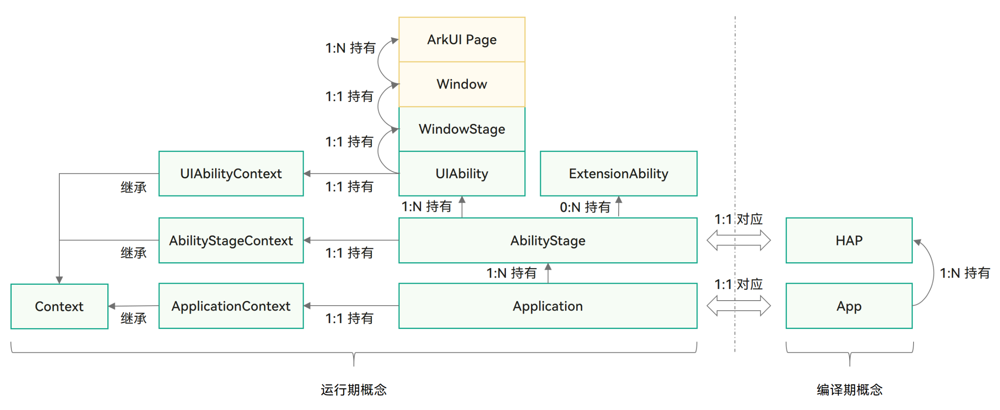

# 03-Application Model Introduction

The application model is an abstract extraction of the capabilities required by applications that HarmonyOS provides to developers. It provides essential components and operating mechanisms for applications. With the application model, developers can develop applications based on a unified model, making application development simpler and more efficient.

HarmonyOS has successively provided two application models:

- ~~**FA (Feature Ability) Model:** The model supported since HarmonyOS API 7, which is no longer actively promoted. FA model development can be found at [FA Model Development Overview](https://developer.huawei.com/consumer/cn/doc/harmonyos-guides-V5/fa-model-development-overview-V5). **The Quick Start section no longer provides development guidance for this model.**~~
- **Stage Model:** The new model added since HarmonyOS API 9, which is currently promoted and will evolve long-term. In this model, classes such as AbilityStage and WindowStage are provided as **"stages"** for application components and Window windows, hence this application model is called the Stage model. Stage model development can be found at [Stage Model Development Overview](https://developer.huawei.com/consumer/cn/doc/harmonyos-guides-V5/stage-model-development-overview-V5). **The Quick Start uses this as an example to provide development guidance.**

# Stage Model Basic Concepts

# AbilityStage

Each Entry type or Feature type [HAP](https://developer.huawei.com/consumer/cn/doc/harmonyos-guides-V5/hap-package-V5) has an AbilityStage class instance at runtime. When the code in the [HAP](https://developer.huawei.com/consumer/cn/doc/harmonyos-guides-V5/hap-package-V5) is first loaded into the process, the system creates an AbilityStage instance first.

[AbilityStage](https://developer.huawei.com/consumer/cn/doc/harmonyos-references-V5/js-apis-app-ability-abilitystage-V5) is a [Module](https://developer.huawei.com/consumer/cn/doc/harmonyos-guides-V5/application-package-structure-stage-V5)-level component container. When an application's [HAP](https://developer.huawei.com/consumer/cn/doc/harmonyos-guides-V5/hap-package-V5) is loaded for the first time, an AbilityStage instance is created, which can perform initialization operations on the Module.

AbilityStage has a one-to-one correspondence with Module, meaning one Module has one AbilityStage.

[AbilityStage](https://developer.huawei.com/consumer/cn/doc/harmonyos-references-V5/js-apis-app-ability-abilitystage-V5) has [onCreate()](https://developer.huawei.com/consumer/cn/doc/harmonyos-references-V5/js-apis-app-ability-abilitystage-V5#abilitystageoncreate) lifecycle callback and [onAcceptWant()](https://developer.huawei.com/consumer/cn/doc/harmonyos-references-V5/js-apis-app-ability-abilitystage-V5#abilitystageonacceptwant), [onConfigurationUpdated()](https://developer.huawei.com/consumer/cn/doc/harmonyos-references-V5/js-apis-app-ability-abilitystage-V5#abilitystageonconfigurationupdate), [onMemoryLevel()](https://developer.huawei.com/consumer/cn/doc/harmonyos-references-V5/js-apis-app-ability-abilitystage-V5#abilitystageonmemorylevel) event callbacks.

- onCreate() lifecycle callback: Before starting to load the first [UIAbility](https://developer.huawei.com/consumer/cn/doc/harmonyos-references-V5/js-apis-app-ability-uiability-V5) instance of the corresponding Module, an AbilityStage is created first, and its onCreate() lifecycle callback is executed after the AbilityStage creation is completed. The AbilityStage module provides notification to developers when the Module is loaded, allowing initialization of the Module (such as resource preloading, thread creation, etc.).

- onAcceptWant() event callback: Event callback triggered when UIAbility [specified instance mode (specified)](https://developer.huawei.com/consumer/cn/doc/harmonyos-guides-V5/uiability-launch-type-V5#specified启动模式) is launched. For specific usage, please refer to [UIAbility Launch Mode Overview](https://developer.huawei.com/consumer/cn/doc/harmonyos-guides-V5/uiability-launch-type-V5).

- onConfigurationUpdated() event callback: Event triggered when global system configuration changes, such as system language, dark/light mode, etc. Configuration items are currently defined in the [Configuration](https://developer.huawei.com/consumer/cn/doc/harmonyos-references-V5/js-apis-app-ability-configuration-V5) class.

- onMemoryLevel() event callback: Event triggered when the system adjusts memory.

When an application is switched to the background, the system retains the backgrounded application in cache. Even when the application is in cache, it affects overall system performance. When system resources are insufficient, the system reclaims memory from applications in various ways, and when necessary, completely stops applications to free memory for executing critical tasks. To further maintain system memory balance and avoid the system stopping user application processes, you can subscribe to system memory changes in the onMemoryLevel() lifecycle callback in AbilityStage to release unnecessary resources.

# UIAbility Component and ExtensionAbility Component

The Stage model provides two types of components: UIAbility and ExtensionAbility. Both components have specific classes to carry them and support object-oriented development approaches.

- UIAbility component is an application component that contains UI, mainly used for user interaction. For example, a gallery application can display a photo waterfall in the UIAbility component, and after the user selects a photo, display the photo's detailed content on a new page. Users can also return to the waterfall page using the back key. The UIAbility component's lifecycle only includes states such as create/destroy/foreground/background, with display-related states exposed to developers through WindowStage events.

- ExtensionAbility component is an application component oriented toward specific scenarios. Developers do not directly derive from the ExtensionAbility component but need to use derived classes of the ExtensionAbility component. Currently, ExtensionAbility components have multiple derived classes such as FormExtensionAbility for card scenarios, InputMethodExtensionAbility for input method scenarios, and WorkSchedulerExtensionAbility for idle task scenarios. These derived classes are all provided based on specific scenarios. For example, when users create application cards on the desktop, application developers need to derive from FormExtensionAbility, implement callback functions within it, and configure this capability in the configuration file. ExtensionAbility component derived class instances are created by user triggers and their lifecycles are managed by the system. In the Stage model, third-party application developers cannot develop custom services but need to implement them through derived classes of ExtensionAbility components based on their business scenarios.

# WindowStage

Each UIAbility instance is bound to a WindowStage class instance, which acts as a window manager within the application process. It contains a main window. In other words, the UIAbility instance holds a main window through WindowStage, which provides a drawing area for ArkUI.

# Context

In the Stage model, Context and its derived classes provide developers with various resources and capabilities that can be called at runtime. UIAbility components and various derived classes of ExtensionAbility components each have their own different Context classes. They all inherit from the base class Context, but each provides different capabilities according to their respective components.
