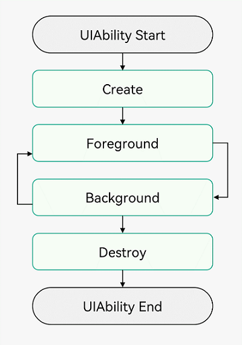

# 04-UIAbility Introduction - Lifecycle

# Introduction

UIAbility component is an application component that contains UI, mainly used for user interaction.

1. Native support for application component-level cross-device migration and multi-device collaboration.
2. Support for multi-device and multi-window forms

UIAbility component is the basic unit of system scheduling, providing windows for applications to draw interfaces. An application can contain one or more UIAbility components. For example, in a payment application, the entry function and payment/collection functions can be configured as independent UIAbilities.

Each UIAbility component instance will display a corresponding task in the recent task list. For example:


For developers, they can choose single or multiple UIAbilities based on specific scenarios. The division suggestions are as follows:

- If developers want to see one task in the task view, it is recommended to use "one UIAbility + multiple pages" approach, which can avoid unnecessary resource loading.

- If developers want to see multiple tasks in the task view, or need to open multiple windows simultaneously, it is recommended to use multiple UIAbilities to implement different functions.

  For example, in instant messaging applications, the message list and audio/video calls are developed using different UIAbilities, which not only allows convenient task window switching but also enables split-screen display of the application's two task windows on one screen.

# Declaration Configuration

To enable the application to use UIAbility normally, you need to declare UIAbility's name, entry, label, and other related information in the [abilities tag](https://developer.huawei.com/consumer/cn/doc/harmonyos-guides-V5/module-configuration-file-V5#abilities标签) of the [module.json5 configuration file](https://developer.huawei.com/consumer/cn/doc/harmonyos-guides-V5/module-configuration-file-V5).

```json
{
  "module": {
    // ...
    "abilities": [
      {
        "name": "EntryAbility", // UIAbility component name
        "srcEntry": "./ets/entryability/EntryAbility.ets", // UIAbility component code path
        "description": "$string:EntryAbility_desc", // UIAbility component description
        "icon": "$media:icon", // UIAbility component icon
        "label": "$string:EntryAbility_label", // UIAbility component label
        "startWindowIcon": "$media:icon", // UIAbility component startup page icon resource file index
        "startWindowBackground": "$color:start_window_background" // UIAbility component startup page background color resource file index
        // ...
      }
    ]
  }
}
```

# UIAbility Component Lifecycle

When users open, switch, and return to corresponding applications, [UIAbility](https://developer.huawei.com/consumer/cn/doc/harmonyos-references-V5/js-apis-app-ability-uiability-V5) instances in the application transition between different states in their lifecycle. The UIAbility class provides a series of callbacks through which you can know when a certain state of the current UIAbility instance has changed, going through the creation and destruction of UIAbility instances, or foreground and background state transitions of UIAbility instances.

The UIAbility lifecycle includes four states: Create, Foreground, Background, and Destroy, as shown in the figure below.



## Create State

The Create state is triggered when the [UIAbility](https://developer.huawei.com/consumer/cn/doc/harmonyos-references-V5/js-apis-app-ability-uiability-V5) instance creation is completed during application loading. The system calls the [onCreate()](https://developer.huawei.com/consumer/cn/doc/harmonyos-references-V5/js-apis-app-ability-uiability-V5#uiabilityoncreate) callback. Page initialization operations can be performed in this callback, such as variable definition and resource loading, for subsequent UI display.

```typescript
import { AbilityConstant, UIAbility, Want } from "@kit.AbilityKit";

export default class EntryAbility extends UIAbility {
  onCreate(want: Want, launchParam: AbilityConstant.LaunchParam): void {
    // Page initialization
  }
  // ...
}
```

## WindowStageCreate

After the [UIAbility](https://developer.huawei.com/consumer/cn/doc/harmonyos-references-V5/js-apis-app-ability-uiability-V5) instance is created and before entering Foreground, the system creates a WindowStage. After WindowStage creation is completed, it enters the [onWindowStageCreate()](https://developer.huawei.com/consumer/cn/doc/harmonyos-references-V5/js-apis-app-ability-uiability-V5#uiabilityonwindowstagecreate) callback, where UI loading and WindowStage event subscriptions can be set.

```typescript
import { UIAbility } from "@kit.AbilityKit";
import { window } from "@kit.ArkUI";
import { hilog } from "@kit.PerformanceAnalysisKit";

const TAG: string = "[EntryAbility]";
const DOMAIN_NUMBER: number = 0xff00;

export default class EntryAbility extends UIAbility {
  // ...
  onWindowStageCreate(windowStage: window.WindowStage): void {
    // Set WindowStage event subscriptions (focus/unfocus, switch to foreground/background, foreground interactive/non-interactive)
    try {
      windowStage.on("windowStageEvent", (data) => {
        let stageEventType: window.WindowStageEventType = data;
        switch (stageEventType) {
          case window.WindowStageEventType.SHOWN: // Switch to foreground
            hilog.info(DOMAIN_NUMBER, TAG, `windowStage foreground.`);
            break;
          case window.WindowStageEventType.ACTIVE: // Focus state
            hilog.info(DOMAIN_NUMBER, TAG, `windowStage active.`);
            break;
          case window.WindowStageEventType.INACTIVE: // Unfocus state
            hilog.info(DOMAIN_NUMBER, TAG, `windowStage inactive.`);
            break;
          case window.WindowStageEventType.HIDDEN: // Switch to background
            hilog.info(DOMAIN_NUMBER, TAG, `windowStage background.`);
            break;
          case window.WindowStageEventType.RESUMED: // Foreground interactive state
            hilog.info(DOMAIN_NUMBER, TAG, `windowStage resumed.`);
            break;
          case window.WindowStageEventType.PAUSED: // Foreground non-interactive state
            hilog.info(DOMAIN_NUMBER, TAG, `windowStage paused.`);
            break;
          default:
            break;
        }
      });
    } catch (exception) {
      hilog.error(
        DOMAIN_NUMBER,
        TAG,
        `Failed to enable the listener for window stage event changes. Cause: ${JSON.stringify(
          exception
        )}`
      );
    }
    hilog.info(DOMAIN_NUMBER, TAG, `%{public}s`, `Ability onWindowStageCreate`);
    // Set UI loading
    windowStage.loadContent("pages/Index", (err, data) => {
      // ...
    });
  }
}
```

## onWindowStageDestroy

Corresponding to the [onWindowStageCreate()](https://developer.huawei.com/consumer/cn/doc/harmonyos-references-V5/js-apis-app-ability-uiability-V5#uiabilityonwindowstagecreate) callback. Before the [UIAbility](https://developer.huawei.com/consumer/cn/doc/harmonyos-references-V5/js-apis-app-ability-uiability-V5) instance is destroyed, it first enters the [onWindowStageDestroy()](https://developer.huawei.com/consumer/cn/doc/harmonyos-references-V5/js-apis-app-ability-uiability-V5#uiabilityonwindowstagedestroy) callback, where UI resources can be released.

```typescript
import { UIAbility } from "@kit.AbilityKit";
import { window } from "@kit.ArkUI";

export default class EntryAbility extends UIAbility {
  windowStage: window.WindowStage | undefined = undefined;

  // ...
  onWindowStageCreate(windowStage: window.WindowStage): void {
    this.windowStage = windowStage;
    // ...
  }

  onWindowStageDestroy() {
    // Release UI resources
  }
}
```

## WindowStageWillDestroy

Corresponding to the [onWindowStageWillDestroy()](https://developer.huawei.com/consumer/cn/doc/harmonyos-references-V5/js-apis-app-ability-uiability-V5#uiabilityonwindowstagewilldestroy12) callback, executed before WindowStage is destroyed, when WindowStage can still be used.

```typescript
import { UIAbility } from "@kit.AbilityKit";
import { window } from "@kit.ArkUI";
import { BusinessError } from "@kit.BasicServicesKit";
import { hilog } from "@kit.PerformanceAnalysisKit";

const TAG: string = "[EntryAbility]";
const DOMAIN_NUMBER: number = 0xff00;

export default class EntryAbility extends UIAbility {
  windowStage: window.WindowStage | undefined = undefined;
  // ...
  onWindowStageCreate(windowStage: window.WindowStage): void {
    this.windowStage = windowStage;
    // ...
  }

  onWindowStageWillDestroy(windowStage: window.WindowStage) {
    // Release resources obtained through windowStage object
    // Unsubscribe from WindowStage event subscriptions in onWindowStageDestroy() (focus/unfocus, switch to foreground/background, foreground interactive/non-interactive)
    try {
      if (this.windowStage) {
        this.windowStage.off("windowStageEvent");
      }
    } catch (err) {
      let code = (err as BusinessError).code;
      let message = (err as BusinessError).message;
      hilog.error(
        DOMAIN_NUMBER,
        TAG,
        `Failed to disable the listener for windowStageEvent. Code is ${code}, message is ${message}`
      );
    }
  }

  onWindowStageDestroy() {
    // Release UI resources
  }
}
```

## Foreground and Background

Foreground and Background states are triggered when [UIAbility](https://developer.huawei.com/consumer/cn/doc/harmonyos-references-V5/js-apis-app-ability-uiability-V5) instances switch to foreground and background respectively, corresponding to [onForeground()](https://developer.huawei.com/consumer/cn/doc/harmonyos-references-V5/js-apis-app-ability-uiability-V5#uiabilityonforeground) and [onBackground()](https://developer.huawei.com/consumer/cn/doc/harmonyos-references-V5/js-apis-app-ability-uiability-V5#uiabilityonbackground) callbacks.

The onForeground() callback is triggered before the UIAbility's UI becomes visible, such as when UIAbility switches to foreground. You can request system-required resources in the onForeground() callback, or re-request resources that were released in onBackground().

The onBackground() callback is triggered after the UIAbility's UI becomes completely invisible, such as when UIAbility switches to background. You can release resources that are useless when UI is invisible in the onBackground() callback, or perform time-consuming operations such as state saving in this callback.

For example, when an application needs to use user location during use, assuming the application has obtained user location permission authorization. Before UI display, you can enable location function in the onForeground() callback to obtain current location information.

When the application switches to background state, you can stop location function in the onBackground() callback to save system resource consumption.

```typescript
import { UIAbility } from "@kit.AbilityKit";

export default class EntryAbility extends UIAbility {
  // ...

  onForeground(): void {
    // Request system-required resources, or re-request resources released in onBackground()
  }

  onBackground(): void {
    // Release resources useless when UI is invisible, or perform time-consuming operations in this callback
    // Such as state saving, etc.
  }
}
```

## onNewWant

When the application's UIAbility instance has been created and the UIAbility is configured as [singleton](https://developer.huawei.com/consumer/cn/doc/harmonyos-guides-V5/uiability-launch-type-V5#singleton启动模式) launch mode, calling the [startAbility()](https://developer.huawei.com/consumer/cn/doc/harmonyos-references-V5/js-apis-inner-application-uiabilitycontext-V5#uiabilitycontextstartability) method again to start that UIAbility instance will only enter the [onNewWant()](https://developer.huawei.com/consumer/cn/doc/harmonyos-references-V5/js-apis-app-ability-uiability-V5#uiabilityonnewwant) callback of that UIAbility, without entering its [onCreate()](https://developer.huawei.com/consumer/cn/doc/harmonyos-references-V5/js-apis-app-ability-uiability-V5#uiabilityoncreate) and [onWindowStageCreate()](https://developer.huawei.com/consumer/cn/doc/harmonyos-references-V5/js-apis-app-ability-uiability-V5#uiabilityonwindowstagecreate) lifecycle callbacks. The application can update resources and data to be loaded in this callback for subsequent UI display.

```typescript
import { AbilityConstant, UIAbility, Want } from "@kit.AbilityKit";

export default class EntryAbility extends UIAbility {
  // ...

  onNewWant(want: Want, launchParam: AbilityConstant.LaunchParam) {
    // Update resources and data
  }
}
```

## Destroy

The Destroy state is triggered when the [UIAbility](https://developer.huawei.com/consumer/cn/doc/harmonyos-references-V5/js-apis-app-ability-uiability-V5) instance is destroyed. System resource release, data saving, and other operations can be performed in the onDestroy() callback.

For example, calling the [terminateSelf()](https://developer.huawei.com/consumer/cn/doc/harmonyos-references-V5/js-apis-inner-application-uiabilitycontext-V5#uiabilitycontextterminateself) method to stop the current UIAbility instance executes the onDestroy() callback and completes the destruction of the UIAbility instance.

```typescript
import { UIAbility } from "@kit.AbilityKit";

export default class EntryAbility extends UIAbility {
  // ...

  onDestroy() {
    // System resource release, data saving, etc.
  }
}
```
