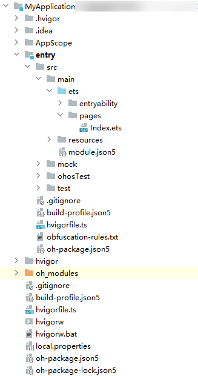
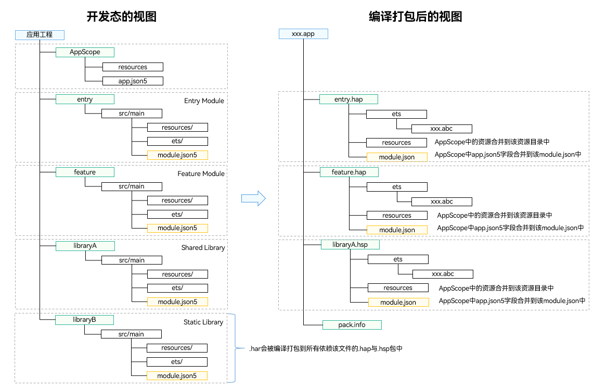
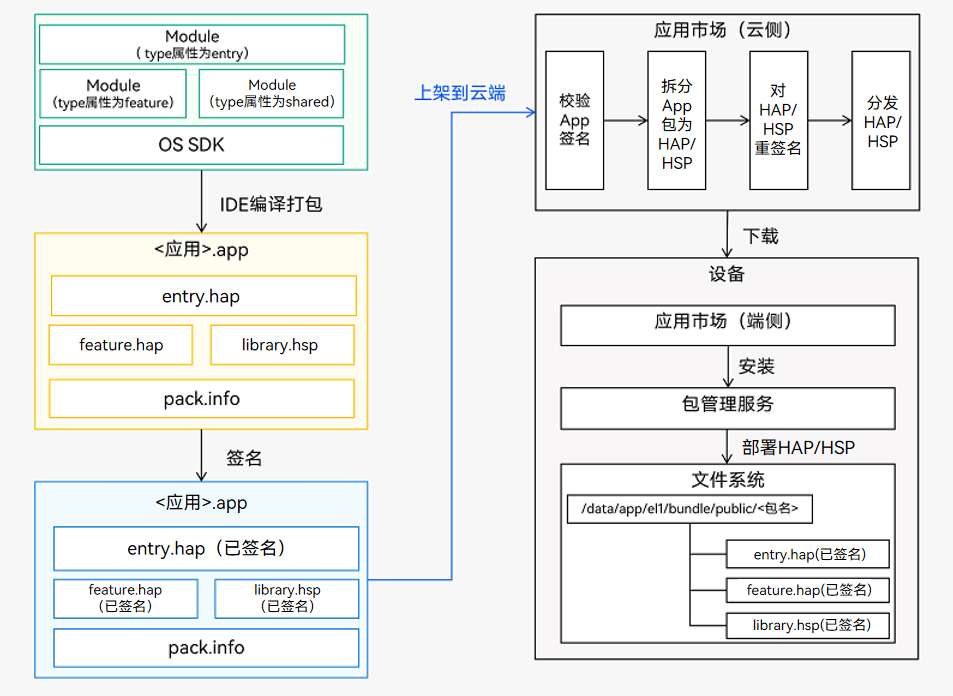

# 05-Stage Model Application Package Introduction

Based on the classification of application packages in different states, we introduce the application structure in three states: **development state**, **compilation state**, and **release state**.

# Development State Package

The development state package is the source code form of the project.

> The project structure mainly includes the following file types and their purposes:
>
> Note
>
> - The AppScope directory is automatically generated by DevEco Studio and cannot be changed.
> - Module directory names can be automatically generated by DevEco Studio (such as entry, library, etc.) or customized. For ease of explanation, the table below uses Module_name uniformly.

| File Type                 | Description                                                                                                                                                                                                                                                                                                                                                                                                                                                                                                                                                                                                                                                                                                                                                                                                                                                                                                       |
| :------------------------ | :---------------------------------------------------------------------------------------------------------------------------------------------------------------------------------------------------------------------------------------------------------------------------------------------------------------------------------------------------------------------------------------------------------------------------------------------------------------------------------------------------------------------------------------------------------------------------------------------------------------------------------------------------------------------------------------------------------------------------------------------------------------------------------------------------------------------------------------------------------------------------------------------------------------- |
| Configuration Files       | Including application-level and Module-level configuration information: - **AppScope > app.json5**: [app.json5 configuration file](https://developer.huawei.com/consumer/cn/doc/harmonyos-guides-V5/app-configuration-file-V5), used to declare global application configuration information such as application Bundle name, application name, application icon, application version number, etc. - **Module_name > src > main > module.json5**: [module.json5 configuration file](https://developer.huawei.com/consumer/cn/doc/harmonyos-guides-V5/module-configuration-file-V5), used to declare Module basic information, supported device types, contained component information, permissions required for operation, etc.                                                                                                                                                                           |
| ArkTS Source Files        | **Module_name > src > main > ets**: Used to store Module's ArkTS source files (.ets files).                                                                                                                                                                                                                                                                                                                                                                                                                                                                                                                                                                                                                                                                                                                                                                                                                       |
| Resource Files            | Including application-level and Module-level resource files, supporting graphics, multimedia, strings, layout files, etc. See [Resource Categories and Access](https://developer.huawei.com/consumer/cn/doc/harmonyos-guides-V5/resource-categories-and-access-V5). - **AppScope > resources**: Used to store resource files needed by the application. - **Module_name > src > main > resources**: Used to store resource files needed by this Module.                                                                                                                                                                                                                                                                                                                                                                                                                                                   |
| Other Configuration Files | Used for compilation and building, including build configuration files, compilation build task scripts, obfuscation rule files, shared package dependency information, etc. - **build-profile.json5**: Project-level or Module-level build configuration file, including application signing, product configuration, etc. - **hvigorfile.ts**: Application-level or Module-level compilation build task script. Developers can customize compilation build tool versions and configuration parameters that control build behavior. - **obfuscation-rules.txt**: Obfuscation rule file. When obfuscation is enabled, code undergoes compilation, obfuscation, and compression processing during Release mode compilation to protect code assets. - **oh-package.json5**: Used to store dependency library information, including third-party libraries and shared packages that are depended upon. |

# Compilation State Package

> Just understand for now

Different types of Modules generate corresponding **HAP**, **HAR**, **HSP** (_will be introduced later_) files after compilation. The correspondence between development state view and compilation state view is as follows:

From development state to compilation state, files in Module undergo the following changes:

- **ets directory**: ArkTS source code is compiled to generate .abc files.
- **resources directory**: Resource files under the AppScope directory are merged into the resource directory under Module. If files with the same name exist in both directories, only the resource files under the AppScope directory will be retained after compilation and packaging.
- **module configuration file**: Fields from the app.json5 file under the AppScope directory are merged into the module.json5 file under Module, and the final module.json file for HAP or HSP is generated after compilation.

# Release State Package

Each application contains at least one .hap file, may contain several .hsp files or none. All .hap and .hsp files in an application together are called a **Bundle**, and its corresponding bundleName is the unique identifier of the application (see the bundleName tag in [app.json5 configuration file](https://developer.huawei.com/consumer/cn/doc/harmonyos-guides-V5/app-configuration-file-V5)).

When an application is published and listed on the app market, the Bundle needs to be packaged into a file with .app suffix for listing. This .app file is called **App Pack** (Application Package). Meanwhile, DevEco Studio automatically generates a **pack.info** file. The **pack.info** file describes the attributes of each HAP and HSP in the App Pack, containing bundleName and versionCode information from the APP, as well as name, type, and abilities information from Modules.

> Note
>
> - App Pack is the basic unit for publishing and listing on app markets, but cannot be directly installed and run on devices.
> - During application signing, cloud distribution, and device-side installation, HAP/HSP are the units for signing, distribution, and installation.

# HAP, HAR, HSP

A summary comparison of the functions and usage scenarios of HAP, HAR, and HSP:

| Module Type    | Package Type                                                                           | Description                                                                                                                                                                                                                                                                                                                                                                                                                                                                                                                                                                                                                                                                                                                                                                                                                                                          |
| :------------- | :------------------------------------------------------------------------------------- | :------------------------------------------------------------------------------------------------------------------------------------------------------------------------------------------------------------------------------------------------------------------------------------------------------------------------------------------------------------------------------------------------------------------------------------------------------------------------------------------------------------------------------------------------------------------------------------------------------------------------------------------------------------------------------------------------------------------------------------------------------------------------------------------------------------------------------------------------------------------- |
| Ability        | [HAP](https://developer.huawei.com/consumer/cn/doc/harmonyos-guides-V5/hap-package-V5) | Application functional module that can be independently installed and run. Must include one entry type HAP, optionally include one or more feature type HAPs.                                                                                                                                                                                                                                                                                                                                                                                                                                                                                                                                                                                                                                                                                                        |
| Static Library | [HAR](https://developer.huawei.com/consumer/cn/doc/harmonyos-guides-V5/har-package-V5) | Static shared package, compile-time reuse. - Supports intra-application sharing and can be published for use by other applications. - As a second-party library, published to [OHPM private repository](https://developer.huawei.com/consumer/cn/doc/harmonyos-guides-V5/ide-ohpm-repo-V5) for use by other applications within the company. - As a third-party library, published to [OHPM central repository](https://ohpm.openharmony.cn/) for use by other applications. - When multiple packages (HAP/HSP) reference the same HAR, it causes duplicate copying of code and resources between packages, leading to application package bloat. - Note: When [compiling HAR](https://developer.huawei.com/consumer/cn/doc/harmonyos-guides-V5/har-package-V5#编译), it is recommended to enable obfuscation capability to protect code assets. |
| Shared Library | [HSP](https://developer.huawei.com/consumer/cn/doc/harmonyos-guides-V5/in-app-hsp-V5)  | Dynamic shared package, runtime reuse. - When multiple packages (HAP/HSP) simultaneously reference the same shared package, using HSP instead of HAR can avoid duplicate copying of code and resources caused by HAR, thus reducing application package size.                                                                                                                                                                                                                                                                                                                                                                                                                                                                                                                                                                                                    |

Comparison of specifications supported by HAP, HSP, and HAR, where "√" means yes and "×" means no.

Developers can choose the appropriate package type for development based on the capabilities required by actual scenarios. Subsequent chapters will provide detailed introductions on how to use [HAP](https://developer.huawei.com/consumer/cn/doc/harmonyos-guides-V5/hap-package-V5), [HAR](https://developer.huawei.com/consumer/cn/doc/harmonyos-guides-V5/har-package-V5), and [HSP](https://developer.huawei.com/consumer/cn/doc/harmonyos-guides-V5/in-app-hsp-V5).

| Specification                                                                                                                                                                                                                                                                | HAP | HAR | HSP |
| :--------------------------------------------------------------------------------------------------------------------------------------------------------------------------------------------------------------------------------------------------------------------------- | :-- | :-- | :-- |
| Support declaring [UIAbility](https://developer.huawei.com/consumer/cn/doc/harmonyos-guides-V5/uiability-overview-V5) and [ExtensionAbility](https://developer.huawei.com/consumer/cn/doc/harmonyos-guides-V5/extensionability-overview-V5) components in configuration file | √   | ×   | ×   |
| Support declaring [pages](https://developer.huawei.com/consumer/cn/doc/harmonyos-guides-V5/module-configuration-file-V5#pages标签) in configuration file                                                                                                                     | √   | ×   | √   |
| Support containing resource files and .so files                                                                                                                                                                                                                              | √   | √   | √   |
| Support depending on other HAR files                                                                                                                                                                                                                                         | √   | √   | √   |
| Support depending on other HSP files                                                                                                                                                                                                                                         | √   | √   | √   |
| Support independent installation and running on devices                                                                                                                                                                                                                      | √   | ×   | ×   |

> Note
>
> - Although HAR does not support declaring pages in configuration files, it can contain pages and navigate through [named routing](https://developer.huawei.com/consumer/cn/doc/harmonyos-guides-V5/arkts-routing-V5#命名路由).
> - Since HSP only supports intra-application sharing, if HAR depends on HSP, the HAR file only supports intra-application sharing and does not support publishing to second-party or third-party repositories for use by other applications, otherwise compilation will fail.
> - Both HAR and HSP do not support circular dependencies or dependency transitivity.
