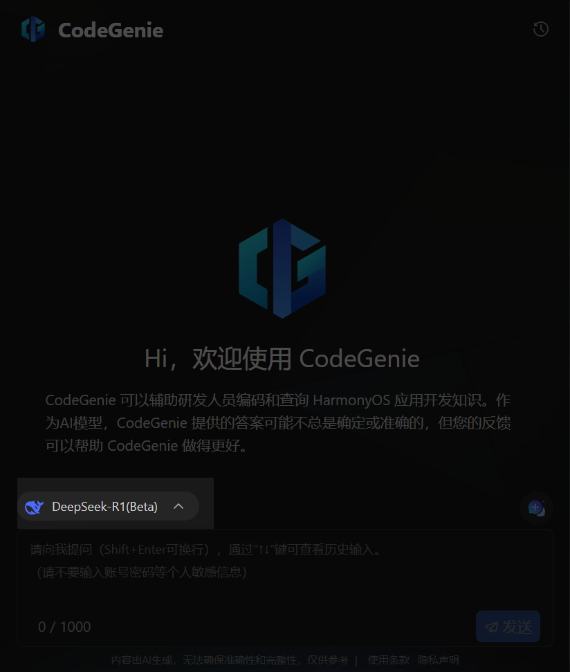
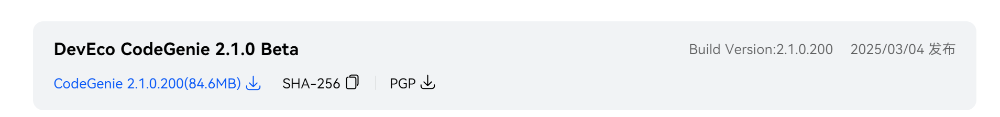

# Great News: DevEco Studio Officially Integrates DeepSeek

**Great news!** The latest version of DevEco Studio's AI tool CodeGenie has integrated DeepSeek. With the rapid development of various AI tools, CodeGenie's DeepSeek integration can be said to have been long overdue.

## Effect Overview

Let's first take a look at the integration effect:



Next, let's see how to integrate it!

## Required Software Versions

1. **DevEco Studio**


2. **CodeGenie**

   

Download addresses can be obtained from the official website:

1. **DevEco Studio**

   ```
   https://developer.huawei.com/consumer/cn/download/deveco-studio
   ```

   

2. **CodeGenie**

   ```
   https://developer.huawei.com/consumer/cn/download/deveco-codegenie
   ```

   

## CodeGenie Installation Steps

1. Download the **CodeGenie** plugin, _do not extract_

   

2. Install in **DevEco Studio**

   > File -> Settings -> Plugins -> Settings -> Install Plugin from Disk, then restart

   

## CodeGenie Practical Features

**CodeGenie** currently provides the following main features:

1. **Intelligent Q&A _DeepSeek_**
2. **Editor AI Code Suggestions**
3. **Compilation Error Intelligent Analysis**
4. Universal Card Generation

### Intelligent Q&A DeepSeek

After reopening **DevEco Studio**, click **CodeGenie** in the sidebar, log in with your Huawei account, and you can start using **CodeGenie** to call DeepSeek.


Then you can conduct intelligent Q&A.

Question: What are the common state decorators in HarmonyOS application development?

Answer:


### Editor AI Code Suggestions

The current **CodeGenie** also supports AI code suggestions within the editor.

By default, developers can manually trigger code generation using hotkeys Alt+X or Alt+C at any position in code files, or enable "snippet generation" or "inline generation" options in settings for AI to automatically continue writing based on code context.

**Alt+X**


**Code Generation Configuration**


### Compilation Error Intelligent Analysis

During development, if the program has compilation errors, you can quickly call AI capabilities for error analysis.

Example: Change API version from 14 to 22 _22 is an incorrect version_


**Execute Compilation**


You can see that **CodeGenie** starts thinking and analyzing the error, then provides an answer:


### Universal Card Generation

Universal card generation is a regular feature of **CodeGenie**.


Switch to the universal card option, refer to the following prompt words, and you can generate universal card code.

| **No.** | **Suggested Description Dimension** | **Description**                                                                                                                                                                                                                                                    | **Example**                                                                                                       |
| ------- | ----------------------------------- | ------------------------------------------------------------------------------------------------------------------------------------------------------------------------------------------------------------------------------------------------------------------ | ----------------------------------------------------------------------------------------------------------------- |
| 1       | Card Purpose                        | Card purpose/business scenario, such as e-commerce shopping, entertainment, lifestyle services, etc.                                                                                                                                                               | For example, "e-commerce shopping card", "entertainment card".                                                    |
| 2       | Card Functions                      | Components included in the card, such as icons, titles, buttons, etc.; component status information, such as icon themes, title content, button display text, etc.                                                                                                 | For example, "new product launch main title", "product search button", "popular movie sub-section entrance", etc. |
| 3       | Card Size                           | Four card sizes provided by HarmonyOS official website: 1*2 (micro card), 2*2 (small card), 2*4 (medium card), 4*4 (large card); card size is optional, AI will intelligently select the best size based on the information described in the first two dimensions. | For example, "2\*2 size card", "medium card", etc.                                                                |

## Summary

With the official integration of **DeepSeek**, **DevEco Studio's** **CodeGenie** tool has achieved a leap upgrade from "code assistant" to "intelligent partner for the entire development process". Whether it's quickly solving technical problems through **intelligent Q&A**, improving coding efficiency with **AI code suggestions**, or precisely locating problems using **compilation error analysis**, this series of features significantly lowers the barrier to HarmonyOS application development, allowing developers to focus more on innovation and business logic implementation. Features like **universal card generation** further demonstrate the practical value of AI in vertical scenarios, providing efficient solutions for the diverse development needs of the HarmonyOS ecosystem. This update is not only an important breakthrough for Huawei in the developer tools field, but also foreshadows the unlimited potential of deep integration between AI and IDEs.

It is recommended that developers upgrade to the latest version as soon as possible to experience the synergistic efficiency of **CodeGenie + DeepSeek** and unlock a smarter, smoother development experience. In the future, with the continuous iteration of AI technology, we believe the HarmonyOS ecosystem will usher in more powerful development tool support, empowering more innovative applications to land.

**Take Action Now**:

- Download DevEco Studio: [Official Link](https://developer.huawei.com/consumer/cn/download/deveco-studio)
- Get CodeGenie Plugin: [Plugin Address](https://developer.huawei.com/consumer/cn/download/deveco-codegenie)

Let AI give wings to your code and start a new era of efficient development! 🚀
