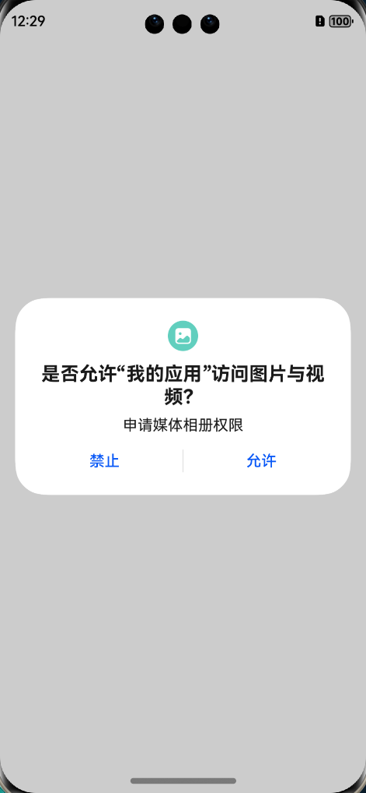
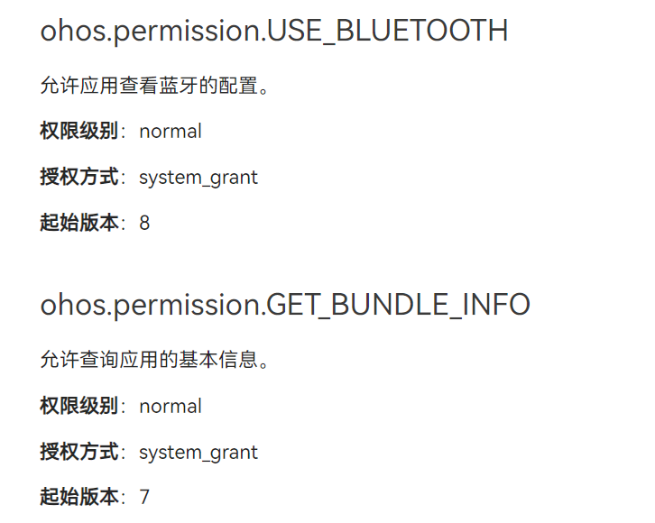
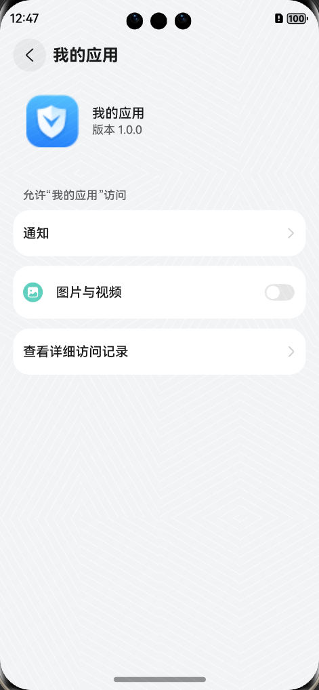
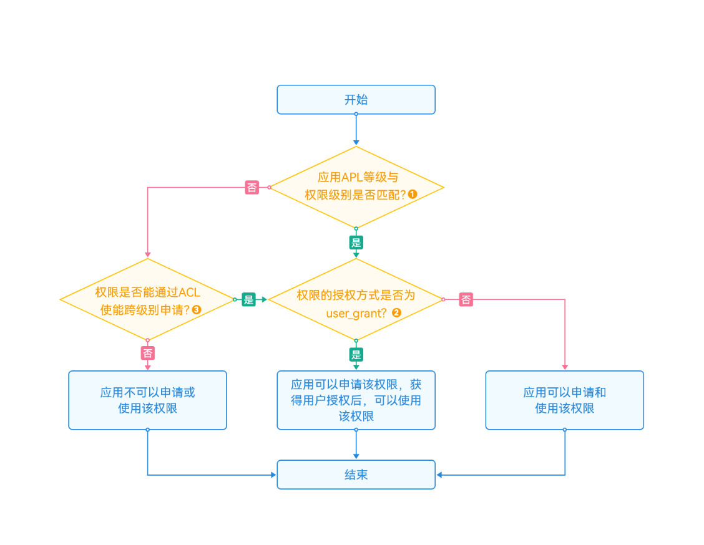
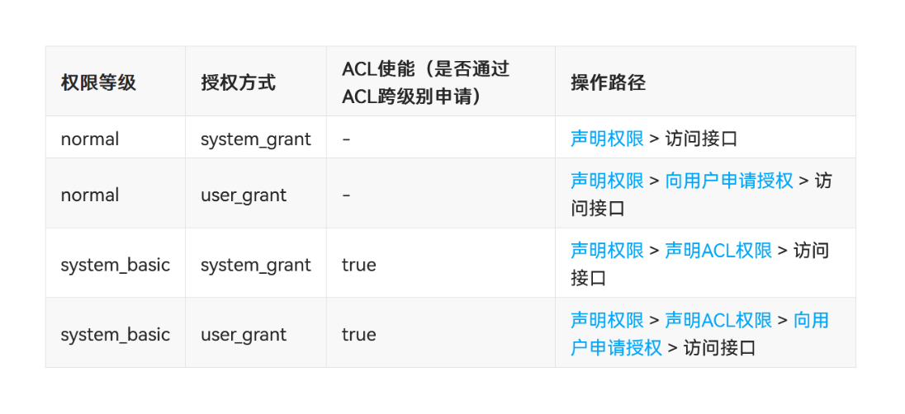
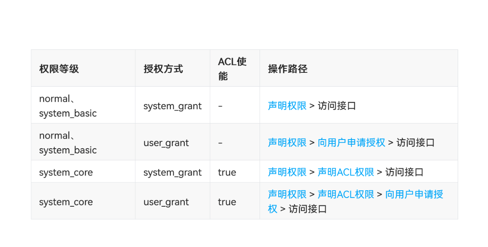
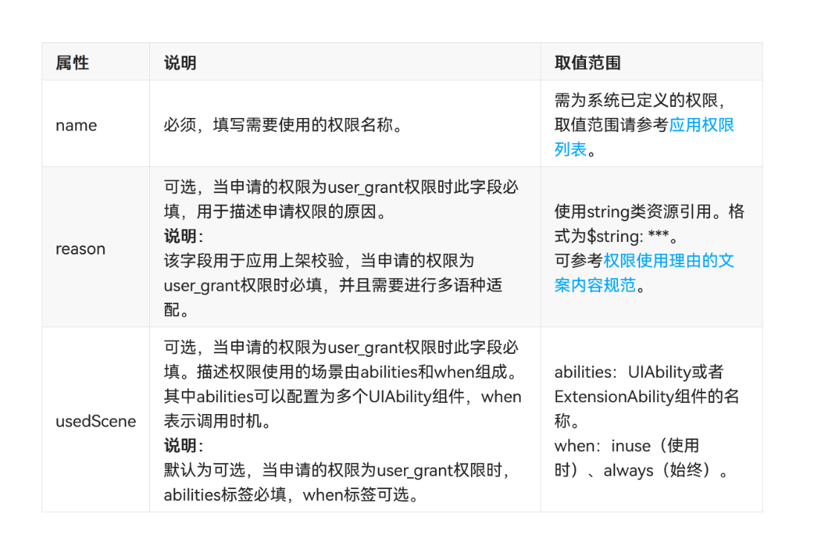
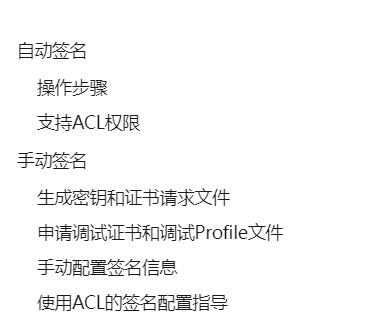
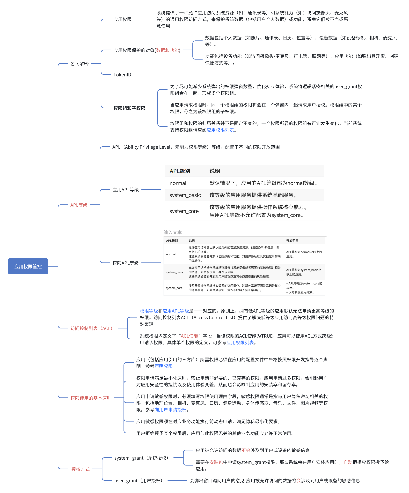
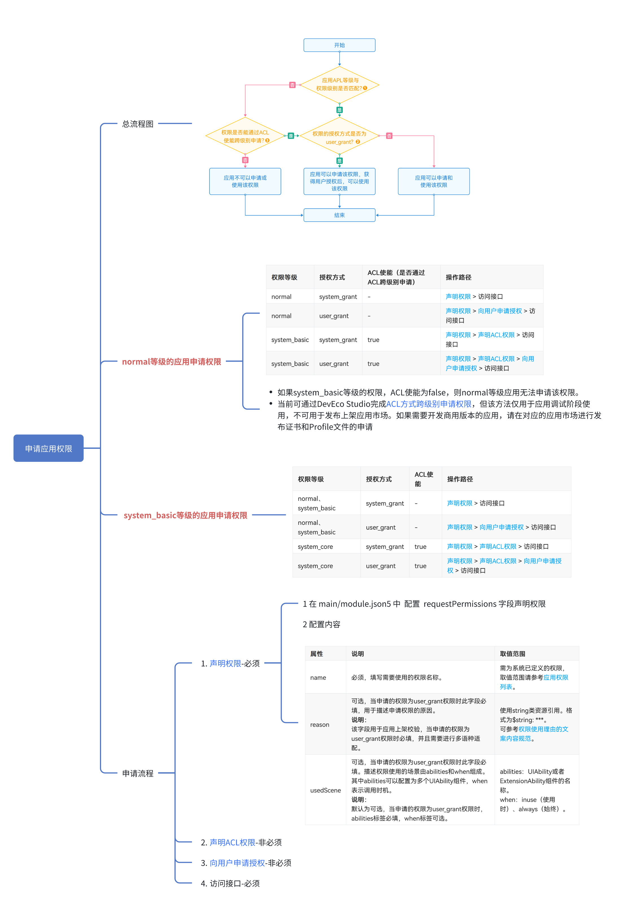

# High-Quality HarmonyOS Permission Management Process

In the development process of **HarmonyOS** applications, it often involves the mobilization and access of **sensitive data** and **hardware resources**. The invocation of this part involves the knowledge and content of managing and controlling this part. We need to understand it in order to improve efficiency and avoid pitfalls in application development.

## What Does Permission Management Control

Permission management mainly controls **data** and **functionality**.

- Data includes personal data (such as photos, contacts, calendar, location, etc.) and device data (such as device identification, camera, microphone, etc.).
- Functionality includes device functions (such as accessing camera/microphone, making phone calls, networking, etc.) and application functions (such as popping up floating windows, creating shortcuts, etc.).

## Permission Groups and Sub-permissions

Let's first look at what sub-permissions are. For example, for media album functionality operations, reading album content is one permission, and writing content to the album is another permission. They belong to sub-permissions within the larger media album permission. When our application applies for read and write permissions for media albums, considering user experience, these two permissions are actually merged into one popup window to ask users for permission. If the user allows it, it's equivalent to obtaining both read and write permissions for media albums. In summary:

- Reading media album is a sub-permission, writing to media album is a sub-permission
- Together they form one permission group.



## Permission Groups and Sub-permissions Overview

> [Link](https://docs.openharmony.cn/pages/v4.1/zh-cn/application-dev/security/AccessToken/app-permission-group-list.md)

```ts
Location Information
ohos.permission.LOCATION_IN_BACKGROUND

ohos.permission.LOCATION

ohos.permission.APPROXIMATELY_LOCATION

Camera
ohos.permission.CAMERA
Microphone
ohos.permission.MICROPHONE
Contacts
ohos.permission.READ_CONTACTS

ohos.permission.WRITE_CONTACTS

Calendar
ohos.permission.READ_CALENDAR

ohos.permission.WRITE_CALENDAR

ohos.permission.READ_WHOLE_CALENDAR

ohos.permission.WRITE_WHOLE_CALENDAR

Fitness and Exercise
ohos.permission.ACTIVITY_MOTION
Body Sensors
ohos.permission.READ_HEALTH_DATA
Images and Videos
ohos.permission.WRITE_IMAGEVIDEO

ohos.permission.READ_IMAGEVIDEO

ohos.permission.MEDIA_LOCATION

Music and Audio
ohos.permission.WRITE_AUDIO

ohos.permission.READ_AUDIO

Files
ohos.permission.READ_DOCUMENT

ohos.permission.WRITE_DOCUMENT

ohos.permission.READ_MEDIA

ohos.permission.WRITE_MEDIA

Ad Tracking
ohos.permission.APP_TRACKING_CONSENT
Read Installed Application List
ohos.permission.GET_INSTALLED_BUNDLE_LIST
Multi-device Collaboration
ohos.permission.DISTRIBUTED_DATASYNC
Bluetooth
ohos.permission.ACCESS_BLUETOOTH
Phone
ohos.permission.ANSWER_CALL

ohos.permission.MANAGE_VOICEMAIL

Call Records
ohos.permission.READ_CALL_LOG

ohos.permission.WRITE_CALL_LOG

Messages
ohos.permission.READ_CELL_MESSAGES

ohos.permission.READ_MESSAGES

ohos.permission.RECEIVE_MMS

ohos.permission.RECEIVE_SMS

ohos.permission.RECEIVE_WAP_MESSAGES

ohos.permission.SEND_MESSAGES

Clipboard
ohos.permission.READ_PASTEBOARD
Folders
ohos.permission.READ_WRITE_DOWNLOAD_DIRECTORY

ohos.permission.READ_WRITE_DESKTOP_DIRECTORY

ohos.permission.READ_WRITE_DOCUMENTS_DIRECTORY
```

## APL Levels

APL (Ability Privilege Level) levels are divided into two categories. One is **Application APL levels** and the other is **Permission APL levels**. In plain language, it's the relationship between military ranks and their corresponding permissions.

### Application APL Levels

Application APL levels are divided into three levels:

| APL Level    | Description                                                                                                                                  |
| :----------- | :------------------------------------------------------------------------------------------------------------------------------------------- |
| normal       | By default, all applications have normal APL level.                                                                                          |
| system_basic | Applications at this level provide system basic services.                                                                                    |
| system_core  | Applications at this level provide operating system core capabilities. Application APL level is not allowed to be configured as system_core. |

### Permission APL Levels

Permission APL levels are also divided into three levels:

| APL Level    | Description                                                                                                                                                                                                                                                                                   | Scope of Access                                                                |
| :----------- | :-------------------------------------------------------------------------------------------------------------------------------------------------------------------------------------------------------------------------------------------------------------------------------------------- | :----------------------------------------------------------------------------- |
| normal       | Allows applications to access ordinary system resources beyond default rules, such as configuring Wi-Fi information, calling camera for shooting, etc. The opening of these system resources (including data and functionality) poses low risk to user privacy and other applications.        | Applications with APL level normal and above.                                  |
| system_basic | Allows applications to access resources related to operating system basic services (basic functions provided or preset by the system), such as system settings, identity authentication, etc. The opening of these system resources poses higher risk to user privacy and other applications. | Applications with APL level system_basic and above.                            |
| system_core  | Involves opening access operations to operating system core resources. These system resources are the most core underlying services of the system. If damaged, the operating system will not function normally.                                                                               | - Applications with APL level system_core. - Only open to system applications. |

## Access Control List (ACL)

**Permission levels** correspond one-to-one with application APL levels. In principle, applications with low APL levels cannot apply for higher-level permissions by default. The Access Control List **ACL (Access Control List)** provides a special channel to solve the problem of low-level applications accessing high-level permissions. We can understand ACL as **allowing ordinary citizens to have certain military officer capabilities, such as commanding troops**.

It should be noted that not all permissions can be obtained by cross-level applications through applying for ACL. Which specific permissions can be applied for cross-level use is clearly marked in **HarmonyOS**. For example: [Link](https://docs.openharmony.cn/pages/v4.1/zh-cn/application-dev/security/AccessToken/permissions-for-all.md#systemgrant%E7%B3%BB%E7%BB%9F%E6%8E%88%E6%9D%83%E6%9D%83%E9%99%90%E5%88%97%E8%A1%A8)



## Authorization Methods

Regardless of the method used to apply for permissions, there are ultimately two types from the user experience perspective: system_grant (system authorization) and user_grant (user authorization).

1. system_grant (System Authorization)

   - Applications are allowed to access data that does not involve sensitive information of users or devices
   - When applying for system_grant permissions in the installation package, the system will **automatically grant the corresponding permissions to the application** when users install the application.

2. user_grant (User Authorization)

   - **A popup window will appear asking for user's opinion** - Applications are allowed to access data that involves sensitive information of users or devices

   - It should be noted that if users have previously denied authorization, permissions can only be opened manually by guiding users to the system settings page

   

## Application Permission Request Process

A picture is worth a thousand words

### Overall Flow Chart



---

### normal Level Application Permission Request



### system_basic Level Application Permission Request



## Application Permission Request Operation Steps

### 1. Declare Permissions - Required

1. Configure the **requestPermissions** field in **main/module.json5** to declare permissions

2. Configuration content

   

### 2. Declare ACL Permissions - Optional

> [Reference Link](https://developer.huawei.com/consumer/cn/doc/harmonyos-guides/ide-signing-0000001587684945)



### 3. Request Authorization from Users - Optional

If the permission type you're applying for is **system_grant (system authorization)**, you can skip this step. If the permission type you're applying for is **user_grant (user authorization)**, you need to actively request permissions, and a dialog box will pop up for users. For example:

```ts
import abilityAccessCtrl, {
  Context,
  PermissionRequestResult,
} from "@ohos.abilityAccessCtrl";
import { BusinessError } from "@ohos.base";
import common from "@ohos.app.ability.common";

let atManager: abilityAccessCtrl.AtManager =
  abilityAccessCtrl.createAtManager();
let context: Context = getContext(this) as common.UIAbilityContext;
// Request camera permission
atManager
  .requestPermissionsFromUser(context, ["ohos.permission.CAMERA"])
  .then((data: PermissionRequestResult) => {
    console.info("data:" + JSON.stringify(data));
    console.info("data permissions:" + data.permissions);
    console.info("data authResults:" + data.authResults);
  })
  .catch((err: BusinessError) => {
    console.info("data:" + JSON.stringify(err));
  });
```

---

_This image is for demonstration only and does not correspond one-to-one with the specific effects of the above code_


### 4. Access Interface - Required

At this point, you can directly call related interfaces to implement business functionality

### 5. Secondary Permission Request When Users Deny

For the above popup, if users click **Deny**, we can popup again to ask users, such as "Cannot continue using functionality without granting permission", "Deny", "Allow".

At this point, if users click Allow:

1. Use [requestPermissionOnSetting](https://developer.huawei.com/consumer/cn/doc/harmonyos-references-V5/js-apis-abilityaccessctrl-V5#requestpermissiononsetting12) to directly popup within the application to request authorization

2. Use [startAbility](https://developer.huawei.com/consumer/cn/doc/harmonyos-references-V5/js-apis-inner-application-uiabilitycontext-V5#uiabilitycontextstartability) to jump to the system permission settings page and re-authorize permissions

   ```typescript
   let want: Want = {
     bundleName: "com.huawei.hmos.settings",
     abilityName: "com.huawei.hmos.settings.MainAbility",
     uri: "application_info_entry",
   };
   const ctx = getContext(this) as common.UIAbilityContext;
   ctx.startAbility(want);
   ```

## Mind Maps for the Above Process



---


