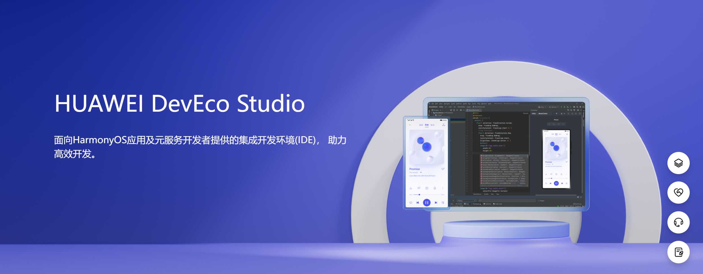
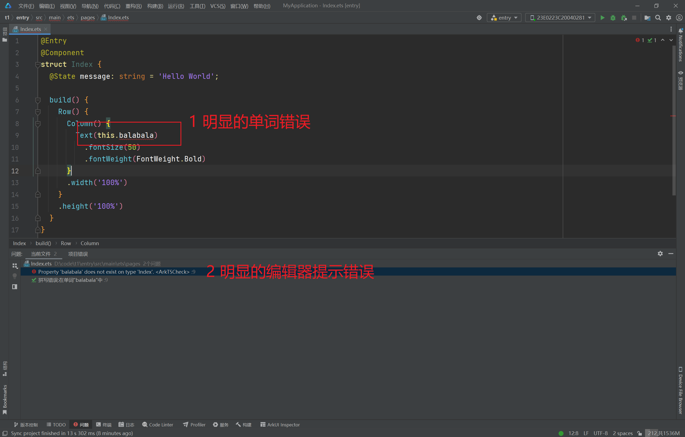
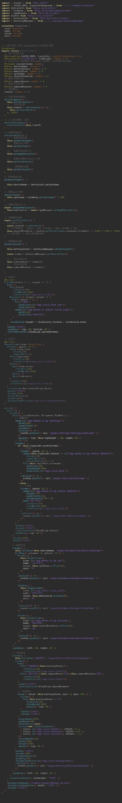
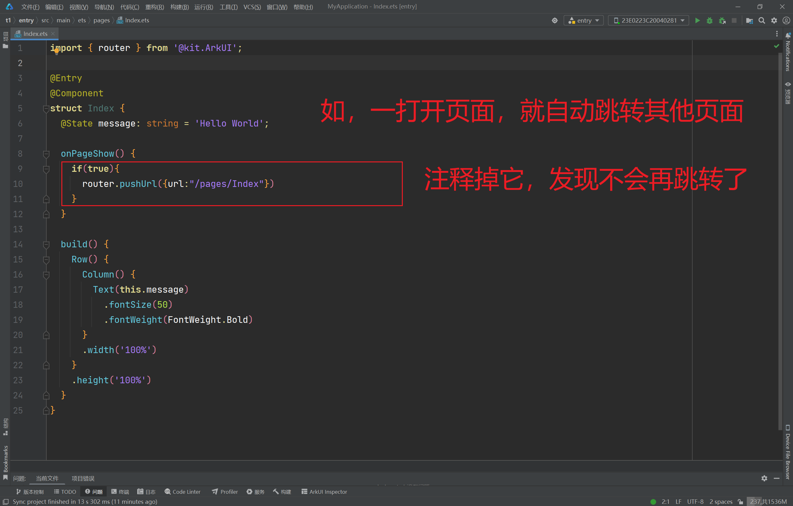
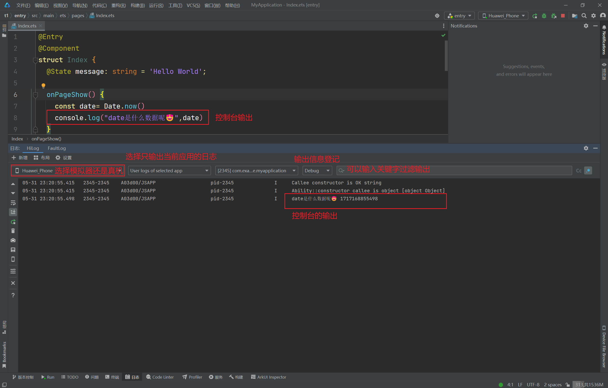
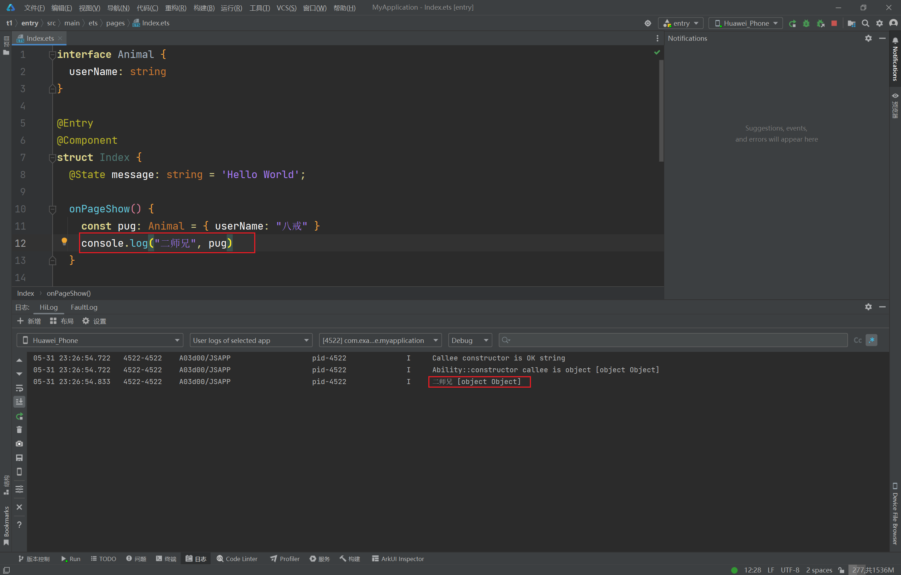
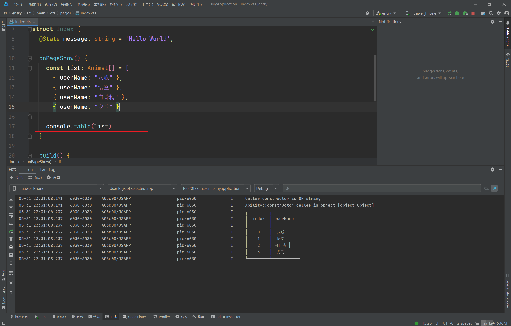
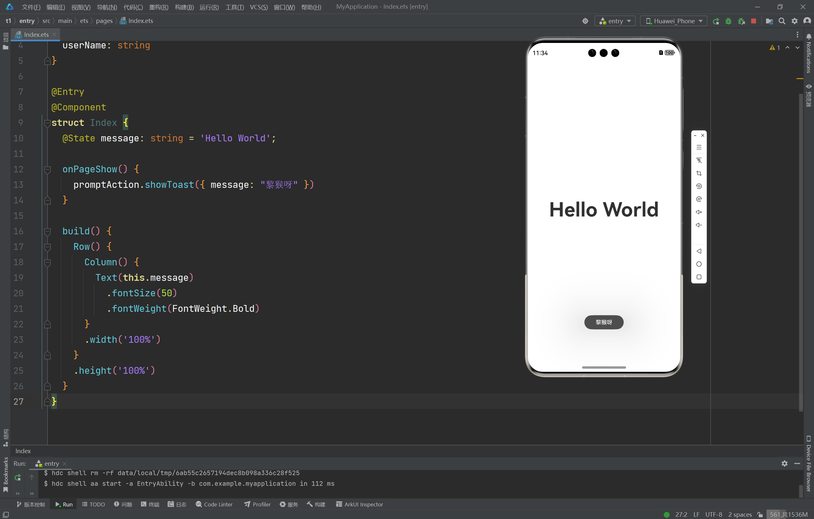
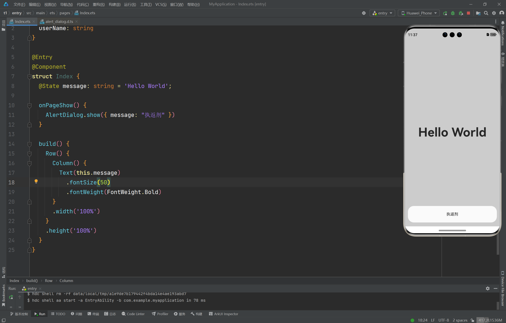
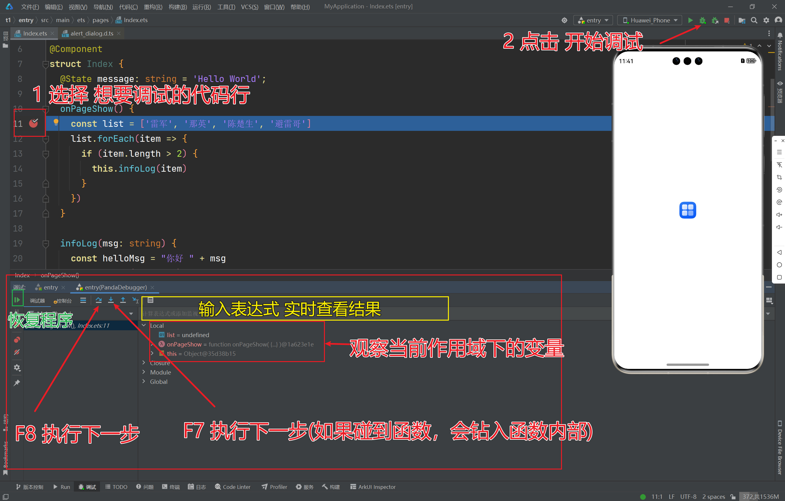

## Latest HUAWEI DevEco Studio Debugging Tips

## Preface



When using **HUAWEI DevEco Studio** editor to develop HarmonyOS applications, we inevitably need to debug our application code. Based on actual situations, we generally use the following methods for code debugging:

1. Visual debugging method
2. Comment-based error debugging method
3. try-catch
4. Console output method
5. Pop-up notification method
6. **Breakpoint debugging method**

## Visual Debugging Method

**Visual debugging method** is also called **lucky debugging method**, generally suitable for obvious errors in the editor or small code segments just written, obviously relying on your **titanium alloy dog eyes**. When you've just written one or two lines of code and found errors during execution, you can directly debug visually. For example:



**Visual debugging method** also has obvious drawbacks. If you're debugging large programs or debugging someone else's code, this method becomes impractical. For example:



## Comment-based Error Debugging Method

**Comment-based error debugging method** is generally suitable for situations where there are no obvious errors, and you feel that errors occur mysteriously. For example, **the code was working fine yesterday, but suddenly doesn't work today**. At this time, you can boldly lock down the possible error range based on code flow and comment it out. If the program doesn't error at this point, it means you've locked down the error range. Then continue commenting out other parts, continue narrowing the range, continue finding suspicious error code, and then debug.



## Console Output Method

**Console output method** is the most handy debugging method for programmers. Directly output the data you want to view in the console, convenient and fast.



However, in **HUAWEI DevEco Studio**, console output also has drawbacks:

1. The first parameter of `console.log` must be a string
2. Cannot effectively output object-type data.



Therefore, for object-type data, it can generally be output after serialization:

```ts
console.log("Er Shi Xiong", JSON.stringify(pug));
```

**Tips:** If it's an object array, you can use `console.table` for friendly output



## try-catch

Additionally, some programs might cause the program to crash directly during runtime, with little error information. In this case, we can use try-catch to capture and output errors:

```ts
onPageShow() {
  try {
    const list: number[] = []
    const a = list[1] + list[2]
    console.log("Successfully output", a)
  } catch (e) {
    console.log("Error information", e.message, e.code)
  }
}
```

## Pop-up Notification Method

When debugging on real devices, you can directly use the pop-up window methods provided by `harmonyos` to output the data you want to view:

1. `promptAction.showToast({ message: "Li Hou Ya" })`
2. `AlertDialog.show({ message: "Zhi Fan Ji" })`



---



## Breakpoint Debugging Method

If the above solutions can't meet your bug debugging needs, then you must master this last method. This method mainly utilizes the breakpoint debugging method provided by **HUAWEI DevEco Studio**.



## Conclusion

If this can help you, feel free to reach out:

1. Email `yeah126139163@163.com`
2. WeChat `w846903522`
3. [Juejin](https://juejin.cn/user/4441682708283191)
4. [Bilibili](https://space.bilibili.com/414874315?spm_id_from=333.1007.0.0)
5. Official Account `程序员漫谈` (Programmer's Chat)
