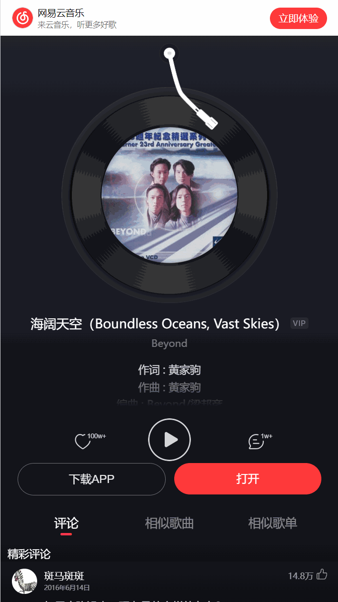
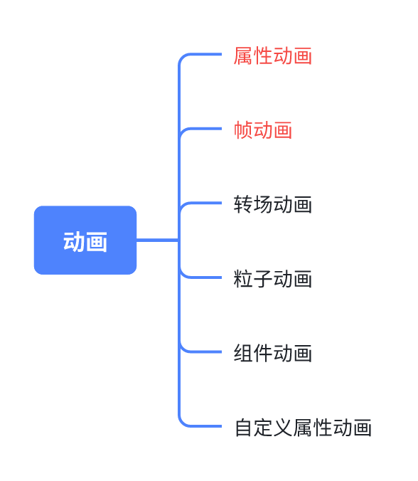
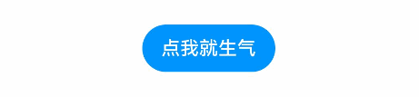
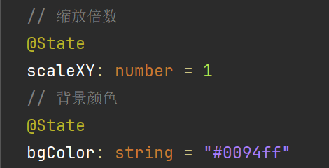
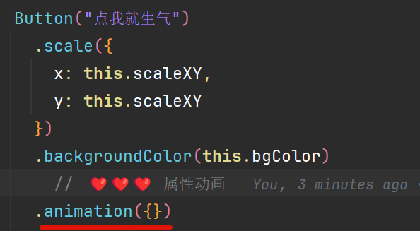
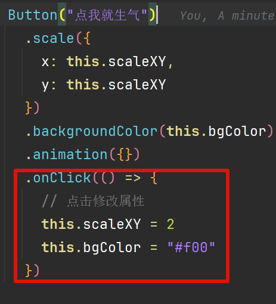
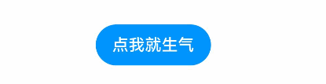
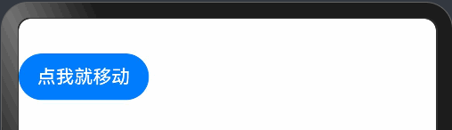

# English Translation Required

This file is marked for translation from: HarmonyOS Next 动画大全 01-属性动画.md

Original Chinese file path: 鸿蒙开发技巧\HarmonyOS Next 动画大全\HarmonyOS Next 动画大全 01-属性动画\HarmonyOS Next 动画大全 01-属性动画.md

Please translate the content from the original Chinese file to English.
The translation should maintain:

- Technical accuracy
- Code examples (translate comments but keep code structure)
- Image references
- Link references
- Formatting (headers, lists, etc.)

---

# HarmonyOS Next Animation Collection 01 - Property Animation

## Introduction

Animation refers to the gradual change effect that elements in our applications can produce when their properties such as position, size, color, shape, etc. change, keeping users' focus following along.

In application interactions, it enhances user experience and lets users know the current action progress.

The following image shows the comparison between effects with and without animation: (_Image from Huawei HarmonyOS application development documentation_)


Moreover, animation effects are ubiquitous in mobile applications we've been using for years.

**NetEase Cloud Music**



**Kuwo Music**


**Kugou Music**


## Animation Classification

In Harmony Next, animations are mainly classified into the following types:



Today we'll mainly explain the first two types: **Property Animation** and **Frame Animation**.

Property animation is further divided into **Property Animation (animation)** and **Explicit Animation (animateTo)**, while frame animation refers to **@ohos.animator (Animation)**.

**This article only covers Property Animation (animation)**. Other animations will be published subsequently.

Why are they grouped together? Because their core concept is to use common style properties, specify start and end states, to achieve animation effects.

Let's get started directly.

## Properties That Can Implement Animation

First, we need to understand which specific style properties can have animation effects. According to the official definition:

| Category          | Description                                              |
| ----------------- | -------------------------------------------------------- |
| Layout Properties | Position, size, padding, margin, alignment, weight, etc. |
| Affine Transform  | Translation, rotation, scaling, anchor point, etc.       |
| Background        | Background color, background blur, etc.                  |
| Content           | Text size, text color, image alignment, blur, etc.       |
| Foreground        | Foreground color, etc.                                   |
| Overlay           | Overlay properties, etc.                                 |
| Appearance        | Opacity, border radius, border, shadow, etc.             |

All the above properties can be simply summarized into one principle: Properties with intermediate states can have animation properties. What are intermediate states?

For example, human height development has intermediate states: **Xiao Wan's height grows from 100cm to 146cm**, so the intermediate states include **101cm, 102cm, ...146cm**, etc.

So **width, coordinates, margins, scaling, background color (rgb(0,0,0) -> rgb(255,255,255)), etc. all have intermediate states** in the table above.

---

Similarly, human gender or life/death has no intermediate states: **Xiao Wan changes from male to female??? Xiao Wan from life to death???**

So **visibility, z-index** have no intermediate states and therefore cannot achieve animation effects.

## Property Animation (animation)

Property animation (animation) is the simplest technique for implementing animations. Let's see the effect directly:



**Code**

```typescript
@Entry
@Component
struct Index {
  // Scale factor
  @State
  scaleXY: number = 1
  // Background color
  @State
  bgColor: string = "#0094ff"

  build() {
    Column() {
      Button("Click me and I'll get angry")
        .scale({
          x: this.scaleXY,
          y: this.scaleXY
        })
        .backgroundColor(this.bgColor)
          // ️️ ❤️❤️❤️ Property animation
        .animation({})
        .onClick(() => {
          // Modify properties on click
          this.scaleXY = 2
          this.bgColor = "#f00"
        })
    }
    .width("100%")
    .padding(30)
  }
}
```

**Code Explanation**

1. Set initial style properties

   

2. Add style properties to the button element

   

3. Set property animation `animation` for the button

   

4. Modify properties on button click, animation takes effect automatically

   

Finally, note that: Style properties **above** animation will have animation effects, while style properties **below** animation will not have animation effects.

```typescript
Button("Click me and I'll get angry")
  // Style properties above animation will have animation effects
  .scale({
    x: this.scaleXY,
    y: this.scaleXY,
  })
  .animation({}) //
  // Style properties below animation will not have animation effects
  .backgroundColor(this.bgColor);
```



## Property Animation Parameters

Property animation accepts configuration parameters to adjust the animation execution process, such as animation duration, repetitions, etc.

```
animation(configuration parameters)
```

| Name       | Description                                                                    | Example         |
| ---------- | ------------------------------------------------------------------------------ | --------------- |
| duration   | Animation execution time in milliseconds                                       | 1000            |
| tempo      | Animation execution speed, default is 1, minimum is 0                          | 1               |
| curve      | Animation curve, such as uniform, fast-then-slow, etc.                         | Curve.linear    |
| delay      | Delay time in milliseconds                                                     | 1000            |
| iterations | Animation execution count, -1 for infinite                                     | 1               |
| playMode   | Animation play mode, such as whether each repetition starts from the beginning | PlayMode.Normal |
| onFinish   | Callback function when animation ends                                          |                 |

### duration

Animation execution time is easy to understand - it determines how long the entire animation takes to complete based on the time you provide.

```typescript
.animation({
  // Complete in 500 milliseconds
  duration: 500,
})
```

### tempo

Execution speed, default is 1, minimum value is 0. For example:

1. If duration is 1s and tempo is 1, animation completes in 1s
2. If duration is 1s and tempo is 0.1, animation completes in 10s

### curve

Animation curve - when animation execution time is fixed, the speed of executing animation can be fast or slow. Here's an inappropriate example:

Suppose Xiao Wan needs to walk from office to toilet in 1 minute:

1. Xiao Wan can walk at uniform speed
2. Xiao Wan starts unhurried, **walks slowly**, then suddenly has an urgent situation and needs to **walk faster** in the latter half - slow then fast
3. Xiao Wan starts very urgent, **runs**, then halfway gives up and walks slowly in the latter half - fast then slow

Available values reference:

| Name                | Description                                                                                         |
| :------------------ | :-------------------------------------------------------------------------------------------------- |
| **Linear**          | Animation speed is the same from start to finish.                                                   |
| Ease                | Animation starts slow, speeds up, then slows down before ending, CubicBezier(0.25, 0.1, 0.25, 1.0). |
| EaseIn              | Animation starts slow, CubicBezier(0.42, 0.0, 1.0, 1.0).                                            |
| EaseOut             | Animation ends slow, CubicBezier(0.0, 0.0, 0.58, 1.0).                                              |
| EaseInOut           | Animation starts and ends slow, CubicBezier(0.42, 0.0, 0.58, 1.0).                                  |
| FastOutSlowIn       | Standard curve, CubicBezier(0.4, 0.0, 0.2, 1.0).                                                    |
| LinearOutSlowIn     | Deceleration curve, CubicBezier(0.0, 0.0, 0.2, 1.0).                                                |
| FastOutLinearIn     | Acceleration curve, CubicBezier(0.4, 0.0, 1.0, 1.0).                                                |
| ExtremeDeceleration | Extreme deceleration curve, CubicBezier(0.0, 0.0, 0.0, 1.0).                                        |
| Sharp               | Sharp curve, CubicBezier(0.33, 0.0, 0.67, 1.0).                                                     |
| Rhythm              | Rhythm curve, CubicBezier(0.7, 0.0, 0.2, 1.0).                                                      |
| Smooth              | Smooth curve, CubicBezier(0.4, 0.0, 0.4, 1.0).                                                      |
| Friction            | Friction curve, CubicBezier(0.2, 0.0, 0.2, 1.0).                                                    |

Here's a reference diagram:


### delay

Delay time, default is 0. When set, animation execution will first delay, then start executing.

### iterations

Animation execution count, default is 1, -1 for infinite.

### playMode

Animation play mode, provides 4 options:

| Name             | Description                                                                               |
| :--------------- | :---------------------------------------------------------------------------------------- |
| Normal           | Animation plays forward.                                                                  |
| Reverse          | Animation plays in reverse.                                                               |
| Alternate        | Animation plays forward on odd times (1, 3, 5...) and reverse on even times (2, 4, 6...). |
| AlternateReverse | Animation plays reverse on odd times (1, 3, 5...) and forward on even times (2, 4, 6...). |

Think of it like driving - from starting point A to destination B. If one trip is considered one animation execution, then when executing 4 animations:

1. **Normal**

   1. A-B
   2. A-B
   3. A-B
   4. A-B

2. **Reverse**

   1. B-A
   2. B-A
   3. B-A
   4. B-A

3. **Alternate**

   1. A-B
   2. B-A
   3. A-B
   4. B-A

4. **AlternateReverse**
   1. B-A
   2. A-B
   3. B-A
   4. A-B

#### Initial Code

```typescript
@Entry
@Component
struct Index {
  @State
  translateX: number = 0

  build() {
    Column() {
      Button("Click me to move")
        .translate({ x: this.translateX })
        .animation({
          iterations: 4,
          playMode: PlayMode.Normal
        })
        .onClick(() => {
          this.translateX = 240
        })
    }
    .width("100%")
    .padding({
      top: 30
    })
    .alignItems(HorizontalAlign.Start)
  }
}
```

#### Normal

```typescript
.animation({
  iterations: 4,
  playMode: PlayMode.Normal
})
```

1. A-B
2. A-B
3. A-B
4. A-B



#### Reverse

```typescript
.animation({
  iterations: 4,
  playMode: PlayMode.Reverse
})
```

1. B-A
2. B-A
3. B-A
4. B-A


#### Alternate

```typescript
.animation({
  iterations: 4,
  playMode: PlayMode.Alternate
})
```

1. A-B
2. B-A
3. A-B
4. B-A


#### AlternateReverse

1. B-A
2. A-B
3. B-A
4. A-B


```typescript
.animation({
  iterations: 4,
  playMode: PlayMode.AlternateReverse
})
```

### onFinish

Callback function after animation completion:

```typescript
.animation({
  onFinish() {
    AlertDialog.show({ message: "Olympics ended!" })
  }
})
```


## Summary

Animation can enhance user experience and make applications more lively and interesting. By using animation, developers can smoothly display changes in UI elements, such as changes in position, size, color, or shape. This document focuses on property animation in Harmony Next and provides some basic concepts and example code.

### Properties That Can Implement Animation

Properties that can achieve animation effects include but are not limited to:

- Layout properties (position, size, etc.)
- Affine transforms (translation, rotation, etc.)
- Background (color, blur, etc.)
- Content (text size, color, etc.)
- Foreground (color, etc.)
- Overlay properties
- Appearance (opacity, border radius, etc.)

These properties can implement animation because they have intermediate states.

### Property Animation `animation`

Property animation is one of the simplest ways to implement animation. It achieves animation effects by changing UI element property values.

### Notes

- Style properties **above** `animation` will have animation effects.
- Style properties **below** `animation` will not have animation effects.

### Property Animation `animation` Parameters

Property animation can adjust the animation execution process through different parameters, including:

- `duration` (animation duration)
- `tempo` (animation speed)
- `curve` (animation curve)
- `delay` (delay time)
- `iterations` (animation repetition count)
- `playMode` (animation play mode)
- `onFinish` (callback after animation completion)

Each parameter has specific meaning and usage, and can be flexibly adjusted according to needs to achieve different animation effects.
