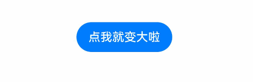
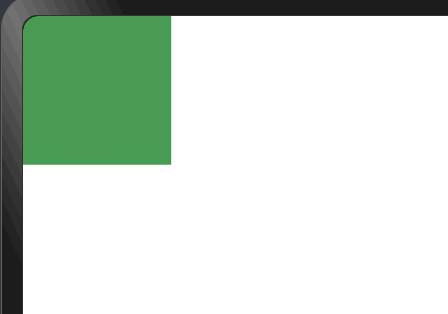
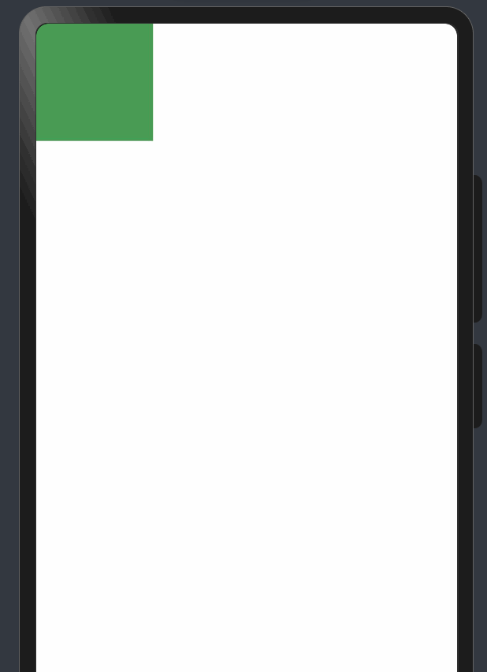
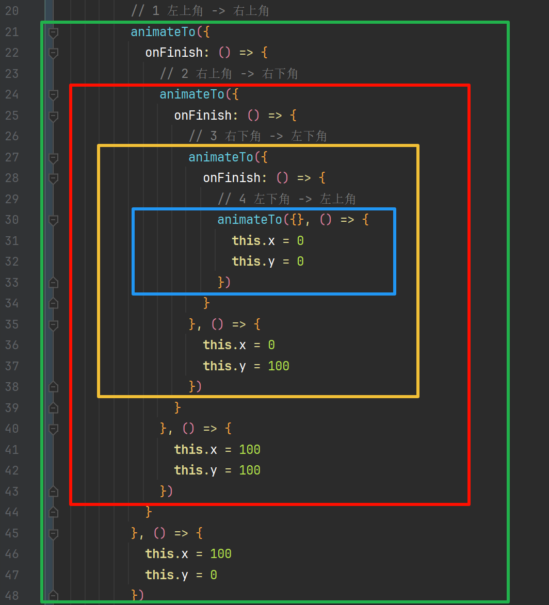
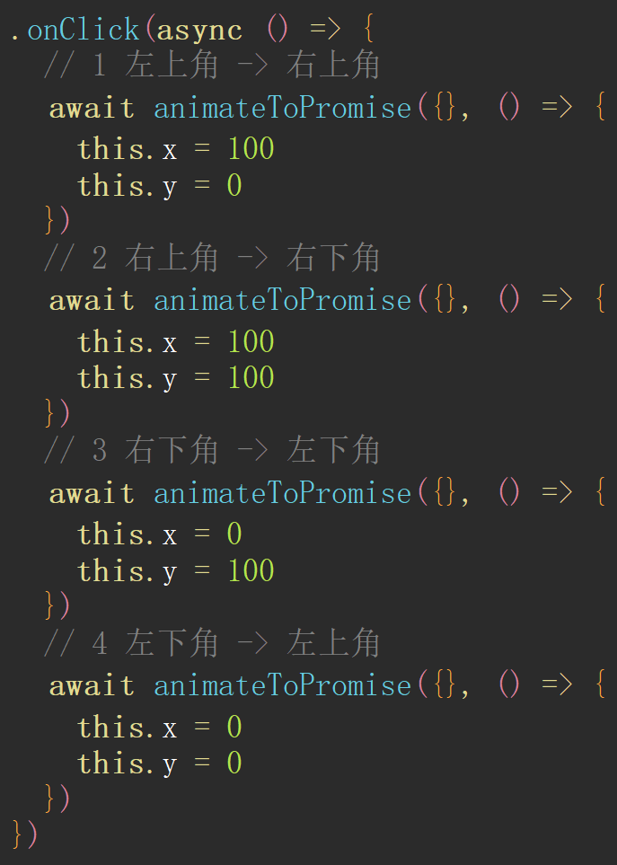

# HarmonyOS Next Animation Series 02 - Explicit Animation

## Preface

In the previous article, we introduced the usage of property animation `animation`. Now let's learn and understand explicit animation `animateTo`.

## animateTo

We call it **explicit animation**. It is a global function that implements animation effects by calling the function. The biggest difference between **explicit animation** `animateTo` and the previous **property animation** `animation` is that explicit animation can use the function's characteristics to implement multiple explicit animation calls consecutively, thus achieving coherent animations.

## Basic Syntax

`animateTo(value: AnimateParam, event: () => void): void`

| Parameter | Type         | Required | Description                                  |
| --------- | ------------ | -------- | -------------------------------------------- |
| value     | AnimateParam | Yes      | Sets animation effect related parameters.    |
| event     | () => void   | Yes      | Specifies the closure function for animation |

Explanation:

1. `AnimateParam` - Animation properties, detailed in the previous article **"HarmonyNext Animation Series 01 - Property Animation"**

   | Name         | Description                                                         | Example         |
   | ------------ | ------------------------------------------------------------------- | --------------- |
   | duration     | Animation execution time in milliseconds                            | 1000            |
   | tempo        | Animation execution speed, default is 1, minimum is 0               | 1               |
   | curve        | Animation curve, such as uniform, fast then slow, etc.              | Curve.linear    |
   | delay        | Delay time in milliseconds                                          | 1000            |
   | iterations   | Animation execution count, -1 for infinite                          | 1               |
   | playMode     | Animation play mode, when playing twice, each starts from beginning | PlayMode.Normal |
   | **onFinish** | Callback function when animation ends                               |                 |

   Among these, **onFinish** is the key to implementing continuous animations

2. `event` - Specifies the closure function for animation effects

## Basic Example



```typescript
@Entry
@Component
struct Index {
  @State
  scaleXY: number = 1

  build() {
    Column() {
      Button("Click me to get bigger!")
        .scale({ x: this.scaleXY, y: this.scaleXY })
        .onClick(() => {
          // Explicit animation
          animateTo({
            // 1 Specify animation parameters
            duration: 1000
          }, () => {
            // 2 Specify animation effect closure function
            this.scaleXY = 2
          })
        })
    }
    .width("100%")
    .height("100%")
    .padding(40)
  }
}
```

**Code Explanation**:

1. You can see that `animateTo` is a global function that can be called directly
2. `duration: 1000` represents animation parameters, with animation duration of 1s
3. `this.scaleXY = 2` is placed in the second parameter of `animateTo`, the callback function, where specific animation effects are specified

So far, we find that explicit animation `animateTo` doesn't differ much from the previous property animation `animation`. Yes, because their biggest difference is that `animateTo` can more conveniently implement **multiple consecutive animation effects**.

## Multiple Consecutive Animation Effects

As shown below:



You can see that the above animation actually consists of multiple animation effects combined together:

1. **Top-left -> Top-right**
2. **Top-right -> Bottom-right**
3. **Bottom-right -> Bottom-left**
4. **Bottom-left -> Top-left**

We think: How should we implement this?

The answer is: **onFinish**. `onFinish` is a property in animation parameters that indicates animation completion.

## onFinish

When the animation finishes executing, it will automatically trigger the logic inside `onFinish`



```typescript
@Entry
@Component
struct Index {
  @State
  x: number = 0
  @State
  y: number = 0

  build() {
    Column() {
      Row()
        .width(100)
        .height(100)
        .backgroundColor("#499C54") // tips: translate sets translation
        .translate({
          x: this.x,
          y: this.y
        })
        .onClick(() => {
          animateTo({
            // Triggered when animation finishes
            onFinish: () => {
              AlertDialog.show({ message: "Animation completed" })
            }
          }, () => {
            this.x = 100
            this.y = 0
          })
        })
    }
    .width("100%")
    .height("100%")
    .alignItems(HorizontalAlign.Start)
  }
}
```

Therefore, when we want to implement multiple consecutive animations, we just keep **nesting** inside `onFinish`


```typescript
@Entry
@Component
struct Index {
  @State
  x: number = 0
  @State
  y: number = 0

  build() {
    Column() {
      Row()
        .width(100)
        .height(100)
        .backgroundColor("#499C54")
        .translate({
          x: this.x,
          y: this.y
        })
        .onClick(() => {
          // 1 Top-left -> Top-right
          animateTo({
            onFinish: () => {
              // 2 Top-right -> Bottom-right
              animateTo({
                onFinish: () => {
                  // 3 Bottom-right -> Bottom-left
                  animateTo({
                    onFinish: () => {
                      // 4 Bottom-left -> Top-left
                      animateTo({}, () => {
                        this.x = 0
                        this.y = 0
                      })
                    }
                  }, () => {
                    this.x = 0
                    this.y = 100
                  })
                }
              }, () => {
                this.x = 100
                this.y = 100
              })
            }
          }, () => {
            this.x = 100
            this.y = 0
          })
        })
    }
    .width("100%")
    .height("100%")
    .alignItems(HorizontalAlign.Start)
  }
}
```

The above code can implement consecutive animations.

## Callback Hell

---

However, this code structure... mom would have a hard time not praising how well you wrote it



The above structure has already formed callback hell, folks~😂

## Solving Callback Hell

Experienced developers should immediately think of solutions:

1. `promise`
2. `async` and `await`

Yes, callback hell can be solved by these two approaches.

First, let's wrap `animateTo` and `Promise`

```typescript
const animateToPromise = (option: AnimateParam, fn: Function) => {
  const promise: Promise<undefined> = new Promise((resolve: Function) => {
    option.onFinish = () => {
      resolve();
    };
    animateTo(option, () => {
      fn();
    });
  });
  return promise;
};
```

Finally, let's look at the solved version

```typescript
Row() {

}
.width(100)
.height(100)
.backgroundColor("#499C54")
.translate({ x: this.x, y: this.y })
.onClick(async () => {
  // 1 Top-left -> Top-right
  await animateToPromise({}, () => {
    this.x = 100
    this.y = 0
  })
  // 2 Top-right -> Bottom-right
  await animateToPromise({}, () => {
    this.x = 100
    this.y = 100
  })
  // 3 Bottom-right -> Bottom-left
  await animateToPromise({}, () => {
    this.x = 0
    this.y = 100
  })
  // 4 Bottom-left -> Top-left
  await animateToPromise({}, () => {
    this.x = 0
    this.y = 0
  })
})
```

---

You can see that the encapsulated code is much cleaner



## Summary

1. `animateTo` is suitable for multiple consecutive animation effects
2. `animateTo` can be combined with `promise`, `async`, and `await` to solve callback hell problems
3. Due to space limitations, promise and async are not directly introduced here.
