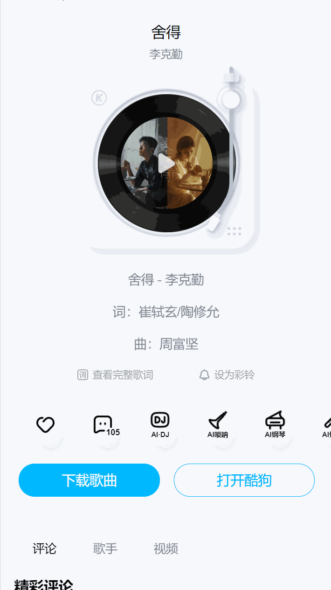
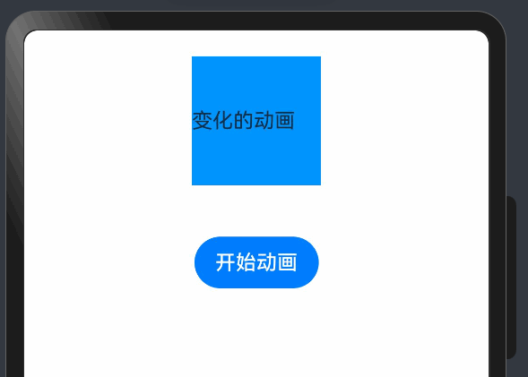

# English Translation Required

This file is marked for translation from: HarmonyOS Next 动画大全 03-帧动画.md

Original Chinese file path: 鸿蒙开发技巧\HarmonyOS Next 动画大全\HarmonyOS Next 动画大全 03-帧动画\HarmonyOS Next 动画大全 03-帧动画.md

Please translate the content from the original Chinese file to English.
The translation should maintain:

- Technical accuracy
- Code examples (translate comments but keep code structure)
- Image references
- Link references
- Formatting (headers, lists, etc.)

---

## HarmonyOS Next Animation Series 03 - Frame Animation

## Introduction

Frame animation `Animator` differs from property animation `animation` and explicit animation `animateTo` in that frame animation provides frame-by-frame callbacks through `onFrame`, allowing developers to set property values on each frame of the application, thus achieving animation effects for components corresponding to those property values. It also allows easy control of animation playback, pause, and other states, providing more powerful animation control capabilities.

## Frame Animation Examples

### KuGou Music



## Basic Usage

The most basic usage consists of 4 steps:

1. Import frame animation
2. Create frame animation
3. Listen to frame change events -> Set animation
4. Start playback

### 1. Import Frame Animation

```typescript
import { Animator, AnimatorResult } from "@kit.ArkUI";
```

1. `Animator` is used to create frame animation objects
2. `AnimatorResult` represents the type of frame animation object

### 2. Create Frame Animation

```typescript
@Entry
@Component
struct Index {
  // 2 Create frame animation object - requires animation parameters
  animator:AnimatorResult=Animator.create({})
  build() {

  }
}
```

When creating a frame animation object, you must pass animation parameters `AnimatorOptions`

#### Frame Animation Parameters

> Most of the following animation parameters are similar to the property animations and explicit animations discussed previously, you can refer back to the previous two animation articles

| Name         | Type                                                        | Description                                                                                                                                                                             |
| ------------ | ----------------------------------------------------------- | --------------------------------------------------------------------------------------------------------------------------------------------------------------------------------------- |
| `duration`   | `number`                                                    | Animation playback duration in milliseconds                                                                                                                                             |
| **easing**   | `string`                                                    | Speed curve                                                                                                                                                                             |
| `delay`      | `number`                                                    | Delay time                                                                                                                                                                              |
| **fill**     | "none" \| "forwards" \| "backwards" \| "both"               | State outside animation playback                                                                                                                                                        |
| `direction`  | "normal" \| "reverse" \| "alternate" \| "alternate-reverse" | Animation playback direction                                                                                                                                                            |
| `iterations` | `number`                                                    | Animation playback count. Set to 0 for no playback, -1 for infinite playback. **Note:** Setting to negative numbers other than -1 is invalid, and invalid values default to 1 playback. |
| **begin**    | `number`                                                    | Animation interpolation start point. Default: 0.                                                                                                                                        |
| **end**      | `number`                                                    | Animation interpolation end point. Default: 1.                                                                                                                                          |

1. `duration` Animation playback duration in milliseconds

2. **easing** Speed curve, can use the following values:

   ```typescript
   linear  Linear - animation speed remains constant
   ease  Ease-in-out - lower speed at animation start and end
   ease-in Ease-in - lower speed at animation start
   ease-out Ease-out - lower speed at animation end
   ease-in-out Ease-in-out - lower speed at animation start and end
   fast-out-slow-in Fast-out-slow-in - standard curve
   linear-out-slow-in Linear-out-slow-in - deceleration curve
   fast-out-linear-in Fast-out-linear-in - acceleration curve
   ```

3. `delay` Delay time in milliseconds

4. **fill** State outside animation playback

   ```
   none Normal
   forwards Animation stays at the last frame when completed
   backwards During delay wait time, screen jumps to first frame (begin value)
   both Equivalent to setting both forwards and backwards
   ```

5. `direction` Animation playback direction. For example, when repeating animation 4 times, direction can be set to `alternate`:

   1. A-B
   2. B-A
   3. A-B
   4. B-A

6. `iterations` Animation execution count, -1 for infinite

7. `begin` Represents animation start value

8. `end` Represents animation end value

**Example Code**:

```typescript
// 2 Create frame animation object
animator: AnimatorResult = Animator.create({
  // Duration
  duration: 10000,
  // Delay time
  delay: 0,
  // Animation curve
  easing: "linear",
  // Playback count
  iterations: -1,
  // Playback mode - state outside playback
  fill: "none",
  // Playback direction
  direction: "normal",
  // Start angle
  begin: 0,
  // End angle
  end: 360,
});
```

### 3. Listen to Frame Change Events

Register the onFrame event to the frame animation object to listen for value changes from begin -> end, then set these value changes to our State to achieve animation effects.

```typescript
  @State
  angle: number = 0

  // 3 Automatically triggered when page starts loading - aboutToAppear
  aboutToAppear() {
    // 3 Listen to frame change events
    this.animator.onFrame = (value) => {
      this.angle = value
    }
  }
```

Don't forget to make your component use this changing state angle:

```typescript
  build() {
    Column({ space: 40 }) {
      Text("Changing Animation")
        .width(100)
        .height(100)
        .backgroundColor("#0094ff")
        .rotate({
          angle: this.angle
        })

      Button("Start Animation")
        .onClick(() => {
          // Start animation

        })
    }
    .width("100%")
    .height("100%")
    .padding(20)
  }
```

### 4. Start Animation

```typescript
Button("Start Animation").onClick(() => {
  this.animator.play();
});
```

Finally, let's view the effect:



## Complete Code

```typescript
// 1 Import
import { Animator, AnimatorResult } from '@kit.ArkUI';

@Entry
@Component
struct Index {
  @State
  angle: number = 0
  // 2 Create frame animation object
  animator: AnimatorResult = Animator.create({
    // Duration
    duration: 10000,
    // Delay time
    delay: 0,
    // Animation curve
    easing: "linear",
    // Playback count
    iterations: -1,
    // Playback mode - state outside playback
    fill: "none",
    // Playback direction
    direction: "normal",
    // Start angle
    begin: 0,
    // End angle
    end: 360
  })

  // 3 Automatically triggered when page starts loading - aboutToAppear
  aboutToAppear() {
    // 3 Listen to frame change events
    this.animator.onFrame = (value) => {
      this.angle = value
    }
  }

  build() {
    Column({ space: 40 }) {
      Text("Changing Animation")
        .width(100)
        .height(100)
        .backgroundColor("#0094ff")
        .rotate({
          angle: this.angle
        })

      Button("Start Animation")
        .onClick(() => {
          this.animator.play()
        })
    }
    .width("100%")
    .height("100%")
    .padding(20)
  }
}
```

## Other Methods

Other methods of frame objects:

1. `reset` Reset animator

   ```typescript
   reset(AnimatorOptions);
   ```

2. `play` Play animation

3. `finish` Complete animation playback - equivalent to setting animation to end value state

4. `pause` Pause animation

5. `cancel` Cancel animation

6. `reverse` Play animation in reverse order

## Other Events

1. `onFrame` Frame change event
2. `onFinish` Animation completion event
3. `onCancel` Animation cancellation event
4. `onRepeat` Event triggered when animation repeats
