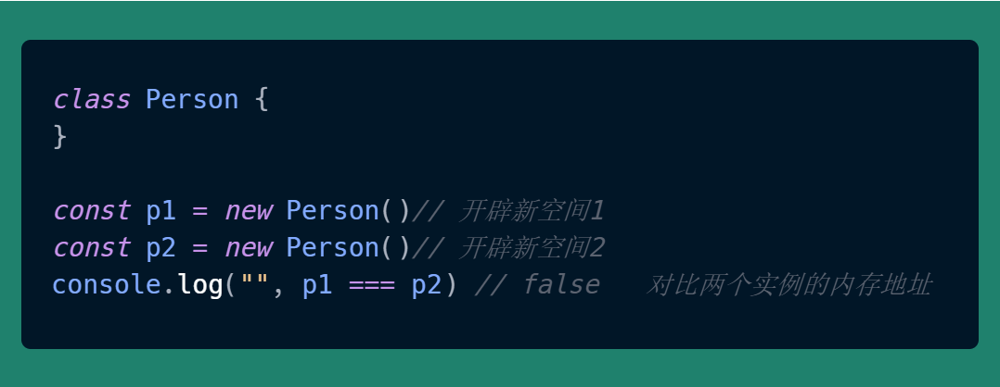
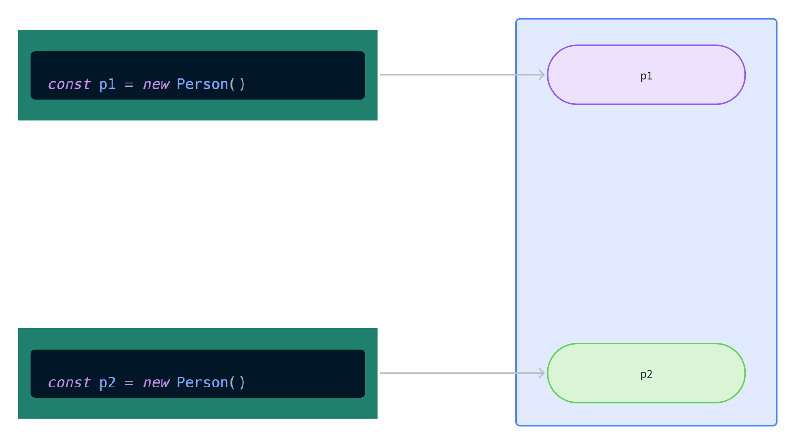
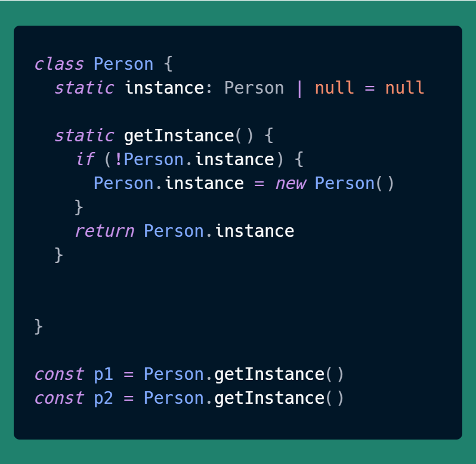
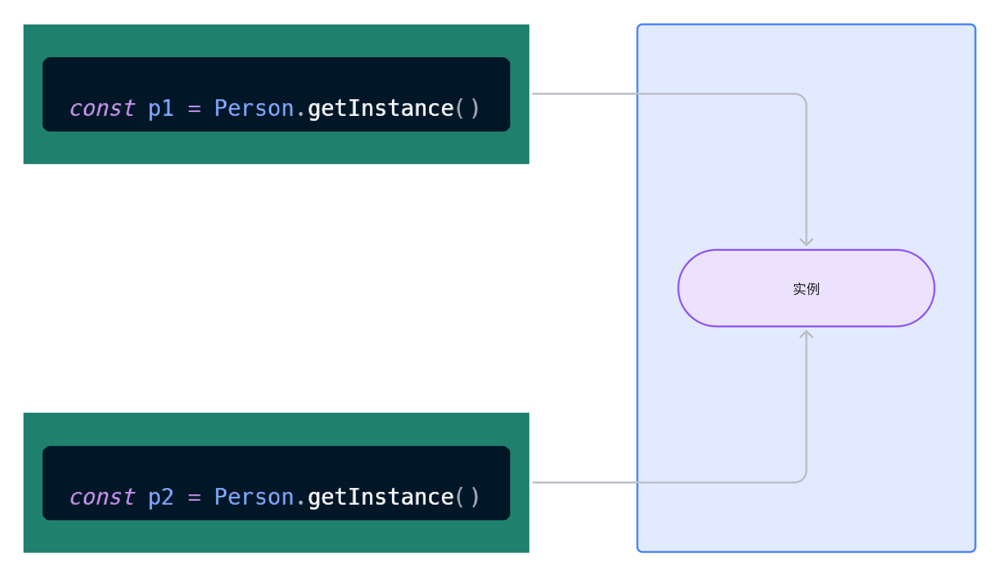
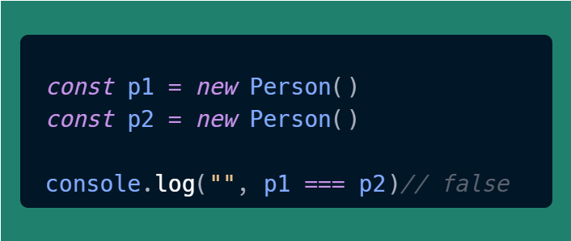
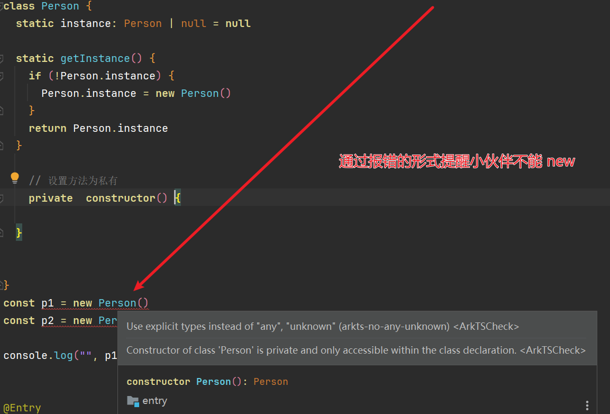

# English Translation Required

This file is marked for translation from: HarmonyOS Next 设计模式-单例模式.md

Original Chinese file path: 鸿蒙开发技巧\HarmonyOS Next 设计模式-单例模式\HarmonyOS Next 设计模式-单例模式.md

Please translate the content from the original Chinese file to English.
The translation should maintain:

- Technical accuracy
- Code examples (translate comments but keep code structure)
- Image references
- Link references
- Formatting (headers, lists, etc.)

---

# HarmonyOS Next Design Pattern - Singleton Pattern

## Preface

Software design patterns, also known as design patterns, are a set of repeatedly used, widely known, categorized, and catalogued summaries of code design experience. Design patterns are used to make code reusable, easier for others to understand, ensure code reliability, and improve program reusability.

**The role of design patterns is to quickly provide reliable solutions when we are designing slightly complex programs, rather than waiting for problems to be exposed before fixing our programs.**

## A Little Story

In 1991, Erich Gamma collaborated with Richard Helm, Ralph Johnson, and John Vlissides to publish the book **Design Patterns - Elements of Reusable Object-Oriented Software**, which contains 23 design patterns:

- **Creational patterns, five in total: Factory Method Pattern, Abstract Factory Pattern, Singleton Pattern, Builder Pattern, Prototype Pattern.**
- **Structural patterns, seven in total: Adapter Pattern, Decorator Pattern, Proxy Pattern, Facade Pattern, Bridge Pattern, Composite Pattern, Flyweight Pattern.**
- **Behavioral patterns, eleven in total: Strategy Pattern, Template Method Pattern, Observer Pattern, Iterator Pattern, Chain of Responsibility Pattern, Command Pattern, Memento Pattern, State Pattern, Visitor Pattern, Mediator Pattern, Interpreter Pattern.**

In actual development, it's rare for programmers to use all 23 design patterns in the same project. So learning while using and applying what you learn is sufficient.

## Singleton Pattern

> The Singleton pattern ensures that a class has only one instance and provides global access to that instance.

For example, in a small company, there are the following roles:

1. HR
2. Finance
3. Development
4. Testing
5. Implementation
6. Operations
7. Network Administrator
8. Boss

**But in reality, from beginning to end, it's just you playing all these roles.**

## Use Cases

There are many:

1. **System Service Management**: HarmonyOS has many system services such as system time management and network management. These services need globally unique instances to provide services, ensuring service uniqueness and consistency. By using the singleton pattern, we can ensure there's only one such service instance in the system, making it easy to manage and access.

2. **Device Access**: The device access layer in HarmonyOS, such as camera access and sensor access, also needs to use the singleton pattern to ensure only one instance accesses the device. This helps avoid conflicts and resource waste caused by multiple instances accessing the device simultaneously.

3. **Resource Management**: Resource managers in HarmonyOS, such as memory managers and file system managers, also need to use the singleton pattern to manage global resources. Through the singleton pattern, we can ensure only one instance manages and allocates resources, improving system stability and performance.

4. **Global State Management**: In HarmonyOS application development, we often need globally unique instances to manage the entire application's configuration and state, such as database access objects. By using the singleton pattern, we can ensure the entire application has only one instance, avoiding resource waste and data inconsistency caused by duplicate instances.

## Program Design

Getting to the point, as we all know, every time we create a new instance, memory allocates a new space, and different instances exist in their respective memory spaces.



---

The corresponding memory diagram is:



## Refactored Version 1

Since the inherent characteristic of `new` is to allocate new memory space, our refactoring approach is to prevent users from creating instances through `new`. Instead, we use static methods to create instances.



The core code lies in **static getInstance**, which determines whether to execute the `new` operation by checking if an instance already exists.



Comparison results:


## Refactored Version 2

However, at this point, some developers might forget that we're using the singleton pattern and still create objects using the `new` approach.



At this point, we can set the **constructor** to private, so when developers try to use **new**, they'll get a syntax error prompt.



> PS: In ArkTS, we cannot use `new.target` to determine if the user is using the `new` behavior.

## Complete Code

```ts
class Person {
  static instance: Person | null = null;

  static getInstance() {
    if (!Person.instance) {
      Person.instance = new Person();
    }
    return Person.instance;
  }

  // Set method to private
  private constructor() {}
}

const p1 = Person.getInstance();
const p2 = Person.getInstance();
console.log("", p1 === p2); // true
```
