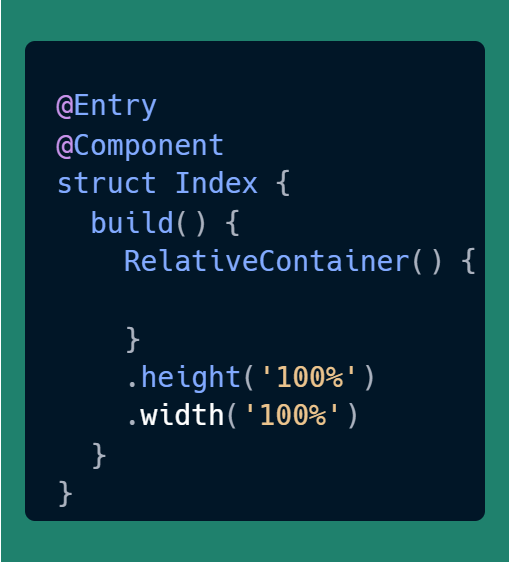
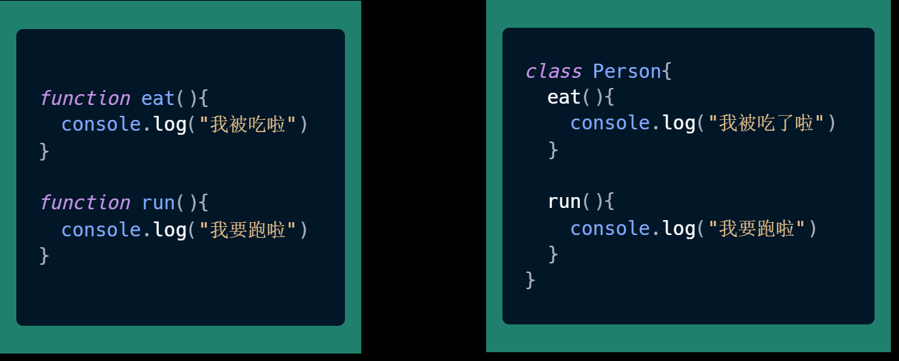
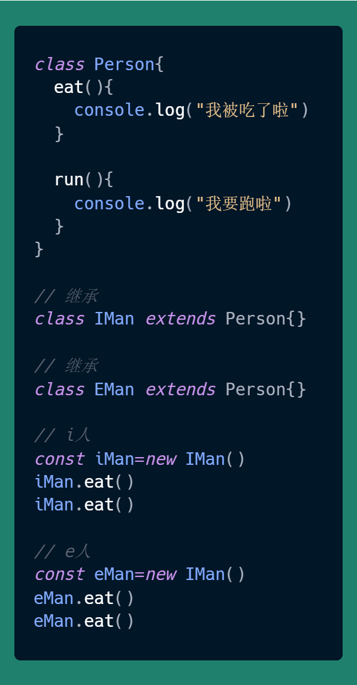
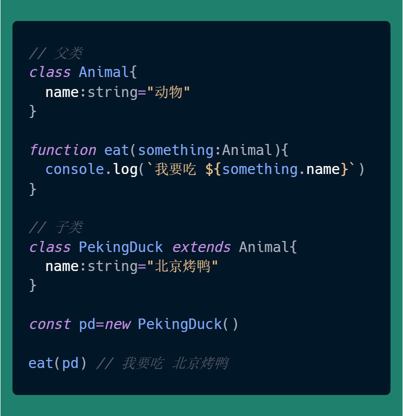
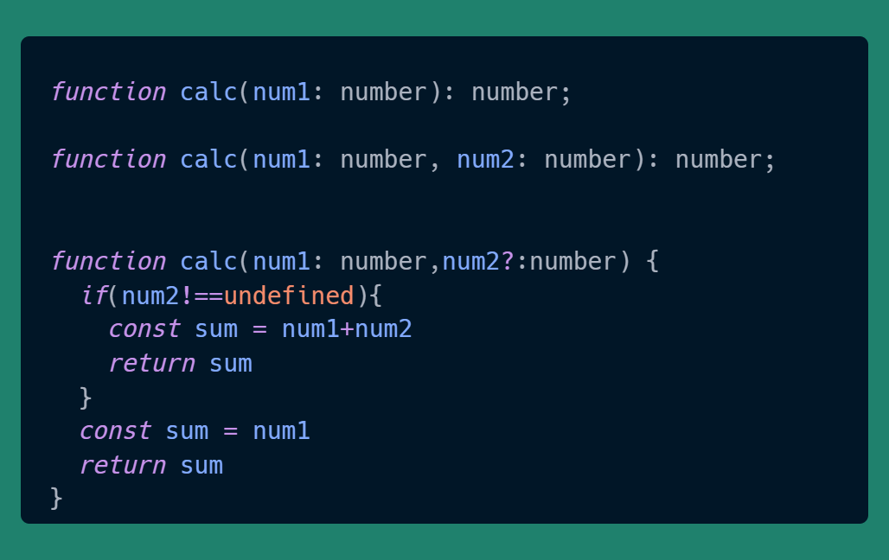

# HarmonyOS Next Development Art: Object-Oriented Programming

## Application Development Paradigms

**HarmonyOS** applications primarily adopt an object-oriented paradigm similar to traditional OOP approaches.

> **struct** represents a structure in Java.
>
> Frontend engineers can think of it as a **class**

This development style may feel somewhat unfamiliar to most frontend engineers. Currently, mainstream frontend development frameworks like React and Vue favor functional programming approaches when developing components _(an application consists of various components)_. Let's compare the pros and cons of **class-based** versus **functional** approaches in application development.

### Functional Components

**Advantages**:

1. **Simplicity**: Functional components are typically more concise, focusing solely on rendering logic without handling state or lifecycle methods.
2. **Performance**: Functional components perform as well as or better than class components during updates.
3. **Testability**: Without class inheritance or complex lifecycle methods, functional components are usually easier to unit test.
4. **Composability**: Hooks and other functional programming features make functional components more composable and reusable.
5. **Aligns with Modern JavaScript Trends**: With the popularity of JavaScript ES6+, concepts like functional programming and immutable data are becoming increasingly prevalent.

**Disadvantages**:

1. **State Management**: In React, functional components don't inherently support state. However, the `useState` Hook enables state management in functional components.
2. **Lifecycle Methods**: React functional components lack built-in lifecycle methods, but the `useEffect` Hook can simulate lifecycle behavior.
3. **Complexity Limitations**: When components become very complex, involving multiple states, lifecycle methods, and intricate logic, functional components may become difficult to manage.

### Class Components

**Advantages**:

1. **State Management**: Class components have built-in state concepts, making state management more intuitive.
2. **Lifecycle Methods**: Class components provide rich lifecycle methods for convenient handling of component mounting, updating, and unmounting processes.
3. **Inheritance**: Class components support inheritance, making it easier to create reusable component logic.

**Disadvantages**:

1. **Complexity**: Class components typically require handling more concepts like the `this` keyword, constructors, inheritance, etc., which may increase code complexity.
2. **Performance**: In React, class components usually perform slightly worse than functional components during updates, as React needs to traverse the entire component tree to determine which parts need re-rendering.
3. **Doesn't Align with Modern JavaScript Trends**: With the popularity of functional programming, class components may no longer be best practice in modern frontend development.

---

_The above comparison is from AI tools._

However, for ordinary developers, the consideration isn't whether to use a hammer or an excavator to move bricks, but rather mastering whichever tool your current job requires. Capitalists don't care whether your brick-moving tools are user-friendly or not.

## About ArkTS

Early pure frontend developers probably have unpleasant memories when discussing object-orientation, prototypes, `this`, and other keywords. The root cause is that in earlier times, frontend development used JavaScript ES3, which didn't support object-oriented design at the language level, unlike Java which was born with built-in support.

Therefore, the three major characteristics of object-orientation (encapsulation, inheritance, polymorphism) that are easily implemented in Java become nightmare-like when forcibly implemented in early JavaScript using prototypes and `this`. Many beginners who see forced object-oriented designs implemented with JavaScript prototypes and `this` feel like going crazy.

HarmonyOS application development uses the ArkTS language. TypeScript is a superset of JavaScript, and ArkTS is a superset of TypeScript - basically JavaScript's grandfather. So when developing HarmonyOS applications, ArkTS is friendly to frontend engineers but not so friendly to backend engineers, especially Java engineers. **This is interesting because Android native development languages (Java, Kotlin) are friendly to Java engineers.** -- Feel free to relate to this in the comments.

---

Although ArkTS is a superset of TypeScript, it's not completely compatible. [Adaptation Rules from TypeScript to ArkTS](https://docs.openharmony.cn/pages/v4.0/zh-cn/application-dev/quick-start/typescript-to-arkts-migration-guide.md)

## Object-Oriented Programming (OOP)

Let's explain object-orientation in HarmonyOS applications from a beginner's perspective.

The three major characteristics of Object-Oriented Programming (OOP) are Encapsulation, Inheritance, and Polymorphism.

### Encapsulation

Encapsulation is like a "black box." Inside this box, you have a bunch of components (variables and methods), but the outside world can only see a few small holes on the box (public interfaces). Through these holes, the outside world can interact with the components inside the box, but cannot directly see or modify the specific components inside.

The main purpose of encapsulation is to **hide the internal details of objects** and only expose necessary interfaces for external use. This protects data from arbitrary modification while simplifying object usage.

For example: Imagine you have a TV remote control. You don't need to know how the remote works internally; you only need to know how to press buttons like "power on/off," "volume+," and "volume-." These buttons are the remote's "interface," while the internal circuits and chips are "encapsulated."

In the left diagram above, code is scattered and easily pollutes the global namespace. There might be multiple **eat** functions.

In the right diagram above, code is combined into a class and aggregated together. This way, different classes can have the same eat method without conflicts. This is a simple understanding of encapsulation.

### Inheritance

Inheritance is like a child inheriting certain characteristics from their parents. In object-oriented programming, one class (subclass) can inherit properties and methods from another class (parent class). This way, the subclass can have all the functionality of the parent class while adding or overriding its own functionality.

The purpose of inheritance is **code reuse**. Through inheritance, we can avoid repeatedly writing the same code - we only need to define it once in the parent class and then inherit it in subclasses.

For example: Suppose you have an "Animal" class with basic properties and methods (like "eat" and "sleep"). Then you can create a "Dog" class that inherits from the "Animal" class and adds or overrides specific properties and methods (like "bark" and "wag tail"). This way, the "Dog" class has both the general functionality of the "Animal" class and its own special functionality.

Inheritance is implemented through the **extends** keyword: `class SubClass extends ParentClass`

As shown in the diagram above, in reality, whether someone is introverted or extroverted, both have eating and running capabilities. Therefore, inheritance can be used to manage them. If adjustments are needed later, only the parent class needs to be modified, and other subclasses will automatically change accordingly.

### Polymorphism

Polymorphism means "multiple forms" or "multiple possibilities." In object-oriented programming, polymorphism refers to different objects responding differently to the same message. Specifically, a parent class reference can point to a subclass object, and when calling methods through this reference, it will call the method of the actual object (possibly a subclass object).

The purpose of polymorphism is to **improve code flexibility and reusability**. Through polymorphism, we can use parent class references to operate subclass objects without caring about the specific subclass type. This makes code more flexible and easier to extend.

For example: Imagine you have a "Shape" class with a "draw" method. Then you can create multiple subclasses like "Circle," "Rectangle," and "Triangle," all inheriting from the "Shape" class and implementing their own "draw" methods. Although each object type may be different (circle, rectangle, triangle, etc.), since they all inherit from the "Shape" class and implement the same "draw" method, you can uniformly call their methods through parent class references. This is the embodiment of polymorphism.

---

Polymorphism in code can be manifested as **variable polymorphism** _(abbreviated as "poly")_ and **function polymorphism**.

**Variable Polymorphism**: When the program runtime requires a certain type, you can pass its subtype as a substitute.

**Function Polymorphism**: The same function can be declared multiple times, as long as one of its parameter count, parameter types, or return value types differs.

## Difficulties in Object-Oriented Programming

In actual programming, many developers feel unfamiliar or awkward when applying object-oriented techniques. At this point, you should have confidence, identify which part you're lacking, and improve accordingly.

- Insufficient familiarity with basic syntax, such as basic usage of **class, extends, interface, function**, etc.
- Limited business practice, such as lack of experience in this area during actual development or seeing too few examples of others' encapsulation, leading to inability to react in similar scenarios.
- Lack of business abstraction ability, such as not seeing the connection between certain business scenarios and specific syntax, leading to inability to apply flexibly in real applications.

For this, I offer some learning suggestions:

Treat the above three capability areas as parts that require continuous investment of energy to improve:

1. When you see good materials, spend time trying to understand them. If you really can't see through them, set them aside for now.
2. When you feel your coding ability has improved, continue to study this part of the code.
3. **Repeatedly follow the above two steps.**

