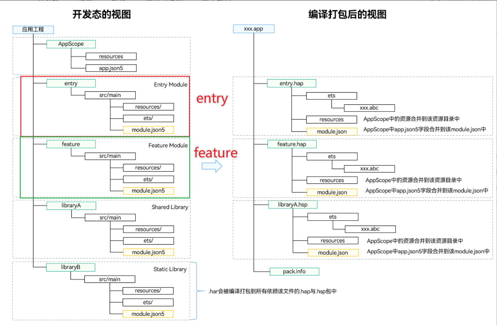
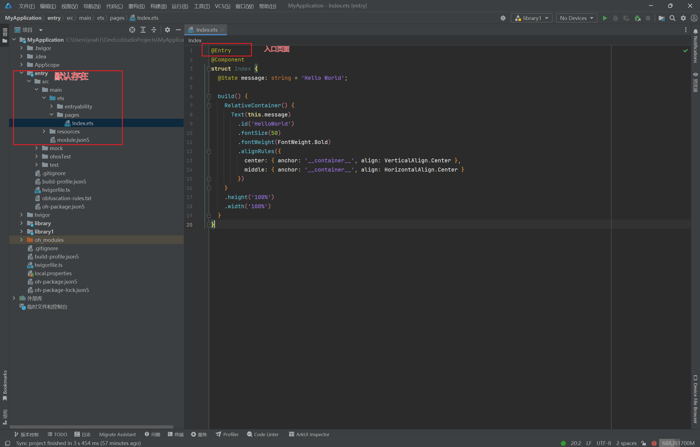
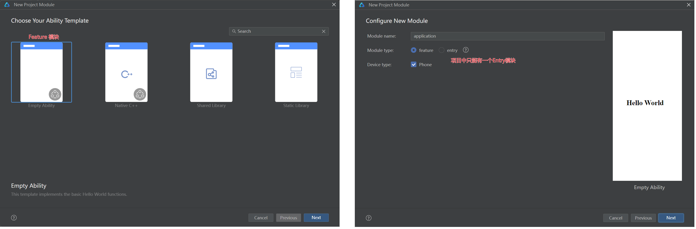
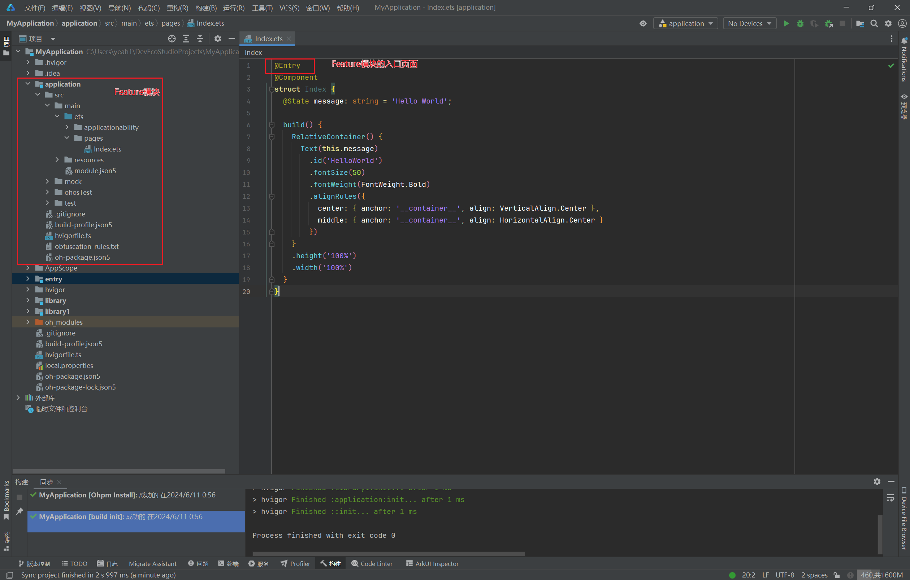
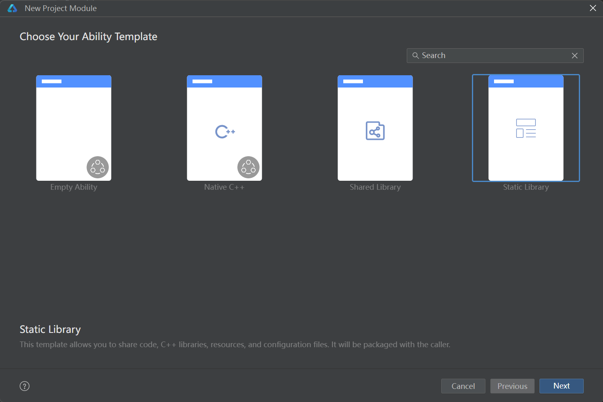
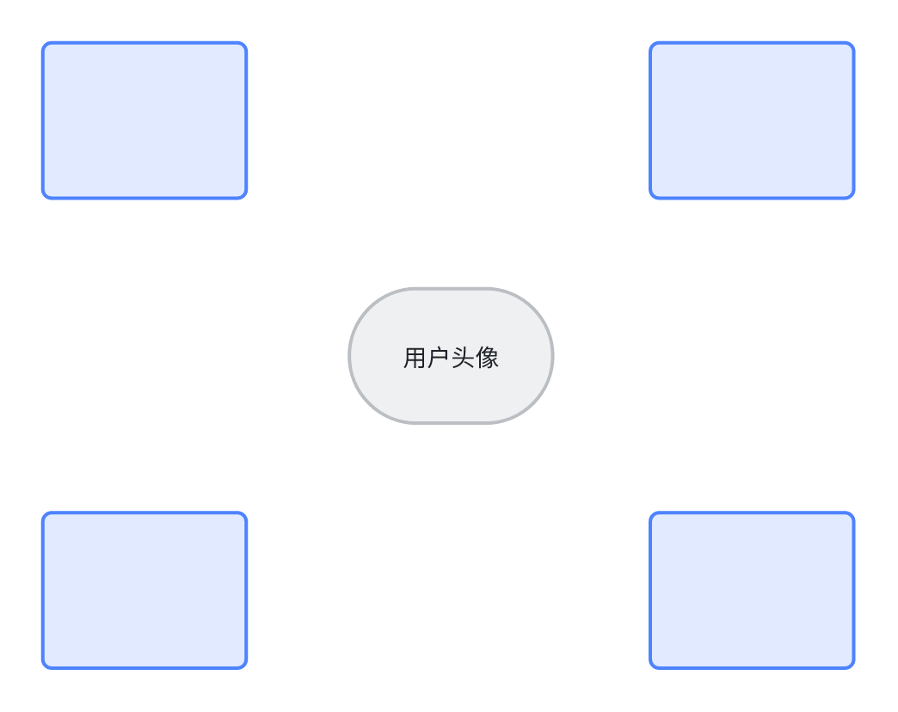
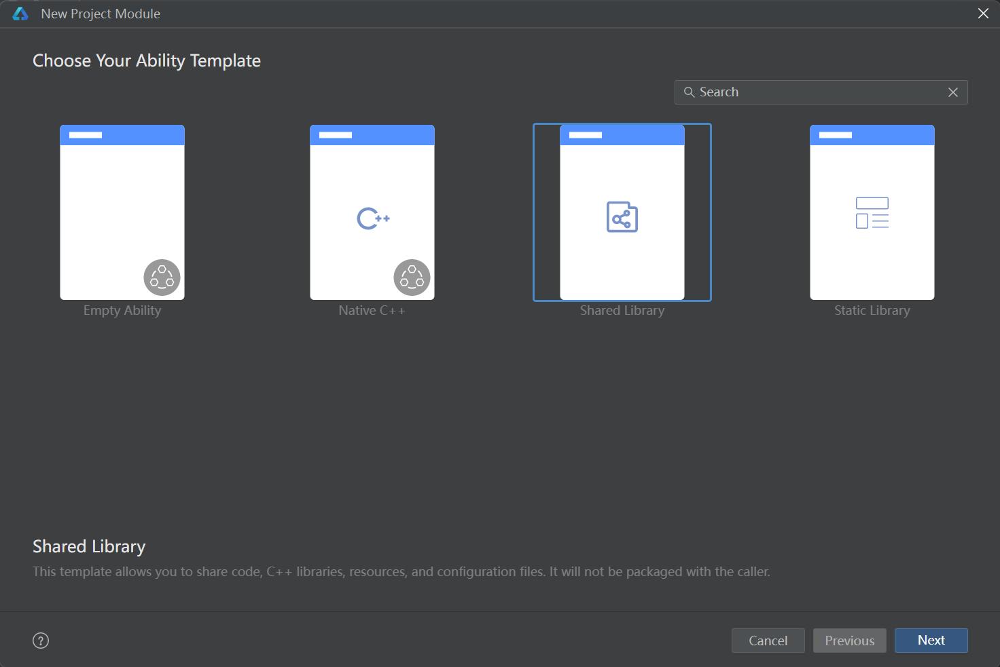

# English Translation Required

This file is marked for translation from: HarmonyOS Next 中的 HAP、HAR、HSP 区别.md

Original Chinese file path: 鸿蒙开发技巧\HarmonyOS Next 中的 HAP、HAR、HSP 区别\HarmonyOS Next 中的 HAP、HAR、HSP 区别.md

Please translate the content from the original Chinese file to English.
The translation should maintain:

- Technical accuracy
- Code examples (translate comments but keep code structure)
- Image references
- Link references
- Formatting (headers, lists, etc.)

---

# Differences Between HAP, HAR, and HSP in HarmonyOS Next

To develop enterprise-level Harmony applications more effectively, it's essential to understand **HAP, HAR, and HSP**.

## Preface

For ordinary users, a typical application might just be one installation file (like an APK on Android). However, for Harmony application development engineers, an application contains much more than that.

> User applications refer to programs that run on the device's operating system and provide specific services to users, abbreviated as "applications". The software package file corresponding to an application is called an "application package".

## Project Architecture

Currently, when developing applications, slightly larger applications adopt modular development approaches. This treats certain functions within the application as separate modules. This development approach has advantages such as **team development, encapsulation and reuse, easy maintenance**, etc. For example: **food delivery, mini-mart, domestic and international hotels** can be viewed as separate modules.

In Harmony applications, **modules** can be categorized into three types:

1. HAP --- Harmony Ability Package **Harmony Capability Unit Package** - author's translation
2. HAR --- Harmony Archive **Static Shared Library**
3. HSP --- Harmony Shared Package **Dynamic Shared Library**

## HAP

HAP (Harmony Ability Package) is the basic unit for application installation and execution. HAP packages are module packages generated by packaging code, resources, third-party libraries, configuration files, etc., and are mainly divided into two types: entry and feature.

- entry: The main module of the application, serving as the application's entry point and providing basic application functionality.
- feature: Dynamic feature modules of the application, serving as extensions of application capabilities that can be selectively installed based on user needs and device types.

**An application package can contain only one basic entry package, or it can contain one basic entry package and multiple functional feature packages.**

---

In project engineering, the entry module exists by default and contains the **entry page** **@Entry**

If a project has only one Entry module, the project can also be called a **single HAP project structure**.

At this point, if we want to create multiple Feature modules, like:

We can create them directly in the project engineering.

---

Feature module:

The relationship between Entry and Feature modules in HAP can be simply illustrated using Meituan APP and Meituan Food Delivery APP:

- Meituan APP serves as a super large APP that includes entrances for Meituan Food Delivery, Meituan Taxi, etc.
- Meituan Food Delivery can also be released and launched as a separate APP.

This validates the official description that **HAP packages can be independently installed and run, and are the basic unit of application installation**.

## HAR

HAR (Harmony Archive) is a static shared package that can contain code, C++ libraries, resources, and configuration files. Through HAR, multiple modules or multiple projects can share ArkUI components, resources, and other related code.

### Usage Scenarios

- As a second-party library, published to [OHPM](https://ohpm.openharmony.cn/) private repository for use by other applications within the company.
- As a third-party library, published to [OHPM](https://ohpm.openharmony.cn/) central repository for use by other applications.

### Example 1

In a project, there might be a multiple HAP structure. Each HAP actually needs to use login functionality. At this point, the login functionality can be encapsulated into a separate page or component **Login.ets**. Considering convenience for reuse, this functionality can be separately extracted into a HAR for easy reuse.

### Example 2

For Alibaba Group, which has multiple APPs that all need login functionality, their login functionality can be extracted into a separate HAR and then **published to [OHPM](https://ohpm.openharmony.cn/) private repository as a second-party library for use by other applications within the company.**

### Example 3

For iFlytek Spark, which has a page or component with built-in Spark AI functionality, it can be **published to [OHPM](https://ohpm.openharmony.cn/) central repository as a third-party library for use by other applications.**

---

Example of creating a HAR module in a project:

## HSP

HSP (Harmony Shared Package) is a dynamic shared package that can contain code, C++ libraries, resources, and configuration files. Through HSP, code and resource sharing within applications can be achieved.

HSP is often compared and distinguished from HAP for understanding:

- HSP is a dynamic shared package
- HAR is a static shared package

In a project, if other modules import HAR, then each module will contain a copy of the HAR, leading to resource redundancy. HSP, on the other hand, achieves resource space efficiency through multiple modules sharing one reference.

### Example

A project has a multi-module structure with multiple places requiring display of user avatar + username. In this case, HSP can be considered to implement this functionality.

---

In engineering, create an HSP module like this:

## Summary Table:

| Module Type    | Package Type                                                                                   | Description                                                                                                                                                                                                                                                                                                                                                                                                                                                                                                                                                                                  |
| :------------- | :--------------------------------------------------------------------------------------------- | :------------------------------------------------------------------------------------------------------------------------------------------------------------------------------------------------------------------------------------------------------------------------------------------------------------------------------------------------------------------------------------------------------------------------------------------------------------------------------------------------------------------------------------------------------------------------------------------- |
| Ability        | [HAP](https://docs.openharmony.cn/pages/v4.1/zh-cn/application-dev/quick-start/hap-package.md) | Functional module of the application that can be independently installed and run. Must contain one entry-type HAP, and optionally contain one or more feature-type HAPs.                                                                                                                                                                                                                                                                                                                                                                                                                     |
| Static Library | [HAR](https://docs.openharmony.cn/pages/v4.1/zh-cn/application-dev/quick-start/har-package.md) | Static shared package, compile-time reuse. - Supports intra-application sharing and can be published for use by other applications. - As a second-party library, published to [OHPM](https://ohpm.openharmony.cn/) private repository for use by other applications within the company. - As a third-party library, published to [OHPM](https://ohpm.openharmony.cn/) central repository for use by other applications. - When multiple packages (HAP/HSP) reference the same HAR, it causes duplicate copying of code and resources between packages, leading to application package bloat. |
| Shared Library | [HSP](https://docs.openharmony.cn/pages/v4.1/zh-cn/application-dev/quick-start/in-app-hsp.md)  | Dynamic shared package, runtime reuse. - Currently only supports intra-application sharing. - When multiple packages (HAP/HSP) simultaneously reference the same shared package, using HSP instead of HAR can avoid duplicate copying of code and resources caused by HAR, thus reducing application package size.                                                                                                                                                                                                                                                                           |

---

| Specification                                                                                                                                                                                                                                                                                                           | HAP | HAR | HSP |
| :---------------------------------------------------------------------------------------------------------------------------------------------------------------------------------------------------------------------------------------------------------------------------------------------------------------------- | :-- | :-- | :-- |
| Supports declaring [UIAbility](https://docs.openharmony.cn/pages/v4.1/zh-cn/application-dev/application-models/uiability-overview.md) components and [ExtensionAbility](https://docs.openharmony.cn/pages/v4.1/zh-cn/application-dev/application-models/extensionability-overview.md) components in configuration files | √   | ×   | ×   |
| Supports declaring [pages](https://docs.openharmony.cn/pages/v4.1/zh-cn/application-dev/quick-start/module-configuration-file.md#pages标签) in configuration files                                                                                                                                                      | √   | ×   | √   |
| Supports containing resource files and .so files                                                                                                                                                                                                                                                                        | √   | √   | √   |
| Supports depending on other HAR files                                                                                                                                                                                                                                                                                   | √   | √   | √   |
| Supports depending on other HSP files                                                                                                                                                                                                                                                                                   | √   | √   | √   |
| Supports independent installation and execution on devices                                                                                                                                                                                                                                                              | √   | ×   | ×   |

## Reference Links

[Application Package Overview](https://docs.openharmony.cn/pages/v4.1/zh-cn/application-dev/quick-start/application-package-overview.md)
