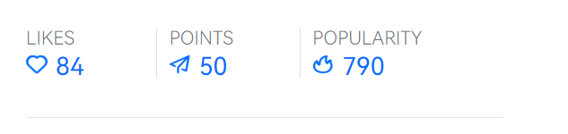
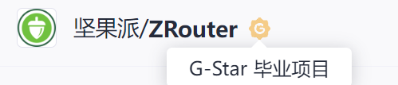
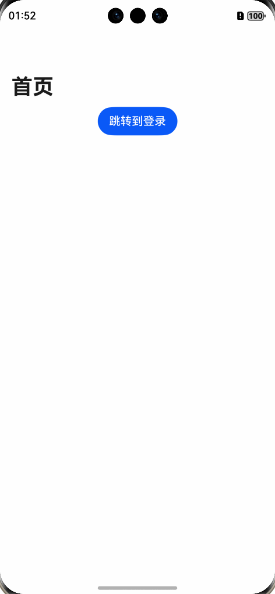
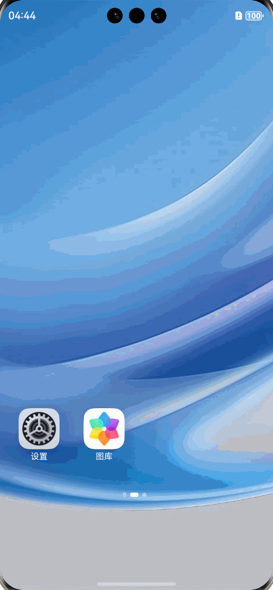

# English Translation Required

This file is marked for translation from: HarmonyOS Next 路由跳转 ZRouter.md

Original Chinese file path: 鸿蒙开发技巧\HarmonyOS Next 路由跳转 ZRouter\HarmonyOS Next 路由跳转 ZRouter.md

Please translate the content from the original Chinese file to English.
The translation should maintain:

- Technical accuracy
- Code examples (translate comments but keep code structure)
- Image references
- Link references
- Formatting (headers, lists, etc.)

---

# HarmonyOS Next Elegant Routing Solution ZRouter

## Preface

Currently in HarmonyOS application development, the official routing solutions are:

1. ~~Router (not recommended)~~
2. **Navigation (recommended)**

Both HMRouter and ZRouter are encapsulations based on Navigation.

## Introduction

[ZRouter](https://ohpm.openharmony.cn/#/cn/detail/@hzw%2Fzrouter) is a lightweight and non-intrusive HarmonyOS dynamic routing framework. Currently, it has **4,671 downloads** on third-party libraries and is a very popular routing management library in the HarmonyOS ecosystem.



It's also a G_Star project on gitcode:



ZRouter has been listed in the [Huawei HarmonyOS Ecosystem Partner Component Zone](https://developer.huawei.com/consumer/cn/market/landing/component).

## Features

ZRouter has the following advantages:

- Simple and easy to use
- Supports both V1 and V2 state management
- **Supports API chaining calls, making APIs more concise and intuitive**
- **Supports NavDestination page templating**
- Annotation parameters support static constants and can be defined across modules
- Supports custom and global interceptors with priority and interruption logic, enabling page redirection, login verification, and other business scenarios
- **Supports service routing, enabling communication between Har/Hsp modules**
- Supports global and individual page lifecycle function management, allowing any class to have the same lifecycle characteristics as components, enabling page tracking statistics and other business scenarios
- **Supports cross-multi-level page parameter carrying and return listening**
- Supports custom URL path navigation, allowing URL parsing in interceptors to implement business logic
- **Built-in multiple transition animation effects (translation, rotation, gradient, scaling, Gaussian blur) with support for custom animations**
- Supports launch modes, obfuscation, nested Navigation, Hap
- Supports third-party Navigation to use this library's API
- **Supports seamless integration with existing Navigation in your project, enabling zero-cost migration to this library**
- Supports use on ArkUI-X cross-platform
- Future plans: Support for shared element animations, continuous optimization

## Quick Start

### 1. Configure **router-register-plugin** plugin in project

```json
// hvigor/hvigor-config.json5
  "dependencies": {
    "router-register-plugin":"1.3.2"
  },
```

### 2. Import router-register-plugin in module's (har, hsp, hap) hvigorfile.ts file, configured in Entry

```typescript
// entry/hvigorfile.ts
import { hapTasks } from "@ohos/hvigor-ohos-plugin";
import { routerRegisterPlugin, PluginConfig } from "router-register-plugin";
// 2. Initialize configuration
const config: PluginConfig = {
  scanDirs: ["src/main/ets/pages", "src/main/ets/views"], // Scan directories, defaults to src/main/ets if not set
  logEnabled: true, // View logs
  viewNodeInfo: false, // View node information
  isAutoDeleteHistoryFiles: true, // Delete unused build artifacts
  lifecycleObserverAttributeName: "xxx", // Optional, set global lifecycle implementation class attribute name on components, default is lifecycleObserver
};
export default {
  system: hapTasks /* Built-in plugin of Hvigor. It cannot be modified. */,
  plugins: [routerRegisterPlugin(config)],
};
```

### 3. Download and install ZRouter in module

```
ohpm install @hzw/zrouter
```

### 4. Initialize ZRouter in EntryAbility's onCreate() method

```typescript
onCreate(want: Want, launchParam: AbilityConstant.LaunchParam): void {
    this.context.getApplicationContext().setColorMode(ConfigurationConstant.ColorMode.COLOR_MODE_NOT_SET);
     ZRouter.initialize((config) => {
          // config.isLoggingEnabled = BuildProfile.DEBUG
          config.isHSPModuleDependent = true
    })
  }
```

### 5. Use page/Index.ets as ZRouter's root container, need to use **Navigation** as outer container

```typescript
import { Route, ZRouter } from '@hzw/zrouter'

@Entry
@Component
export struct Index {

  build() {
    // Get NavPathStack instance object
    Navigation(ZRouter.getNavStack()){
      Column({space:12}){
        Button('Navigate to Login').onClick((event: ClickEvent) => {
          ZRouter.getInstance().push("Login")
        })
      }
    }
    .title('Home')
    .height('100%')
    .width('100%')
  }
}
```

### 6. Other pages need to be decorated with @Route and NavDestination

```typescript
// entry/src/main/ets/pages/Login.ets
import { Route, ZRouter } from "@hzw/zrouter";

@Route({ name: 'Login'})
@Component
export struct Login {

  build() {
    NavDestination(){
      Column({space:12}){
         Text("Login Page")
          // Use pop method to return
      }
    }
    .title('Login')
    .width('100%')
    .height('100%')

  }
}
```

### 7. Result



## Splash Page Setup Process

Generally, app startup flow is Splash Page -> Main Page. Since pages/Index.ets is used as the root container, implementing the splash page flow actually requires 3 pages.

### 1. page/Index.ets as page root container

```typescript
// entry/src/main/ets/pages/Index.ets
import { Route, ZRouter } from '@hzw/zrouter'

@Route({ name: "Index" })
@Entry
@Component
export struct Index {
  build() {
    // Get NavPathStack instance object
    Navigation(ZRouter.getNavStack()) {
      Column({ space: 12 }) {
        Button('Navigate to Login').onClick((event: ClickEvent) => {
          ZRouter.getInstance().push("Login")
        })
      }
    }
    .title('Home')
    .height('100%')
    .width('100%')
    .onAppear(() => {
      // Navigate to splash page
      ZRouter.getInstance().push("Splash")
    })
    .hideTitleBar(true)

  }
}
```

### 2. Create splash page, navigate to actual business home page after display

```typescript
// entry/src/main/ets/pages/Splash.ets
import { Route, ZRouter } from "@hzw/zrouter";

@Route({ name: "Splash" })
@Component
export struct Splash {
  build() {
    NavDestination() {
      Column() {
        Button('Splash Page')
      }
      .width("100%")
      .height("100%")
      .justifyContent(FlexAlign.Center)
      .backgroundColor(Color.Yellow)
    }
    .onAppear(() => {
      // Simulate splash page display
      setTimeout(() => {
        ZRouter.getInstance().navigation("Login")
      }, 3000)
    })
  }
}
```

### 3. Business Home Page

Login page serves as the business home page

```typescript
// entry/src/main/ets/pages/Login.ets
import { Route, TranslateAnimationOptions, ZRouter } from "@hzw/zrouter";

@Route({ name: 'Login' })
@Component
export struct Login {
  build() {
    NavDestination() {
      Column({ space: 12 }) {
        Text("Login Page")
      }
    }
    .title('Login')
    .width('100%')
    .height('100%')
  }
}
```

### 4. Result



## Animation Transitions

ZRouter also provides animation effects for page transitions, mainly including:

1. Translation
2. Scaling
3. Rotation
4. Fade

[Custom transition animations are also supported.](https://gitee.com/common-apps/ZRouter/wikis/%E8%B7%AF%E7%94%B1%E8%BD%AC%E5%9C%BA%E5%8A%A8%E7%94%BB)

You can set page transition animations globally or for individual pages.

### Global Animation

#### 1. Set global animation in container page

```typescript
import {
  OpacityAnimateOptions,
  RotateAnimateOptions,
  Route,
  ScaleAnimateOptions,
  TranslateAnimationOptions,
  ZRouter
} from '@hzw/zrouter'

@Entry
@Component
export struct Index {
  build() {
    // Get NavPathStack instance object
    Navigation(ZRouter.getNavStack()) {
      Column({ space: 12 }) {
        Button('Navigate to Login').onClick((event: ClickEvent) => {
          ZRouter.getInstance().push("Login")
        })
      }
    }
    .title('Home')
    .height('100%')
    .width('100%')
    .customNavContentTransition(
      ZRouter.animateMgr()// Create default animation manager
        .defaultAnimateBuilder()// Set enter animation parameters
        .setEnterAnimate({ duration: 500 })// Set exit animation parameters
        .setExitAnimate({ duration: 700 })// Translation
          // .addAnimateOptions(new TranslateAnimationOptions({ x: '50%', y: '50%' }))// Fade
        .addAnimateOptions(new OpacityAnimateOptions(0.01))// Scale
          // .addAnimateOptions(new ScaleAnimateOptions({ x: 0, y: 0 }))// Rotation
          // .addAnimateOptions(new RotateAnimateOptions({ angle: 90 }))// Custom transition animation callback
        .getAnimCustomNavContentTransition())

  }
}
```

#### 2. Register and unregister animation in child pages

For example, if you need to navigate to the login page, register and unregister animation in the login page

```typescript
// entry/src/main/ets/pages/Login.ets
import { Route, ZRouter } from "@hzw/zrouter";

@Route({ name: 'Login' })
@Component
export struct Login {
  build() {
    NavDestination() {
      Column({ space: 12 }) {
        Text("Login Page")
      }
    }
    .title('Login')
    .width('100%')
    .height('100%')
    .onReady((context: NavDestinationContext) => {
      // Register animation
      ZRouter.animateMgr().registerAnimParam(this, context)
    })
    .onDisAppear(() => {
      // Unregister animation
      ZRouter.animateMgr().unregisterAnim(this)
    }) // Set NavAnimationModifier
    .attributeModifier(ZRouter.animateMgr().modifier(this))
  }
}
```

#### 3. View Result


### Individual Page Animation

If you don't want to set global page transition animations, you can set them for individual child pages, such as the **Login** page.

**Set animation effects and register/unregister animation functions**

#### 1. Container Page

```typescript
// entry/src/main/ets/pages/Index.ets
import {
  OpacityAnimateOptions,
  RotateAnimateOptions,
  Route,
  ScaleAnimateOptions,
  TranslateAnimationOptions,
  ZRouter
} from '@hzw/zrouter'

@Entry
@Component
export struct Index {
  build() {
    // Get NavPathStack instance object
    Navigation(ZRouter.getNavStack()) {
      Column({ space: 12 }) {
        Button('Navigate to Login').onClick((event: ClickEvent) => {
          ZRouter.getInstance().push("Login")
        })
      }
    }
    .title('Home')
    .height('100%')
    .width('100%')
    // Container page setup
    .customNavContentTransition(
      ZRouter
        .animateMgr()
        .getAnimCustomNavContentTransition())
  }
}
```

#### 2. Login Page

```typescript
// entry/src/main/ets/pages/Login.ets
import { Route, TranslateAnimationOptions, ZRouter } from "@hzw/zrouter";

@Route({ name: 'Login' })
@Component
export struct Login {
  build() {
    NavDestination() {
      Column({ space: 12 }) {
        Text("Login Page")
      }
    }
    .title('Login')
    .width('100%')
    .height('100%')
    .onReady((context: NavDestinationContext) => {
      ZRouter
        .animateMgr()
        .registerAnimParam(this, context)// Set enter animation parameters (duration, playback speed, etc.)
        .setEnterAnimate({ duration: 500, curve: Curve.LinearOutSlowIn })// Set exit animation parameters (duration, playback speed, etc.)
        .setExitAnimate({ duration: 500, curve: Curve.LinearOutSlowIn })// Add translation animation
        .addAnimateOptions(new TranslateAnimationOptions({ y: '100%' }))
    })
  }
}
```
