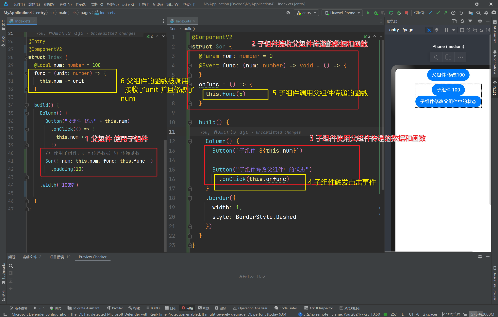
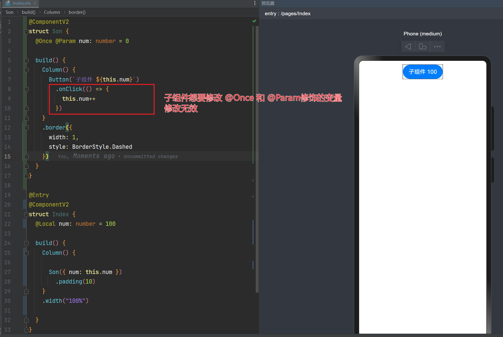

# HarmonyOS Next V2 @Event

## Background

In the previous section, we discussed knowledge about data transmission for parent-child components. We learned that:

1. `@Local` manages internal data of the component itself
2. `@Param` is responsible for receiving data from parent components, and the child component cannot directly modify it

According to the basic functionality of a component, it should **be able to receive data from external sources** and **transmit data to external sources**. The `@Event` decorator is designed to solve this problem.

## Introduction

`@Event` is a technology for child components to pass data to parent components. It can only be used on components decorated with `@ComponentV2`. The concept is:

1. The operation to modify data is still placed within the parent component, implemented by defining a function `func`
2. When the parent component calls the child component, it also passes this function `func` to the child component
3. The child component uses `@Event` to decorate this function internally, and calls it directly when needed

## Parent Component

1. Define internal data `num`
2. Define function `func` to modify internal data `num`
3. When using the child component, pass both `num` and `func`

```
@Entry
@ComponentV2
struct Index {
  @Local num: number = 100
  // Custom function responsible for modifying data, this function also needs to be passed to child component
  func = (unit: number) => {
    this.num -= unit
  }

  build() {
    Column() {
      Button("Parent component modify" + this.num)
        .onClick(() => {
          this.num++
        })
      // Use child component and pass data and function
      Son({ num: this.num, func: this.func })
        .padding(10)
    }
    .width("100%")

  }
}
```

## Child Component

1. Use `@Param` to receive `num` passed from parent component
2. Use `@Event` to receive function `func` passed from parent component
3. Define click event handler `onfunc`, which directly calls the function passed from parent component

```
@ComponentV2
struct Son {
  @Param num: number = 0
  @Event func: (num: number) => void = () => {
  }
  onfunc = () => {
    this.func(5)
  }

  build() {

    Column() {
      Button(`Child component ${this.num}`)

      Button("Child component modifies parent component state")
        .onClick(this.onfunc)
    }
    .border({
      width: 1,
      style: BorderStyle.Dashed
    })
  }
}
```

## Flow



## @Once

`@Once` and `@Param` have similar functions - both can represent receiving data passed from parent components, but there are differences:

1. `@Once` only receives the data passed from parent component for the first time. Subsequent data modifications in parent component will not synchronize to variables decorated with `@Once`
2. `@Once` needs to be used together with `@Param`, because variables decorated with `@Param` are passed from parent to child component and cannot be directly modified. Therefore, variables decorated with `@Once` also cannot be directly modified within child components.

```
@ComponentV2
struct Son {
  @Once @Param num: number = 0

  build() {
    Column() {
      Button(`Child component ${this.num}`)
        .onClick(() => {
          this.num++ // Modification is invalid
        })
    }
    .border({
      width: 1,
      style: BorderStyle.Dashed
    })
  }
}

@Entry
@ComponentV2
struct Index {
  @Local num: number = 100

  build() {
    Column() {

      Son({ num: this.num })
        .padding(10)
    }
    .width("100%")

  }
}
```



## Summary

1. `@Param` represents data passed from parent component to child component. When the parent component modifies it, the child component will respond accordingly. At the same time, the child component cannot directly modify variables decorated with `@Param`
2. `@Event` represents a technology for child components to modify parent component data. It is used to decorate functions that are defined and passed to child components by parent components
3. `@Once` must be used together with `@Param`, representing data passed from parent component that only takes effect the first time.
