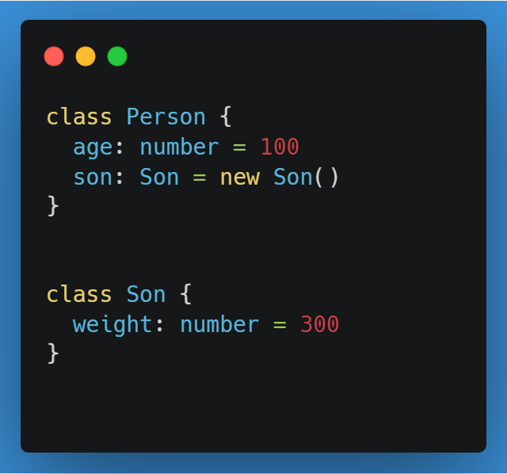
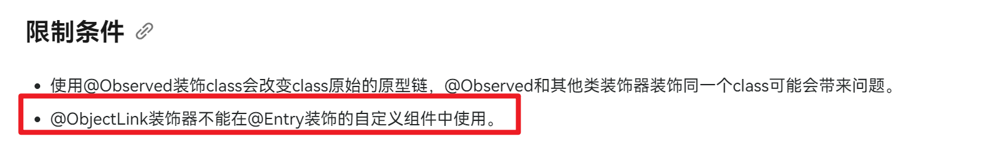
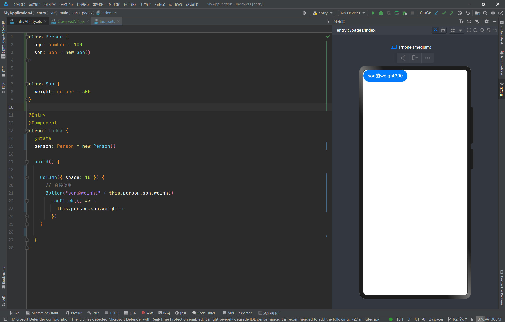
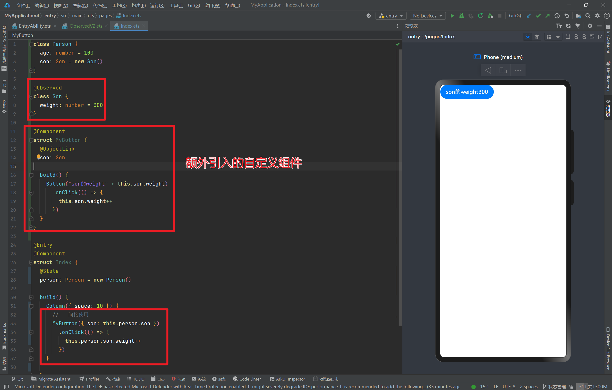
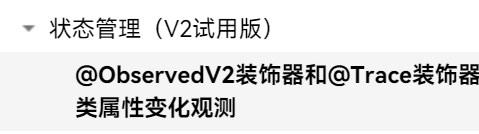
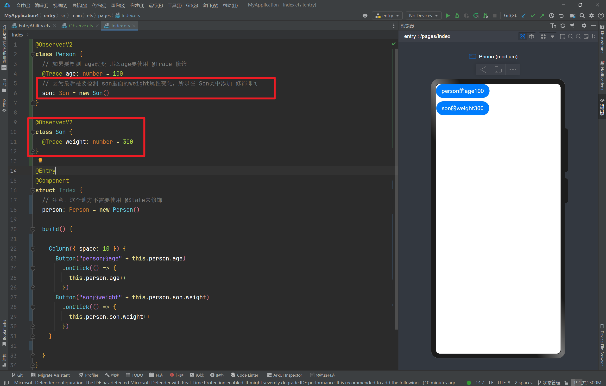

# English Translation Required

This file is marked for translation from: @ObservedV2.md

Original Chinese file path: 鸿蒙开发技巧\HarmonyOS Next V2 状态管理\HarmonyOS Next V2 @ObservedV2\@ObservedV2.md

Please translate the content from the original Chinese file to English.
The translation should maintain:

- Technical accuracy
- Code examples (translate comments but keep code structure)
- Image references
- Link references
- Formatting (headers, lists, etc.)

---

# HarmonyOS Next V2 State Management @ObservedV2 Basic Usage

## Background

Recently, **Harmony** application development technology has launched a new version of state management technology. After trying it out, it's quite impressive. Let's see why?

Because during **Harmony** application development, we will definitely encounter the need to listen to **nested classes/deep-level properties**, such as hoping that changes to the **weight** property of **son** can trigger UI refresh.

## **@Observed** Decorator and **@ObjectLink** Decorator

For the above requirements, how was it done before, that is, in the so-called **v1** version? It was implemented through **@Observed** decorator and **@ObjectLink** decorator.

Among them, this solution has a very serious, destructive problem - it must be used together with custom components.

So, your code was originally like this 🤓:

To implement deep-level data listening, you had to refactor - destroy your UI structure, introduce custom components, so it became like this 😭:

---

**Look at this code style, is this something a human should do?**

Next, let's see what the updated technical solution looks like 👇👇👇👇

## @ObservedV2 Decorator and @Trace Decorator

> As of July 15, 2024, v2 is still in trial version

### Introduction

To enhance the state management framework's ability to observe properties in class objects, developers can use the **@ObservedV2** decorator and @Trace decorator to decorate classes and properties within classes.

The official documentation states:

- **@ObservedV2** decorator and **@Trace** decorator need to be used together. Using **@ObservedV2** decorator or **@Trace** decorator alone has no effect.
- When a property **property** decorated with **@Trace** decorator changes, it will only notify components associated with **property** to refresh.
- In nested classes, only when the property **property** in nested classes is decorated with **@Trace** and the nested class is decorated with **@ObservedV2**, does it have the ability to trigger UI refresh.
- In inheritance classes, only when the property **property** in parent or child classes is decorated with **@Trace** and the class containing that **property** is decorated with **@ObservedV2**, does it have the ability to trigger UI refresh.
- Properties not decorated with **@Trace** cannot perceive changes when used in UI and cannot trigger UI refresh.
- Class instances of **@ObservedV2** currently do not support serialization using **JSON.stringify**.

---

Let's summarize the above. The usage technique is quite simple:

1. **Properties to be monitored should add @Trace decorator**
2. **Classes containing monitored properties should add @ObservedV2**
3. **In inheritance classes, when inheriting monitored properties, it can be equivalently viewed as adding @Trace decorator monitoring to your own class.**

---

Isn't this much simpler and easier compared to **@Observed** decorator and **@ObjectLink**?

## Summary

1. When we encounter the need to listen to deep-level properties during development, we can use **@Observed** decorator and **@ObjectLink** decorator, or **@ObservedV2** decorator and **@Trace** decorator
2. **@Observed** decorator and **@ObjectLink** decorator are relatively stable technologies, but have low development efficiency, poor experience, and are invasive to code
3. **@ObservedV2** decorator and **@Trace** decorator are newly launched v2 versions, currently still in trial period, but will likely become stable versions. They are more code-friendly, and if it's new business, you can prioritize using them.
