# HarmonyOS Next End-to-End Cloud Development (1)

Cloud Foundation Kit can provide cloud functions, cloud databases, cloud storage and other cloud services on demand for applications. The servers and environments required for application operation can all be provided by the cloud platform, allowing developers to focus only on business logic without worrying about infrastructure (such as servers, operating systems, containers, etc.).

DevEco Studio also provides an [end-to-end cloud development](https://developer.huawei.com/consumer/cn/doc/harmonyos-guides-V5/agc-harmonyos-clouddev-overview-V5) experience, where you can efficiently and collaboratively complete the writing, debugging, compiling and deployment of client and cloud code based on a unified technology stack, greatly improving the efficiency of building HarmonyOS applications and meta-services.

## Application Scenarios

- **Application Backend** Quickly build backend services for applications or meta-services, thereby greatly simplifying application development and operation-related tasks, and quickly completing application construction
- **Compute-Intensive Tasks** When compute-intensive tasks appear in applications, sufficient computing power can be applied for in the cloud in a timely manner to support task execution. When tasks end, resources can be released immediately to avoid waste.
- **Adaptation Applications** Use Cloud Foundation Kit to implement protocol type conversion, such as implementing protocol adaptation for different devices in IoT. As well as accessing third-party platforms, implementing business access or collaboration through interfaces provided by third-party platforms.
- **Sudden High Traffic** Traditional architecture services may experience large amounts of access in certain special scenarios. To ensure that the system can run stably during business peaks, it is generally necessary to purchase high-performance, expensive servers and build cluster load balancing. However, when business falls back, it leads to a lot of server resource waste.

## Included Resources

End-to-end cloud development mainly includes the following resources:

- Cloud Functions
- Cloud Database
- Cloud Storage

## Compatible Project Types

End-to-end cloud development can be used in developing HarmonyOS **applications** or meta-services. Because application publishing requires software copyright + filing, while meta-service publishing only requires filing. So in subsequent tutorials, for more convenient learning, we will proceed in a meta-service environment.

## Learning Process

We will subsequently follow these steps to help everyone master the end-to-end cloud development process as much as possible.

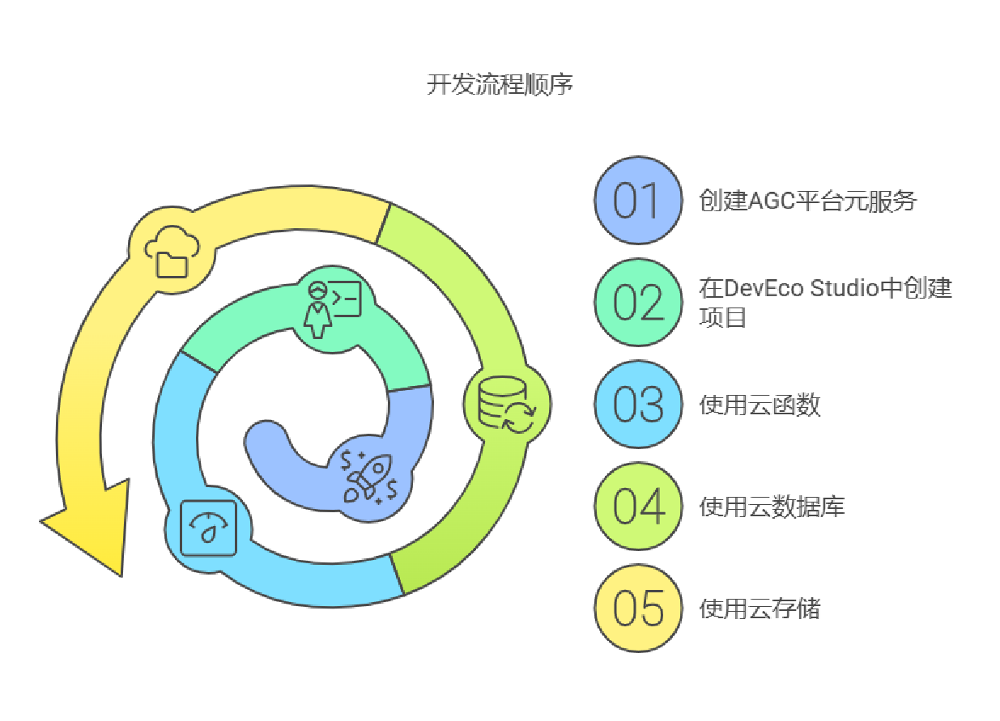

1. [Create Meta-Service on AGC Platform](https://juejin.cn/post/7441761663701041161)
2. Create Corresponding Project in DevEco Studio
3. Basic Usage of Cloud Functions
4. Basic Usage of Cloud Database
5. Basic Usage of Cloud Storage

## Create Meta-Service on AGC Platform

The specific steps for creating a service on the AGC platform can refer to this article [HarmonyOS Next Latest Complete Process from Meta-Service Creation to Publishing](https://juejin.cn/post/7441761663701041161#heading-2), so we won't describe it here.

## Create Corresponding Project in DevEco Studio

When creating a new project locally using DevEco Studio, you need to create an end-to-end cloud meta-service project.

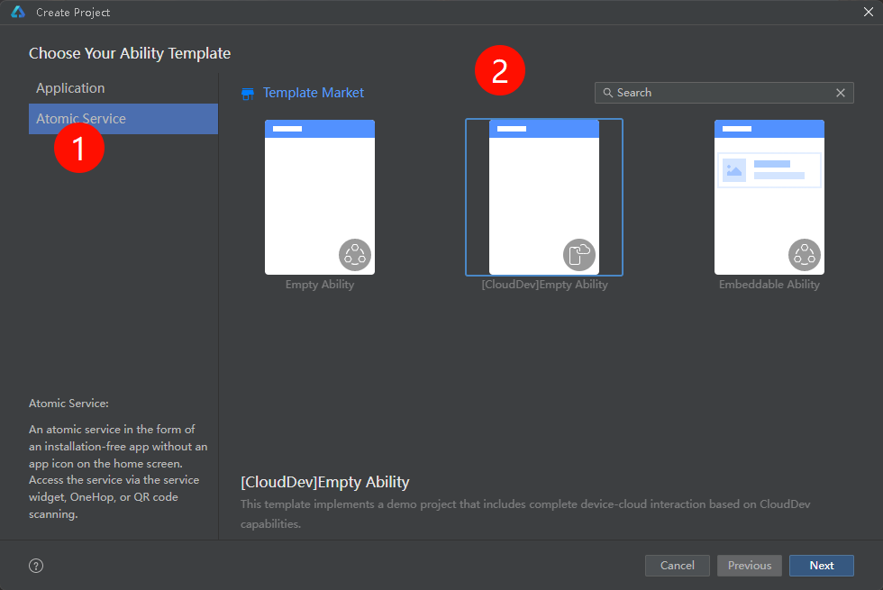

---

At this point, you will see additional cloud-related directory structure in your project.

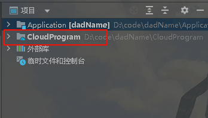

> It's particularly important to note that currently simulators do not support running end-to-end cloud projects. So for convenient testing, it's best to use a **real device**.

## Run on Real Device

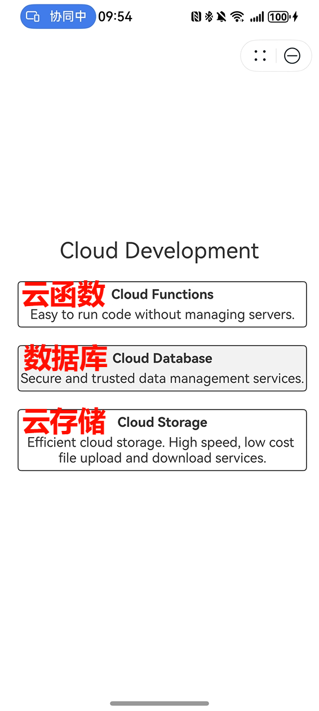

- Test cloud functions

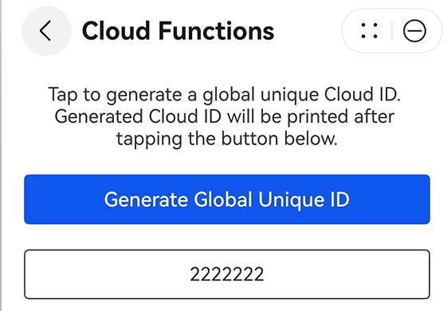

- Test cloud database

  > Cloud database hasn't been configured in the cloud yet, so this test has no response at this time.

  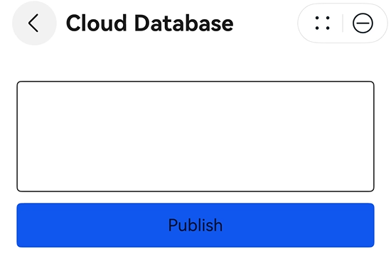

- Test cloud storage

  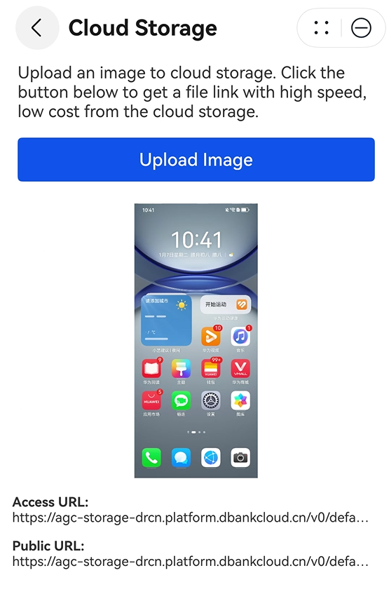

## Cloud Environment Overview

We need to understand that when operating cloud resources locally, we are essentially performing operations on cloud resources. The ultimate success or failure of operations will be reflected in the actual cloud environment.

We log into the AGC platform and then find the corresponding project. _Here is the meta-service name, not the project name, your meta-service belongs to a certain project_

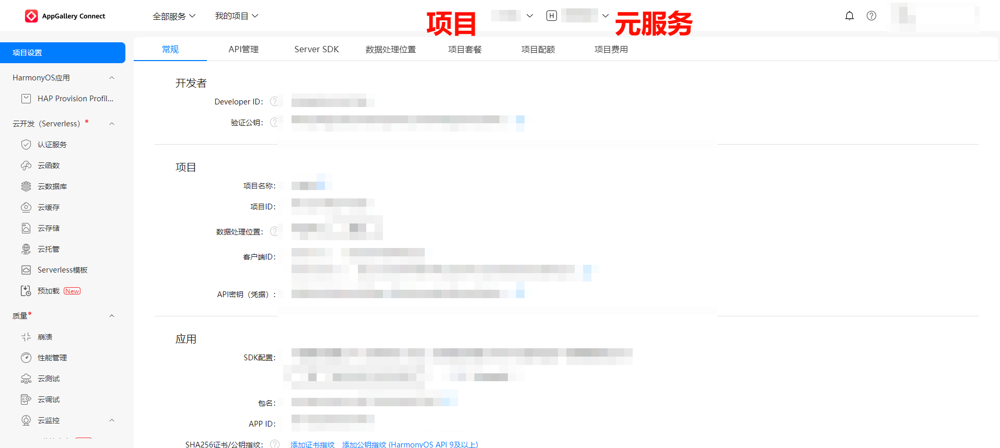

### Cloud Functions Overview

Cloud functions are essentially where backend logic is stored. This is also the main area where we will write backend business logic later.

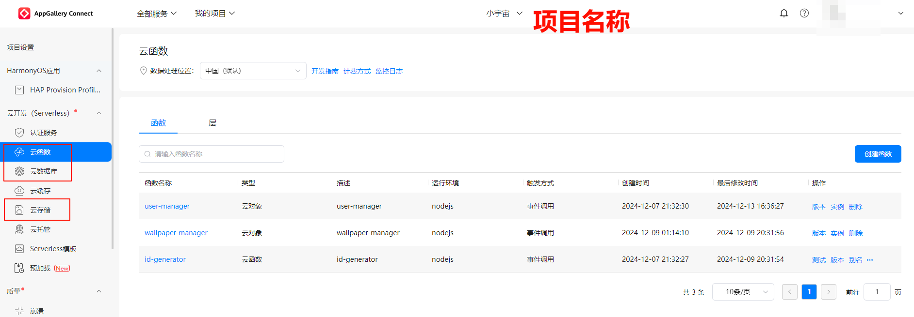

### Cloud Database Overview

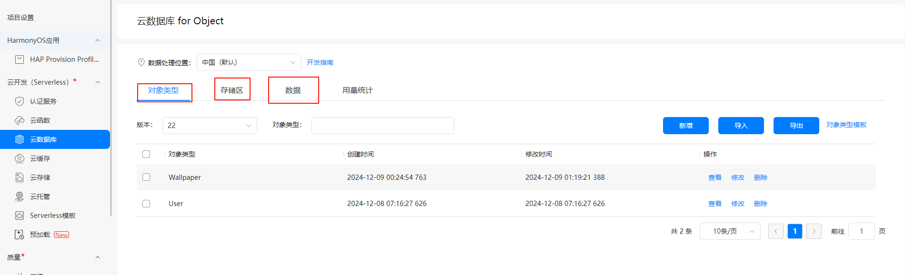

The field explanations here are as follows:

| Field       | Description                                                                                                                                                  |
| ----------- | ------------------------------------------------------------------------------------------------------------------------------------------------------------ |
| Object Type | Represents the entity types used in your data, such as users and shopping carts are different entity types, which can also be understood as your data tables |
| Zone        | Understood as the database name, you can manage multiple zones-databases here                                                                                |
| Data        | The actual data you store                                                                                                                                    |

- Object Type

  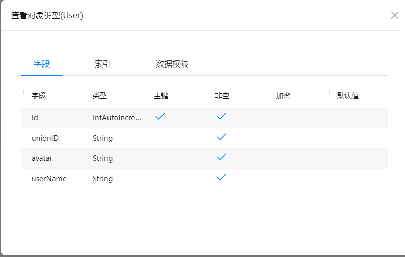

- Zone

  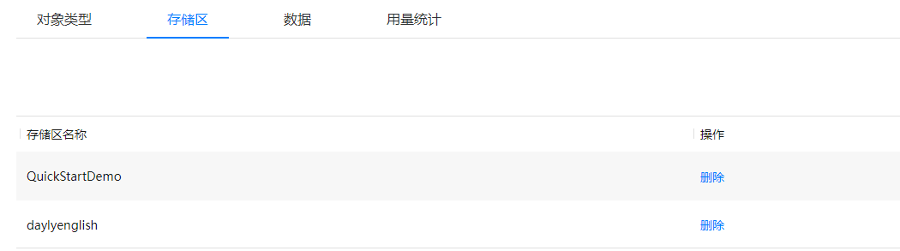

- Data

  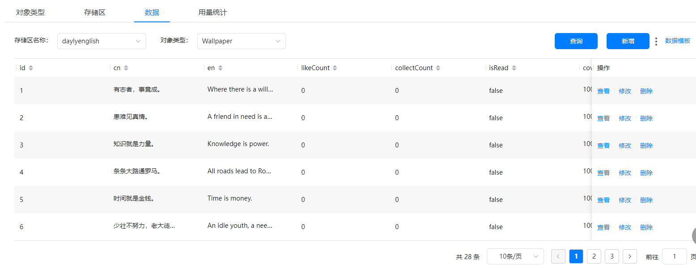

### Cloud Storage Overview

Cloud storage is where you store physical files, such as images, videos, audio, etc.

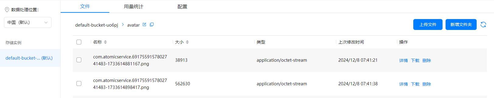

## Cloud Resources in DevEco Studio

Everyone should remember that when we created the end-to-end cloud service, an additional folder was added to the local project: `CloudProgram`

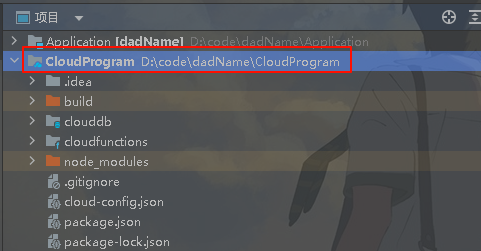

Its main directory structure is as follows:

1. **clouddb** Stores database-related files
2. **cloudfunctions** Stores cloud function-related files
3. **cloud-config.json** Stores cloud environment-related configuration

Our later development approach can be one of the following two methods:

1. Operate everything on the AGC platform, such as writing cloud function logic code, building databases, data tables
2. **Try to write cloud function logic code, debug code, build databases, and data set tables in the local DevEco Studio tool as much as possible**

Both of the above methods work. But for a better development experience, we recommend using method 2.

## Summary

This article introduces the basic concepts and environment setup of end-to-end cloud development in HarmonyOS Next. Through Cloud Foundation Kit, developers can more conveniently use cloud functions, cloud databases, cloud storage and other cloud services, thereby focusing on business logic development without paying too much attention to infrastructure construction and maintenance.

Main content includes:

- Application scenarios and main resources of end-to-end cloud development
- Process of creating meta-services on AGC platform
- Steps to create end-to-end cloud projects in DevEco Studio
- Basic introduction to cloud environment (cloud functions, cloud database, cloud storage)
- Directory structure of local development environment and development method recommendations

Through learning this article, readers can have an overall understanding of HarmonyOS Next's end-to-end cloud development, laying the foundation for subsequent in-depth learning. It is recommended that developers prioritize development in DevEco Studio, which can provide a better development experience.

---

If you are interested in learning more about HarmonyOS application development details and latest information, please leave a comment or private message or check my personal information to join technical exchange groups.
