# English Translation Required

This file is marked for translation from: 手把手带你实现鸿蒙应用-键盘音乐.md

Original Chinese file path: 鸿蒙开发技巧\手把手带你实现鸿蒙应用-键盘音乐\手把手带你实现鸿蒙应用-键盘音乐.md

Please translate the content from the original Chinese file to English.
The translation should maintain:

- Technical accuracy
- Code examples (translate comments but keep code structure)
- Image references
- Link references
- Formatting (headers, lists, etc.)

---

# Step-by-Step Guide to Building a HarmonyOS Application - Keyboard Music

## Preview the Result

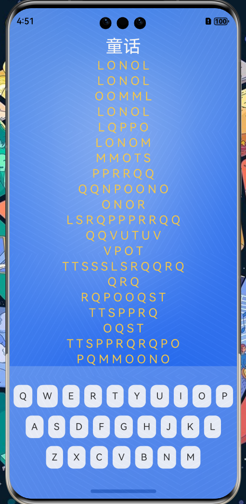

## Key Technologies

1. Basic layout techniques
2. AVPlayer
3. Object-oriented programming
4. Full use of V2 version state management technology

## Create a New Project

1. Create project

   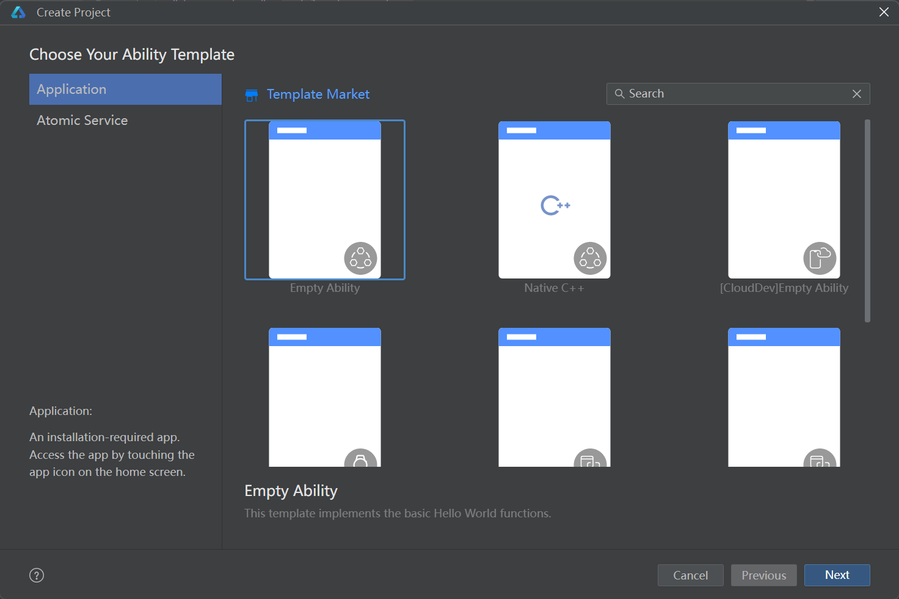

2. New project

   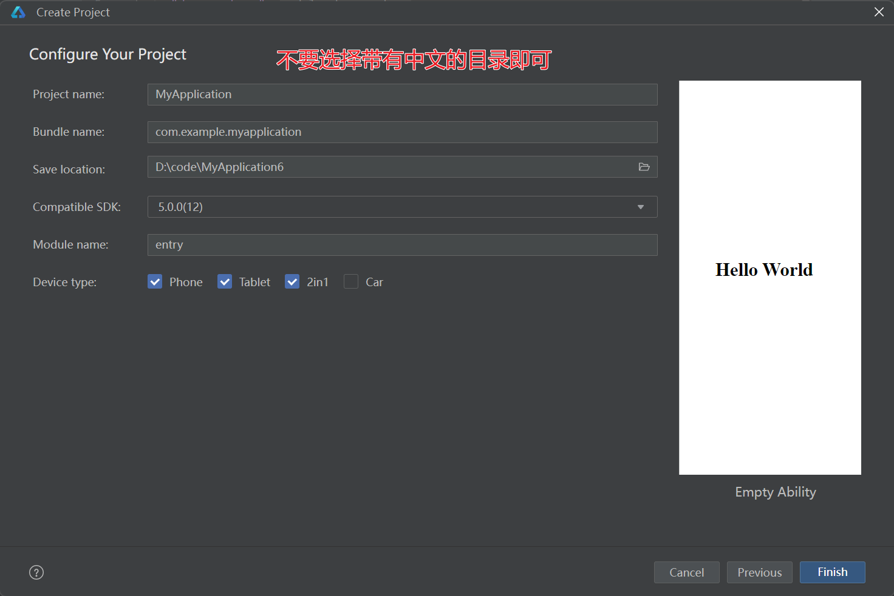

3. Directory structure - can be created later when needed

   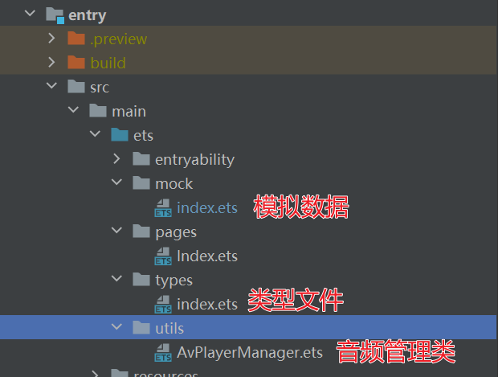

## Set Global Immersive Mode

The difference between setting and not setting global immersive mode is as follows:

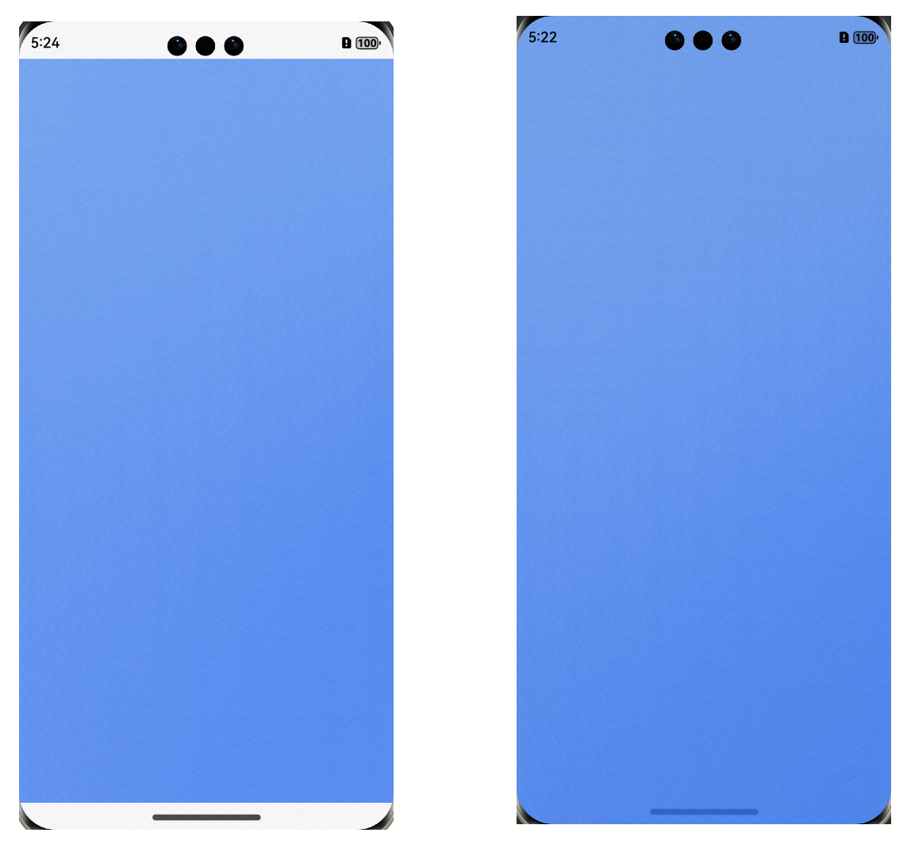

1. Edit in the `src/main/ets/entryability/EntryAbility.ets` file

2. Set in `loadContent`

   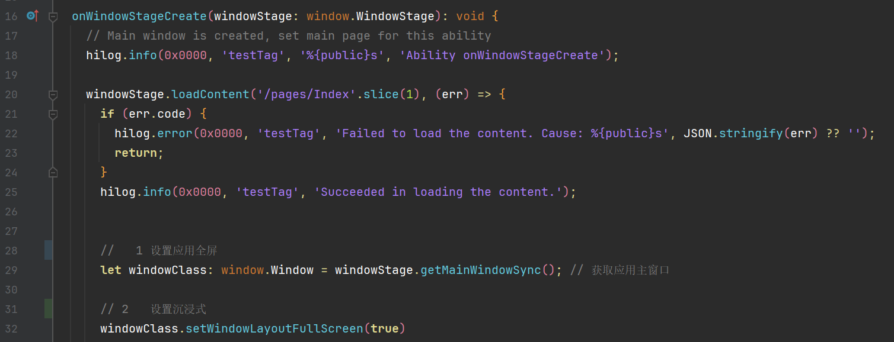

   ```typescript
   // 1 Set application fullscreen
   let windowClass: window.Window = windowStage.getMainWindowSync(); // Get main window

   // 2 Set immersive mode
   windowClass.setWindowLayoutFullScreen(true);
   ```

3. At this point, the effect is that text will also be displayed directly on the **status bar**

   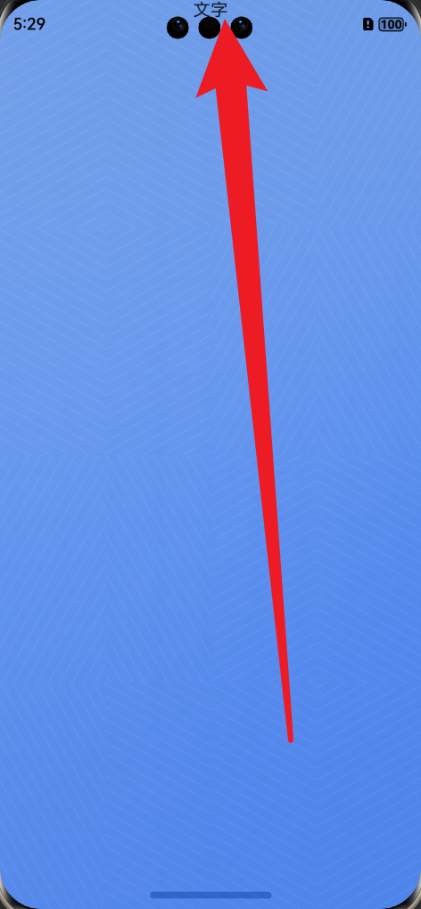

   4. At this point, considering that different devices may have different status bar heights, we need to:

      1. Dynamically get the status bar height and store it in global state `AppStorageV2`
      2. The page reads the status bar height from global state and sets it separately for the page

      ```typescript
      // 1 Get application window object
      const windowClass: window.Window = windowStage.getMainWindowSync(); // Get main window
      // 2 Set fullscreen
      windowClass.setWindowLayoutFullScreen(true);
      // 3 Get area to avoid layout occlusion
      const type = window.AvoidAreaType.TYPE_NAVIGATION_INDICATOR;

      const avoidArea = windowClass.getWindowAvoidArea(type);
      const bottomRectHeight = avoidArea.bottomRect.height; // Get navigation bar area height
      const vpHeight = px2vp(bottomRectHeight); // Convert to vp unit value
      // 4 Store navigation bar height data globally
      const appStatu = AppStorageV2.connect(
        AppStatu,
        "AppStatu",
        () => new AppStatu()
      );
      appStatu!.vpHeight = vpHeight;
      ```

   5. `AppStatu` is a custom class used to store status bar height data

      > src/main/ets/types/index.ets

      ```typescript
      @ObservedV2
      export class AppStatu {
        @Trace vpHeight: number = 0;
      }
      ```

## Build Background

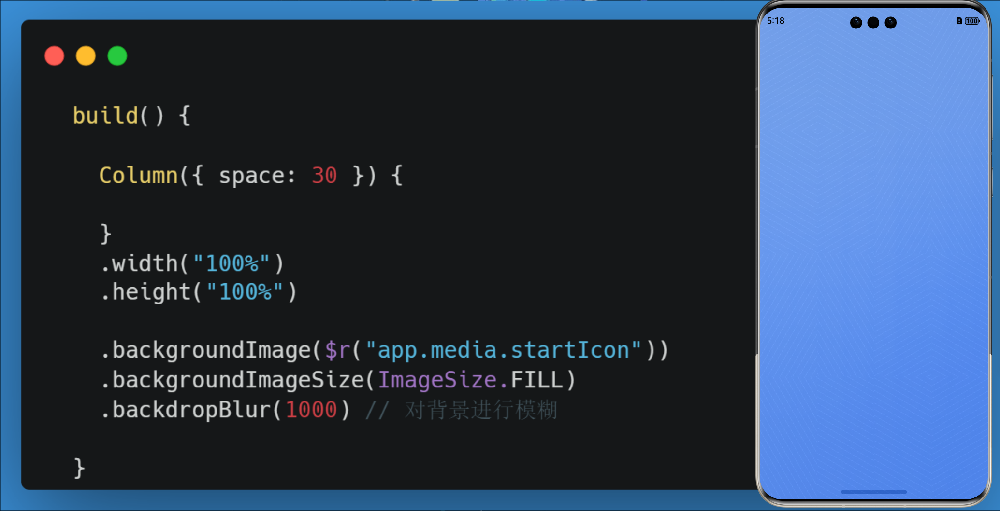

```typescript
  build() {

    Column({ space: 30 }) {

    }
    .width("100%")
    .height("100%")
    .backgroundImage($r("app.media.startIcon"))
    .backgroundImageSize(ImageSize.FILL)
    .backdropBlur(1000) // Blur the background

  }
```

## Build Music Score

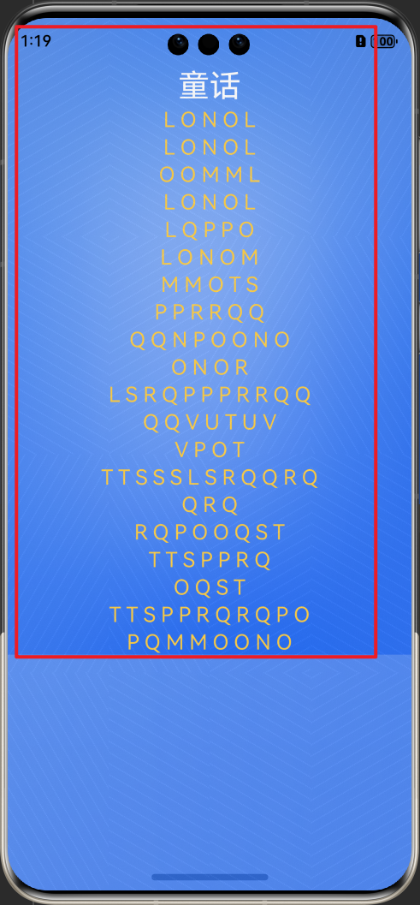

### Music Score Background Area

Use background image + blur to build the music score area, height is determined by content

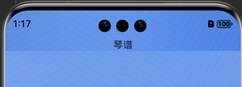

```typescript
  @Builder
  MusicScore() {
    // Music score
    Column({ space: 3 }) {
      Text("Music Score")
    }
    .width("100%")
    .backgroundImage($r("app.media.startIcon"))
    .backgroundImageSize(ImageSize.FILL)
    .backdropBlur(500) // Blur the background
    .padding({
      top: this.appStatu!.vpHeight + 20
    })
  }

  build() {

    Column({ space: 30 }) {
      // 1 Music score
      this.MusicScore()
    }
    .width("100%")
    .height("100%")

    .backgroundImage($r("app.media.startIcon"))
    .backgroundImageSize(ImageSize.FILL)
    .backdropBlur(1000) // Blur the background

  }
```

### Define Music Score Data Type

Music score only needs two fields:

1. Song title corresponding to the music score `title`
2. English letters corresponding to the music score `content`

> src/main/ets/types/index.ets

```typescript
@ObservedV2
export class Lyric {
  @Trace title: string = "";
  @Trace content: string[] = [];
}
```

### Define Correct and Incorrect States for Letters

1. As shown in the figure, green indicates correct
2. Yellow indicates untyped or incorrect

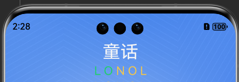

```typescript
@ObservedV2
export class LyricStatu {
  @Trace title: string = "";
  @Trace isCorrect: boolean = false;
}
```

### Process Data to be Rendered

To facilitate page effect processing, we need to simply process the data we have to make it convenient for page rendering

1. Available data

   > src/main/ets/mock/index.ets

   ```typescript
   import { Lyric } from "../types";

   export const tonghua: Lyric = {
     title: "Fairy Tale",
     content: [
       "LONOL",
       "LONOL",
       "OOMML",
       "LONOL",
       "LQPPO",
       "LONOM",
       "MMOTS",
       "PPRRQQ",
       "QQNPOONO",
       "ONOR",
       "LSRQPPPRRQQ",
       "QQVUTUV",
       "VPOT",
       "TTSSSLSRQQRQ",
       "QRQ",
       "RQPOOQST",
       "TTSPPRQ",
       "OQST",
       "TTSPPRQRQPO",
       "PQMMOONO",
     ],
   };
   ```

2. Processed data structure

   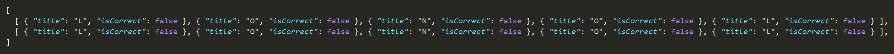

3. Why process it this way? To make it convenient for rendering

   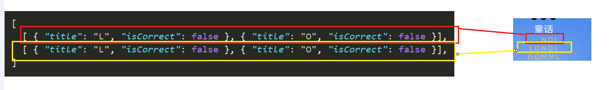

4. How to process? Process in `aboutToAppear` when the page opens `lyricList`

   ```typescript
   import { tonghua } from '../mock'
   import { LyricStatu } from '../types'
   @Entry
   @ComponentV2
   struct Index {
     // Music score list
    @Local lyricList: LyricStatu[][] = []
     aboutToAppear() {
       this.lyricList = tonghua.content.map(row => {
         const list = row.split('').map(v => {
           const o = new LyricStatu()
           o.title = v
           return o
         })
         return list
       })
     }
   }
   ```

### Render Music Score

```typescript
// Status bar height
@Local appStatu: AppStatu | undefined = AppStorageV2.connect(AppStatu, "AppStatu", () => new AppStatu())

@Builder
  MusicScore() {
    // Music score
    Column({ space: 3 }) {
      // Title
      Text(tonghua.title)
        .fontSize(30)
        .fontColor("#fff")
      ForEach(this.lyricList, (item1: LyricStatu[]) => {
        Row({ space: 5 }) {
          ForEach(item1, (item2: LyricStatu) => {
            Text(item2.title)
              .fontColor(item2.isCorrect ? "#23d96e" : "#ffcf49")
              .fontSize(20)
          })
        }
      })
    }
    .width("100%")
    .backgroundImage($r("app.media.startIcon"))
    .backgroundImageSize(ImageSize.FILL)
    .backdropBlur(500) // Blur the background
    .padding({ // Set text to move down, otherwise blocked by screen camera
      top: this.appStatu!.vpHeight + 20
    })
  }

  build() {

    Column({ space: 30 }) {
      // 1 Music score
      this.MusicScore()

      // this.KeyBoard()
    }
    .width("100%")
    .height("100%")

    .backgroundImage($r("app.media.startIcon"))
    .backgroundImageSize(ImageSize.FILL)
    .backdropBlur(1000) // Blur the background

  }
```

Result:

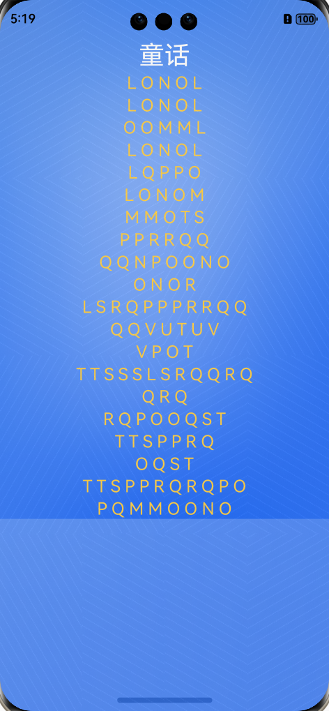

## Build Keyboard

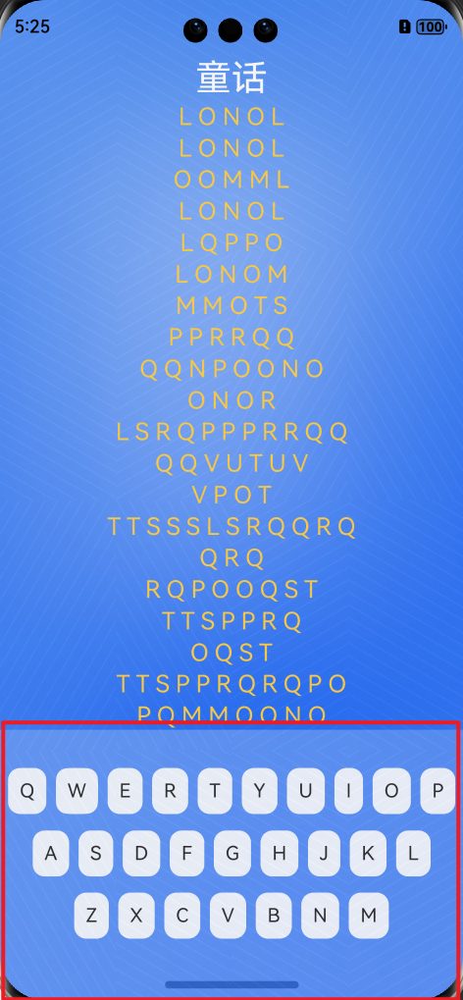

### Prepare Audio Resources

The keyboard has 26 letters, each corresponding to 26 sounds. They correspond one-to-one.

Among them, our static resources are stored in rawFile. HarmonyOS applications will not perform any compilation processing on the files inside when packaging, and then need to be used with AVPlayer when using. For example:

```typescript
 const res = await getContext().resourceManager.getRawFd("paino1.mp3")
AVPlayer instance.fdSrc = res
```

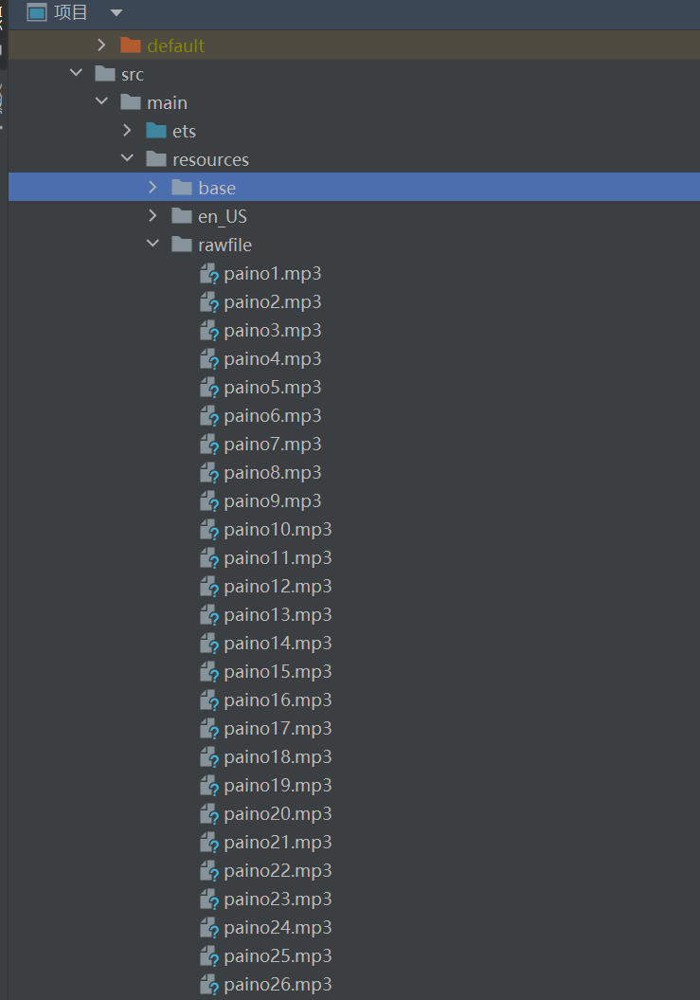

### Define Letter and Audio Mapping Data

> src/main/ets/mock/index.ets

```typescript
export const letters: LettemMusic[][] = [
  [
    { name: "Q", src: "paino17.mp3" },
    { name: "W", src: "paino23.mp3" },
    { name: "E", src: "paino5.mp3" },
    { name: "R", src: "paino18.mp3" },
    { name: "T", src: "paino20.mp3" },
    { name: "Y", src: "paino25.mp3" },
    { name: "U", src: "paino21.mp3" },
    { name: "I", src: "paino9.mp3" },
    { name: "O", src: "paino15.mp3" },
    { name: "P", src: "paino16.mp3" },
  ],
  [
    { name: "A", src: "paino1.mp3" },
    { name: "S", src: "paino19.mp3" },
    { name: "D", src: "paino4.mp3" },
    { name: "F", src: "paino6.mp3" },
    { name: "G", src: "paino7.mp3" },
    { name: "H", src: "paino8.mp3" },
    { name: "J", src: "paino10.mp3" },
    { name: "K", src: "paino11.mp3" },
    { name: "L", src: "paino12.mp3" },
  ],
  [
    { name: "Z", src: "paino26.mp3" },
    { name: "X", src: "paino24.mp3" },
    { name: "C", src: "paino3.mp3" },
    { name: "V", src: "paino22.mp3" },
    { name: "B", src: "paino2.mp3" },
    { name: "N", src: "paino14.mp3" },
    { name: "M", src: "paino13.mp3" },
  ],
];
```

### Link Page Data

```typescript
import { letters, tonghua } from '../mock'

...
// Keyboard and corresponding music keys
@Local letters: LettemMusic[][] = letters
```

### Build Keyboard Layout Structure

```typescript
  // Keyboard
  @Builder
  KeyBoard() {
    Column({ space: 10 }) {
      ForEach(this.letters, (items: LettemMusic[]) => {
        Row({ space: 8 }) {
          ForEach(items, (item: LettemMusic) => {
            Text(item.name)
              .backgroundColor("rgba(255,255,255,0.9)")
              .padding(10)
              .borderRadius(10)
              .fontWeight(400)
              .stateStyles({
                clicked: {
                  .backgroundColor("#fff")
                }
              })
          })
        }
        .width("100%")
        .padding(2)
        .justifyContent(FlexAlign.Center)
      })

    }
    .layoutWeight(1)
  }
```

### Use Keyboard Layout Structure

```typescript
  build() {

    Column({ space: 30 }) {
      // 1 Music score
      this.MusicScore()

      // 2 Keyboard
      this.KeyBoard()
    }
    .width("100%")
    .height("100%")
    .backgroundImage($r("app.media.startIcon"))
    .backgroundImageSize(ImageSize.FILL)
    .backdropBlur(1000) // Blur the background

  }
```

## Press Keyboard to Play Music Function

### Key Process

1. Encapsulate AVPlayer management class, each key corresponds to a separate sound. Since the previous sound has not finished playing, we can play the second and third sounds simultaneously, so multiple AVPlayer instances can be created to make them correspond one-to-one
2. Click keyboard to get the music path corresponding to the keyboard
3. Pass the music path to AVPlayer to make it play sound

### Understanding AVPlayer

> Using AVPlayer can achieve end-to-end playback of raw media resources. This development guide will use playing a complete piece of music as an example to explain AVPlayer audio playback related functions to developers.
>
> The complete playback process includes: creating AVPlayer, setting playback resources, setting playback parameters (volume/speed/focus mode), playback control (play/pause/seek/stop), reset, destroy resources.
>
> During application development, developers can actively get the current state through AVPlayer's state property or use the on('stateChange') method to listen for state changes. If the application performs operations when the audio player is in an error state, the system may throw exceptions or generate other undefined behaviors.

The usage process basically revolves around this diagram:

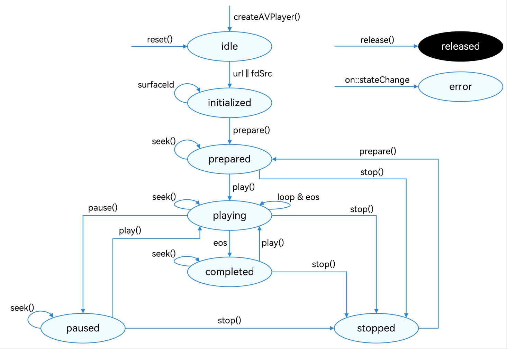

### AVPlayer Basic Usage Process

1. Create AVPlayer instance _At this time, avPlayer enters idle state_

   ```typescript
   const avPlayer = await media.createAVPlayer();
   ```

2. Listen for state changes. Every operation we perform on the player will affect its state

   ```typescript
   avPlayer.on("stateChange", (state) => {
     switch (state) {
       // If player initialization is complete, let it start
       case "initialized":
         avPlayer.prepare();
         break;
       case "prepared":
         // If player is ready, start playing
         avPlayer.play();
         break;
       default:
         break;
     }
   });
   ```

3. Set the URL of the music to play

   ```typescript
   const res = await getContext().resourceManager.getRawFd(this.url);
   avPlayer.fdSrc = res; // After setting the player, the player will enter initialized state
   ```

4. Start playing

   We have already set automatic playback in the `prepared` state: `avPlayer.play()`

### Core Logic Explanation

1. Let's think about the logic of playing piano. Can we press multiple keys simultaneously and play sounds at the same time? So we need to create multiple AVPlayer instances
2. If you repeatedly press two identical piano keys, **terminate the previous key's playback and immediately start the new key's playback**
3. Finally, when this key finishes playing, we need to destroy this instance to free memory

### AVPlayerManager

> src/main/ets/utils/AvPlayerManager.ets
>
> Implements basic encapsulation of AVPlayer functionality

```typescript
import { media } from "@kit.MediaKit";

class AVPlayerManager {
  // Player instance
  avPlayer: media.AVPlayer | null = null;
  url: string = "";
  // Callback event when playback is complete
  playComplete: () => void = () => {};

  // Constructor
  constructor(url: string) {
    this.init();
    this.url = url;
  }

  // Initialize
  async init() {
    this.avPlayer = await media.createAVPlayer();
    this.avPlayer.on("stateChange", (state) => {
      switch (state) {
        case "initialized":
          this.avPlayer?.prepare();
          break;
        case "prepared":
          this.avPlayer?.play();
          break;
        case "completed":
          // Playback complete, destroy instance
          this.avPlayer?.release();
          this.playComplete();
          break;
        default:
          break;
      }
    });
    this.avPlayer.on("error", (err) => {
      console.log("err", err);
    });
    // Set URL
    const res = await getContext().resourceManager.getRawFd(this.url);
    this.avPlayer!.fdSrc = res;
  }
}

export default AVPlayerManager;
```

### Flatten Music Score Data

> Convenient for judging whether the pressed keyboard is correct and playing the correct key music

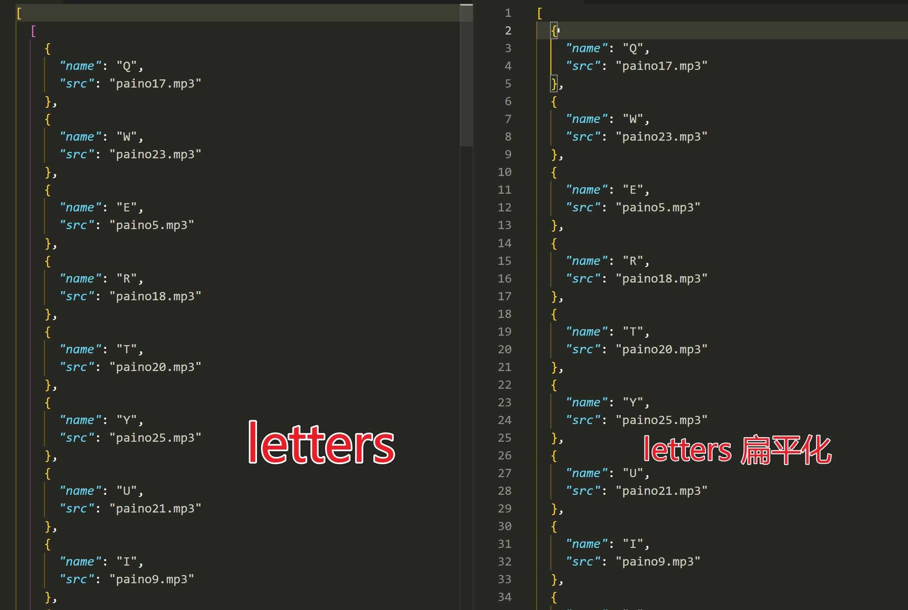

```typescript
// Used to judge whether the pressed key corresponds to the music score
letterFlat: LettemMusic[] = []

aboutToAppear() {
    this.letterFlat = this.letters.flat()
    // ...
  }
```

### Add Click Events to Keyboard

```typescript
 .onClick(() => this.playLetter(item))
```

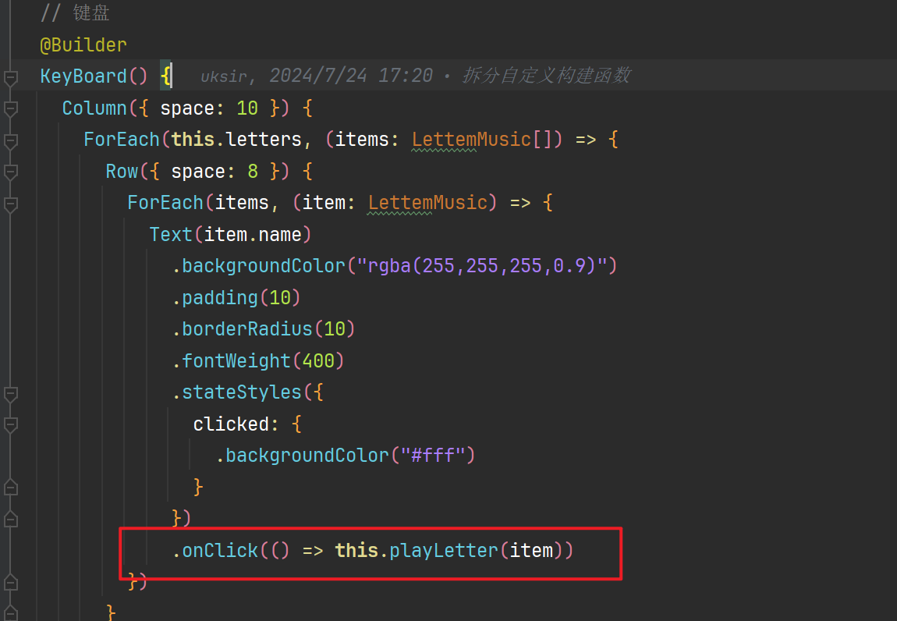

### Implement Click to Play Music

```typescript
  // Used to manage AVPlayer instances corresponding to currently playing sounds. If Q W are pressed, two AVPlayer instances will be created
  avPlayManagerList: AVPlayerManager[] = []

  // Click keyboard to play music
  playLetter(letter: LettemMusic) {
    // Find music score music object based on clicked keyboard, e.g., { name :"A" ,src :"paino1.mp1"}
    const item = this.letterFlat.find(v => v.name === letter.name)

    // Judge whether current music is playing based on played song path
    const avIndex = this.avPlayManagerList.findIndex(v => v.url === item!.src)

    if (avIndex !== -1) {
      // If playing, destroy immediately
      this.avPlayManagerList[avIndex].avPlayer?.release()
      // And remove from array
      this.avPlayManagerList.splice(avIndex, 1)
    }
    // Create corresponding AVPlayer instance based on currently clicked keyboard
    const avplayManager = new AVPlayerManager(letter.src)
    // Add to array
    this.avPlayManagerList.push(avplayManager)

    // Add a playback complete callback to delete AvPlay from avPlayManagerList array
    avplayManager.playComplete = () => {
      const index = this.avPlayManagerList.findIndex(v => v.url === item!.src)
      this.avPlayManagerList.splice(index, 1)
    }
  }
```

## Press Keyboard to Judge Whether Key is Correct

Similar to typing practice effect, when the correct key is pressed, set it to green, like:

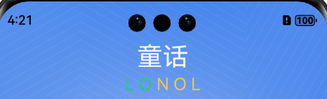

Since our music score is a two-dimensional array


Therefore, we also define an array [row coordinate, column coordinate], corresponding to the two-dimensional array

```typescript
  // User's music score coordinates
  nextRowColumn: number[] = [0, 0]
```

Then, also in the click event, judge whether the pressed key equals the corresponding music score. If yes, set it to green

```typescript
  // Click keyboard to play music
  playLetter(letter: LettemMusic) {

  // ....
    // Get row coordinate
    const row = this.nextRowColumn[0]
    // Get column coordinate
    const column = this.nextRowColumn[1]
    // Judge whether current coordinate exceeds range
    if (this.lyricList[row] && this.lyricList[row][column]) {
      // Get music score corresponding to coordinate
      const item = this.lyricList[row][column]
      // Judge whether pressed key equals corresponding music score, e.g., L == L
      if (item.title === letter.name) {
        // Set as selected
        item.isCorrect = true
        // Following code sets coordinate progression
```

[Automatic placeholder - Replace with actual translation]
