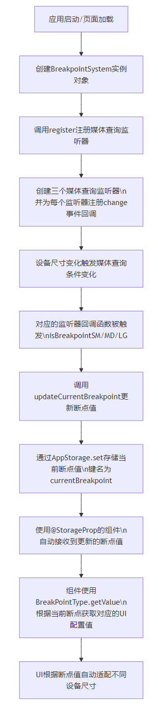

# English Translation Required

This file is marked for translation from: 01-万少带你精读鸿蒙 codelabs 一多界面适配和三层架构.md

Original Chinese file path: 万少带你精读鸿蒙 codelabs\01-万少带你精读鸿蒙 codelabs 一多界面适配和三层架构\01-万少带你精读鸿蒙 codelabs 一多界面适配和三层架构.md

Please translate the content from the original Chinese file to English.
The translation should maintain:

- Technical accuracy
- Code examples (translate comments but keep code structure)
- Image references
- Link references
- Formatting (headers, lists, etc.)

---

# 01 - Wanshao's In-Depth Analysis of HarmonyOS CodeLabs - Multi-Interface Adaptation and Three-Layer Architecture

## Preface

This article provides an in-depth analysis of the excellent one-for-many development sample project - MultiShopping from Huawei Developer Alliance CodeLabs. This project demonstrates best practices in HarmonyOS application development, particularly in responsive layout and enterprise-level one-for-many architecture implementation. Project link: [https://developer.huawei.com/consumer/cn/codelabsPortal/carddetails/tutorials_Next-MultiShopping](https://developer.huawei.com/consumer/cn/codelabsPortal/carddetails/tutorials_Next-MultiShopping)

## One Development, Multi-Device Deployment - Shopping Application Feature Demo


---


---


## I. Responsive Layout Solution: Breakpoint System

When developing cross-device applications, responsive layout is key to ensuring applications provide a good user experience across different device sizes. The MultiShopping project implements an elegant Breakpoint System to detect device screen sizes and automatically adjust UI layout.

### 1.1 Core Implementation of Breakpoint System

The core code of the breakpoint system is located in the `common/src/main/ets/utils/BreakpointSystem.ets` file, containing two key classes:

#### BreakpointSystem Class

This class is responsible for listening to device screen size changes and storing current breakpoint information in AppStorage:

```typescript
export class BreakpointSystem {
  private currentBreakpoint: string = "";
  private smListener?: mediaquery.MediaQueryListener;
  private mdListener?: mediaquery.MediaQueryListener;
  private lgListener?: mediaquery.MediaQueryListener;

  private updateCurrentBreakpoint(breakpoint: string) {
    if (this.currentBreakpoint !== breakpoint) {
      this.currentBreakpoint = breakpoint;
      AppStorage.set<string>(
        BreakpointConstants.CURRENT_BREAKPOINT,
        this.currentBreakpoint
      );
    }
  }

  public register() {
    this.smListener = mediaquery.matchMediaSync(BreakpointConstants.RANGE_SM);
    this.smListener.on("change", this.isBreakpointSM);
    this.mdListener = mediaquery.matchMediaSync(BreakpointConstants.RANGE_MD);
    this.mdListener.on("change", this.isBreakpointMD);
    this.lgListener = mediaquery.matchMediaSync(BreakpointConstants.RANGE_LG);
    this.lgListener.on("change", this.isBreakpointLG);
  }

  public unregister() {
    this.smListener?.off("change", this.isBreakpointSM);
    this.mdListener?.off("change", this.isBreakpointMD);
    this.lgListener?.off("change", this.isBreakpointLG);
  }
}
```

#### BreakPointType Class

This class provides a convenient way to return corresponding UI configuration values based on the current breakpoint type:

```typescript
export class BreakPointType<T> {
  options: BreakPointTypeOption<T>;

  constructor(option: BreakPointTypeOption<T>) {
    this.options = option;
  }

  getValue(currentBreakPoint: string): T {
    if (this.options.sm !== undefined && currentBreakPoint === "sm") {
      return this.options.sm as T;
    }
    if (this.options.md && currentBreakPoint === "md") {
      return this.options.md as T;
    } else {
      return this.options.lg as T;
    }
  }
}
```

### 1.2 Breakpoint Constants Definition

The constants used by the breakpoint system are defined in the `common/src/main/ets/constants/BreakpointConstants.ets` file:

```typescript
export class BreakpointConstants {
  /**
   * Represents small device breakpoint
   */
  static readonly BREAKPOINT_SM: string = "sm";

  /**
   * Represents medium device breakpoint
   */
  static readonly BREAKPOINT_MD: string = "md";

  /**
   * Represents large device breakpoint
   */
  static readonly BREAKPOINT_LG: string = "lg";

  /**
   * Current breakpoint for device type query
   */
  static readonly CURRENT_BREAKPOINT: string = "currentBreakpoint";

  /**
   * Small device width range
   */
  static readonly RANGE_SM: string = "(320vp<=width<520vp)";

  /**
   * Medium device width range
   */
  static readonly RANGE_MD: string = "(520vp<=width<840vp)";

  /**
   * Large device width range
   */
  static readonly RANGE_LG: string = "(840vp<=width)";
}
```

### 1.3 Working Principle of Breakpoint System

#### Key Method Analysis

1. **mediaquery.matchMediaSync**:

   - This is a media query API provided by HarmonyOS for creating a media query listener
   - The parameter is a media query condition string, e.g., `"(320vp<=width<520vp)"` represents screen width between 320vp and 520vp
   - Returns a `MediaQueryListener` object that can be used to listen for media query condition changes
   - Similar to `window.matchMedia()` in web development but optimized for HarmonyOS

2. **listener.on("change", callback)**:

   - Registers a callback function for the change event of the media query listener
   - When device screen size changes cause the media query condition result to change, the callback function is triggered
   - The callback function receives a `MediaQueryResult` object where the `matches` property indicates whether it currently matches the query condition
   - This event listening pattern enables the breakpoint system to respond to device size changes in real-time

3. **AppStorage.set**:
   - Stores current breakpoint information in the application's global state storage
   - Uses `"currentBreakpoint"` as the key to ensure application-wide accessibility
   - When breakpoints change, all components using `@StorageProp('currentBreakpoint')` will automatically update

#### Breakpoint System Workflow Diagram



### 1.4 Breakpoint System Usage Flow

1. **Initialization and Registration**:
   Initialize and register the breakpoint system when the application starts (usually in the `aboutToAppear` lifecycle function of the entry page):

   ```typescript
   // SplashPage.ets
   @Entry
   @Component
   struct SplashPage {
     @StorageProp('currentBreakpoint') currentBreakpoint: string = 'sm';
     private breakpointSystem = new BreakpointSystem();

     aboutToAppear() {
       this.breakpointSystem.register();
       // ...other code
     }

     aboutToDisappear() {
       this.breakpointSystem.unregister();
       // ...other code
     }
   }
   ```

2. **Using Breakpoint Information in Components**:
   Components can access current breakpoint information through the `@StorageProp` decorator:

   ```typescript
   @Component
   struct MyComponent {
     @StorageProp('currentBreakpoint') currentBreakpoint: string = 'md';

     // ...component code
   }
   ```

3. **Adjusting UI Based on Breakpoints**:
   Use the `BreakPointType` class to return corresponding UI configurations based on current breakpoints:

   ```typescript
   Image($r("app.media.ic_eshop")).width(
     new BreakPointType({
       sm: $r("app.float.splash_image_size"),
       md: $r("app.float.splash_image_size"),
       lg: $r("app.float.splash_image_size_lg"),
     }).getValue(this.currentBreakpoint)
   );
   ```

### 1.5 Advantages of Breakpoint System

1. **Decoupling and Reusability**: Breakpoint logic is decoupled from UI components and can be reused throughout the application
2. **Easy Maintenance**: Centralized management of breakpoint definitions, convenient for unified modifications
3. **Type Safety**: Type safety ensured through generic support
4. **Simple Usage**: Provides concise APIs, reducing developer usage costs
5. **Real-time Response**: Based on event listening mechanism, can respond to device size changes in real-time
6. **Global State Sharing**: Uses AppStorage mechanism to ensure breakpoint information consistency application-wide

## II. Enterprise-Level One-for-Many Architecture

The MultiShopping project adopts a three-layer architecture pattern common in HarmonyOS application development, implementing enterprise-level one-for-many development capabilities.

### 2.1 Architecture Layers

The project architecture is divided into three layers:

1. **Common Capabilities Layer (common)**:

   - Provides basic components, utility classes, and constants shared across the entire application
   - Contains core capabilities for cross-device adaptation such as breakpoint system
   - Located in the `common/` directory

2. **Basic Features Layer (features)**:

   - Implements various functional modules of the application
   - Each functional module is relatively independent and can be developed and tested separately
   - Located in the `features/` directory, including subdirectories like `home/`, `personal/`, etc.

3. **Product Customization Layer (product)**:
   - Specific product implementations for different device types (such as phones, tablets, etc.)
   - Integrates common capabilities layer and basic features layer to build complete products
   - Located in the `product/` directory, currently including the `phone/` subdirectory

### 2.2 Directory Structure Analysis

```
MultiShopping/
├── common/                 # Common capabilities layer
│   ├── src/main/ets/
│   │   ├── components/     # Common UI components
│   │   ├── constants/      # Common constants definition
│   │   ├── utils/          # Common utility classes
│   │   └── viewmodel/      # Common data models
│   └── ...
├── features/               # Basic features layer
│   ├── home/               # Home page functional module
│   ├── personal/           # Personal center functional module
│   ├── shopcart/           # Shopping cart functional module
│   ├── commoditydetail/    # Product details functional module
│   └── ...
└── product/                # Product customization layer
    └── phone/              # Phone product
        ├── src/main/ets/
        │   ├── pages/      # Page definitions
        │   ├── entryability/ # Application entry
        │   └── ...
        └── ...
```

### 2.3 Inter-layer Dependency Relationships

- **Dependency Direction**: Product layer → Features layer → Common layer
- **Dependency Management**: Manages inter-module dependencies through `oh-package.json5` files

### 2.4 Advantages of Enterprise-Level One-for-Many Architecture

1. **Code Reuse**: The common capabilities layer provides cross-device shared basic capabilities, reducing redundant development
2. **Separation of Concerns**: Clear responsibilities for each layer, facilitating team collaborative development
3. **Flexible Adaptation**: The product layer can be customized for different device characteristics to provide optimal user experience
4. **Maintainability**: Modular design makes code easier to maintain and extend
5. **Parallel Development**: Different teams can develop different layers or modules in parallel

## Summary

The MultiShopping project implements elegant responsive layout through the breakpoint system and enterprise-level one-for-many development capabilities through three-layer architecture. These designs not only improve development efficiency but also ensure consistency and good experience across different devices.

For HarmonyOS application developers, these design patterns and practical experiences have high reference value and can help developers build high-quality cross-device applications. By learning and referencing the implementation of the MultiShopping project, developers can better master best practices in HarmonyOS application development.
