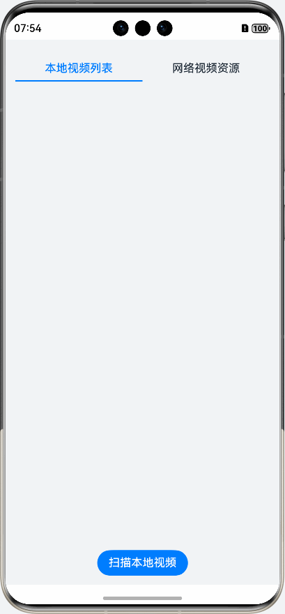
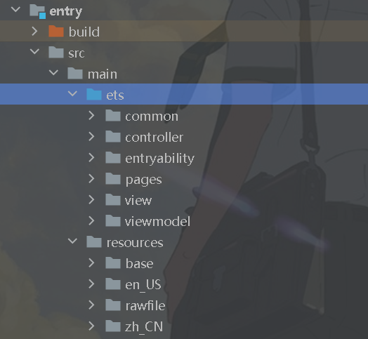
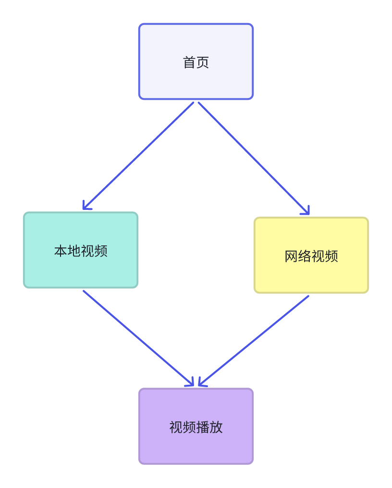
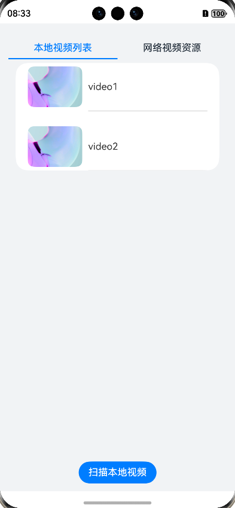
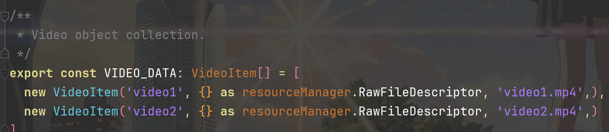
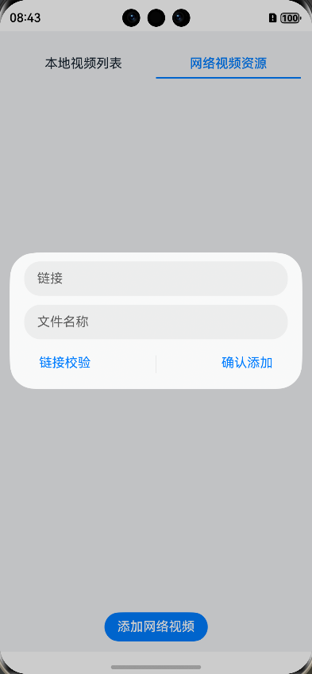
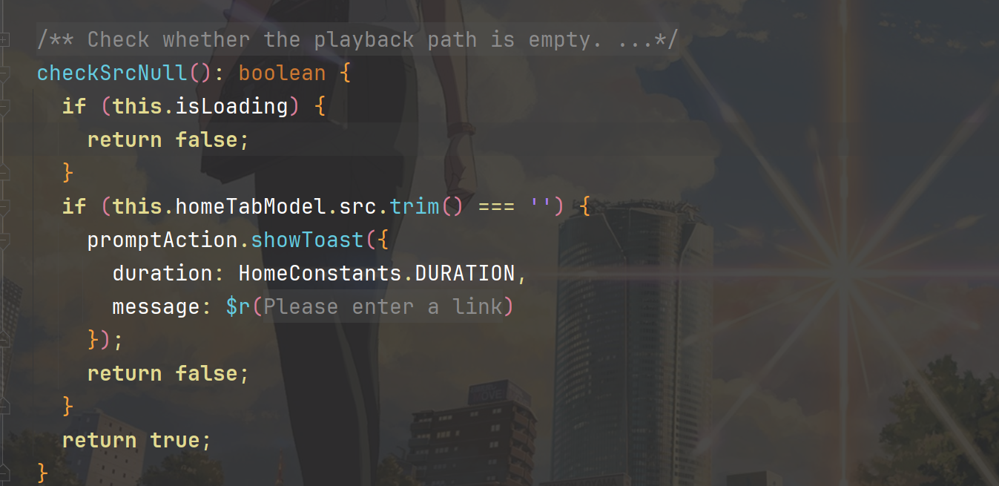
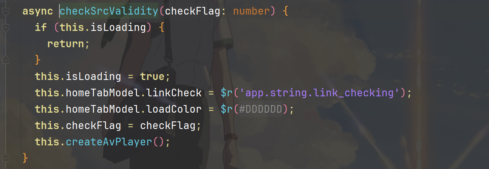
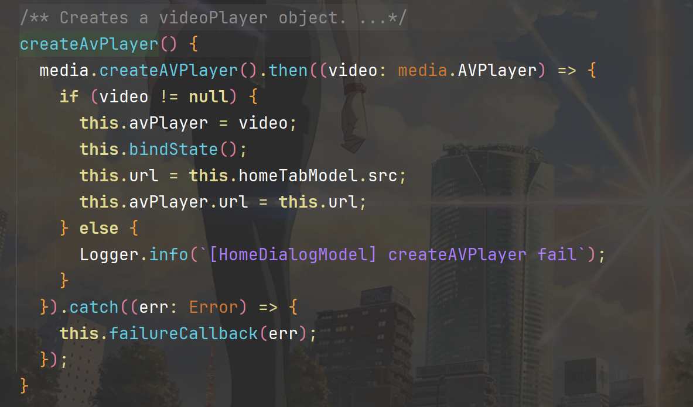
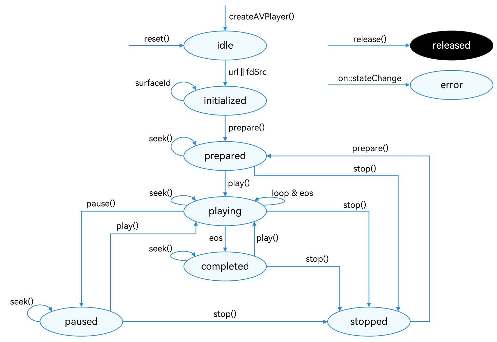

# English Translation Required

This file is marked for translation from: 02-万少带你精读鸿蒙 codelabs 一 AVPlayer 视频播放器.md

Original Chinese file path: 万少带你精读鸿蒙 codelabs\02-万少带你精读鸿蒙 codelabs 一 AVPlayer 视频播放器\02-万少带你精读鸿蒙 codelabs 一 AVPlayer 视频播放器.md

Please translate the content from the original Chinese file to English.
The translation should maintain:

- Technical accuracy
- Code examples (translate comments but keep code structure)
- Image references
- Link references
- Formatting (headers, lists, etc.)

---

# 02-Xiaowan Takes You Through HarmonyOS CodeLabs - AVPlayer Video Player

## Preface

This article will provide an in-depth analysis of the high-quality **AVPlayer-based Video Player implementation - VideoPlayer** from Huawei Developer Alliance CodeLabs. This project implements a video player using ArkTS language, mainly including video acquisition and video playback functions:

1. **Acquiring local videos and network videos.**
2. **Video playback through AVPlayer.**
3. **Adjusting screen brightness and video playback volume through gestures.**

Project Address: https://developer.huawei.com/consumer/cn/codelabsPortal/carddetails/tutorials_NEXT-VideoPlayer

## Functional Demo



## Project Directory



```
ets
│
├─common
│  ├─constants
│  │  ├─CommonConstants.ets - Define global common constants such as status codes, event names, etc.
│  │  ├─HomeConstants.ets - Home page related constant definitions
│  │  └─PlayConstants.ets - Play page related constant definitions
│  │
│  ├─model
│  │  ├─HomeTabModel.ets - Home page tab data model
│  │  └─PlayerModel.ets - Player data model, storing playback status, progress, volume and other information
│  │
│  └─util
│     ├─DateFormatUtil.ets - Date formatting utility for converting video time display
│     ├─GlobalContext.ets - Global context manager for cross-component data sharing
│     ├─Logger.ets - Logging utility class for unified log output
│     └─ScreenUtil.ets - Screen related utility class for getting screen parameters
│
├─controller
│  └─VideoController.ets - Video controller core class responsible for video playback state management, gesture control and other core business logic
│
├─entryability
│  └─EntryAbility.ts - Application entry ability class responsible for application initialization and lifecycle management
│
├─pages
│  ├─HomePage.ets - Home page displaying video list
│  └─PlayPage.ets - Play page integrating various player components
│
├─view
│  ├─HomeTabContent.ets - Home page tab content component
│  ├─HomeTabContentButton.ets - Home page tab content button component
│  ├─HomeTabContentDialog.ets - Home page dialog component
│  ├─HomeTabContentList.ets - Home page video list component
│  ├─HomeTabContentListItem.ets - Home page video list item component
│  ├─PlayControl.ets - Play control component including play/pause, previous/next buttons
│  ├─PlayPlayer.ets - Player core rendering component integrating XComponent
│  ├─PlayProgress.ets - Play progress bar component
│  ├─PlayTitle.ets - Play page top title component
│  └─PlayTitleDialog.ets - Play page title dialog component
│
└─viewmodel
   ├─HomeDialogModel.ets - Home page dialog data model
   ├─HomeVideoListModel.ets - Home page video list data model
   ├─VideoItem.ets - Video item data model
   └─VideoSpeed.ets - Video playback speed data model
```

## Business Flow



## Home Page

The main work on the home page is to acquire videos - both local videos and network videos.



The home page is divided into **Local Videos** and **Network Videos** sub-pages through the [Tabs](https://developer.huawei.com/consumer/cn/doc/search?val=Tabs&type=all) component.

### Local Videos

Local videos are mainly loaded by scanning video files in the raw directory with temporarily hardcoded files. In actual development, this can be adjusted to read album videos or access cache directories.



The **VideoItem** type is defined as:

```typescript
@Observed
export class VideoItem {
  name: string;
  src: resourceManager.RawFileDescriptor;
  iSrc: string;
  pixelMap?: image.PixelMap;

  constructor(
    name: string,
    src: resourceManager.RawFileDescriptor,
    iSrc: string,
    pixelMap?: image.PixelMap
  ) {
    this.name = name;
    this.src = src;
    this.iSrc = iSrc;
    this.pixelMap = pixelMap;
  }
}
```

After acquiring the data, it's stored globally and can also be returned through functions:

```typescript
// HomeVideoListModel.ets
async getLocalVideo() {
    this.videoLocalList = [];
    await this.assemblingVideoItem();
    GlobalContext.getContext().setObject('videoLocalList', this.videoLocalList);
    return this.videoLocalList;
  }
```

### Network Videos


Network video acquisition is mainly done through [CustomDialogController](https://developer.huawei.com/consumer/cn/doc/search?val=CustomDialogController&type=all) showing a popup layer.



The link validation here actually consists of two steps:

1. Validate if the link is empty `checkSrcNull`
2. Validate if the link can actually be played `checkSrcValidity`, _directly by creating an AVPlayer instance and judging based on the instance's status_

**Validating if the link is empty `checkSrcNull`**


---



---

**Validating if the link can actually be played `checkSrcValidity`, _directly by creating an AVPlayer instance and judging based on the instance's status_**



---



After validation passes, clicking add begins initializing AVPlayer to prepare for playing network videos.

## Video Playback

Video playback is mainly implemented through [AVPlayer](https://developer.huawei.com/consumer/cn/doc/harmonyos-guides/video-playback), which is generally encapsulated based on it. Let's first look at the usage introduction.

### Playback Steps

1. Call createAVPlayer() to create an AVPlayer instance, initialize and enter idle state.

2. Set business-required listening events for use with full-process scenarios. Supported listening events include:

   | Event Type        | Description                                                                                                                                                                                                                                                                                                                                                           |
   | :---------------- | :-------------------------------------------------------------------------------------------------------------------------------------------------------------------------------------------------------------------------------------------------------------------------------------------------------------------------------------------------------------------- |
   | stateChange       | Required event, listens to player's state property changes.                                                                                                                                                                                                                                                                                                           |
   | error             | Required event, listens to player's error information.                                                                                                                                                                                                                                                                                                                |
   | durationUpdate    | For progress bar, listens to progress bar length, refreshes resource duration.                                                                                                                                                                                                                                                                                        |
   | timeUpdate        | For progress bar, listens to progress bar current position, refreshes current time.                                                                                                                                                                                                                                                                                   |
   | seekDone          | Response to API calls, listens to seek() request completion. When using seek() to jump to specified playback position, if seek operation succeeds, this event will be reported.                                                                                                                                                                                       |
   | speedDone         | Response to API calls, listens to setSpeed() request completion. When using setSpeed() to set playback speed, if setSpeed operation succeeds, this event will be reported.                                                                                                                                                                                            |
   | volumeChange      | Response to API calls, listens to setVolume() request completion. When using setVolume() to adjust playback volume, if setVolume operation succeeds, this event will be reported.                                                                                                                                                                                     |
   | bitrateDone       | Response to API calls, for HLS protocol streams, listens to setBitrate() request completion. When using setBitrate() to specify playback bitrate, if setBitrate operation succeeds, this event will be reported.                                                                                                                                                      |
   | availableBitrates | For HLS protocol streams, listens to available bitrates of HLS resources, used for setBitrate().                                                                                                                                                                                                                                                                      |
   | bufferingUpdate   | For network playback, listens to network playback buffering information.                                                                                                                                                                                                                                                                                              |
   | startRenderFrame  | For video playback, listens to video playback first frame rendering time. When AVPlayer first starts playing and enters playing state, when the first frame of video is rendered to the display, this event will be reported. Applications can typically use this event reporting to remove video covers, achieving smooth connection between cover and video frames. |
   | videoSizeChange   | For video playback, listens to video playback width and height information, can be used to adjust window size and ratio.                                                                                                                                                                                                                                              |
   | audioInterrupt    | Listens to audio focus switching information, used with property audioInterruptMode. If there are multiple media playing on the current device and audio focus is switched (i.e., playing other media like calls), this event will be reported, allowing applications to handle it timely.                                                                            |

3. Set resources: Set property url, AVPlayer enters initialized state.

   Note: The url in the code example below is for illustration only. Developers need to confirm resource validity and set according to actual situations:

   - For local resource playback, must confirm resource file availability and use application sandbox path to access corresponding resources. Refer to [Getting Application File Paths](https://developer.huawei.com/consumer/cn/doc/harmonyos-guides/application-context-stage#获取应用文件路径). For application sandbox introduction and how to push files to application sandbox, refer to [File Management](https://developer.huawei.com/consumer/cn/doc/harmonyos-guides/app-sandbox-directory).
   - For network playback paths, need to [declare permission](https://developer.huawei.com/consumer/cn/doc/harmonyos-guides/declare-permissions): ohos.permission.INTERNET.
   - For using ResourceManager.getRawFd to open HAP resource file descriptors, usage can refer to [ResourceManager API Reference](https://developer.huawei.com/consumer/cn/doc/harmonyos-references/js-apis-resource-manager#getrawfd9).
   - Need to use [supported playback formats and protocols](https://developer.huawei.com/consumer/cn/doc/harmonyos-guides/media-kit-intro#支持的格式与协议).

4. Set window: Get and set property SurfaceID for setting display screen.

   Applications need to get surfaceID from XComponent component. For getting methods, refer to [XComponent](https://developer.huawei.com/consumer/cn/doc/harmonyos-references/ts-basic-components-xcomponent).

5. Prepare playback: Call prepare(), AVPlayer enters prepared state. At this time, duration can be obtained and scaling mode, volume, etc. can be set.

6. Video playback control: Play play(), pause pause(), seek seek(), stop stop(), etc.

7. (Optional) Change resources: Call reset() to reset resources, AVPlayer re-enters idle state, allowing resource url change.

8. Exit playback: Call release() to destroy instance, AVPlayer enters released state, exit playback.

### AVPlayer Playback State Diagram

> This state diagram is very important. AVPlayer's playback process and program encapsulation need to reference it.



### Official Example Code

```typescript
import { media } from "@kit.MediaKit";
import { fileIo as fs } from "@kit.CoreFileKit";
import { common } from "@kit.AbilityKit";
import { BusinessError } from "@kit.BasicServicesKit";

export class AVPlayerDemo {
  private count: number = 0;
  private surfaceID: string = ""; // surfaceID for playback screen display, specific value needs to be obtained through Xcomponent interface, related documentation link see Xcomponent creation method above.
  private isSeek: boolean = true; // Used to distinguish whether mode supports seek operation.
  private fileSize: number = -1;
  private fd: number = 0;

  constructor(surfaceID: string) {
    this.surfaceID = surfaceID;
  }

  // Register avplayer callback functions.
  setAVPlayerCallback(avPlayer: media.AVPlayer) {
    // startRenderFrame first frame rendering callback function.
    avPlayer.on("startRenderFrame", () => {
      console.info(`AVPlayer start render frame`);
    });
    // seek operation result callback function.
    avPlayer.on("seekDone", (seekDoneTime: number) => {
      console.info(`AVPlayer seek succeeded, seek time is ${seekDoneTime}`);
    });
    // error callback listening function, when avPlayer encounters error during operation, call reset interface to trigger reset process.
    avPlayer.on("error", (err: BusinessError) => {
      console.error(
        `Invoke avPlayer failed, code is ${err.code}, message is ${err.message}`
      );
      avPlayer.reset(); // Call reset to reset resources, trigger idle state.
    });
    // State machine change callback function.
    avPlayer.on(
      "stateChange",
      async (state: string, reason: media.StateChangeReason) => {
        switch (state) {
          case "idle": // Triggered after successfully calling reset interface.
            console.info("AVPlayer state idle called.");
            avPlayer.release(); // Call release interface to destroy instance object.
            break;
          case "initialized": // Triggered after avplayer sets playback source.
            console.info("AVPlayer state initialized called.");
            avPlayer.surfaceId = this.surfaceID; // Set display screen, no need to set when playing pure audio resources.
            avPlayer.prepare();
            break;
          case "prepared": // Reported after successful prepare call.
            console.info("AVPlayer state prepared called.");
            avPlayer.play(); // Call play interface to start playback.
            break;
          case "playing": // Triggered after successful play call.
            console.info("AVPlayer state playing called.");
            if (this.count !== 0) {
              if (this.isSeek) {
                console.info("AVPlayer start to seek.");
                avPlayer.seek(avPlayer.duration); //seek to video end.
              } else {
                // Continue playing to end when playback mode doesn't support seek operation.
                console.info("AVPlayer wait to play end.");
              }
            } else {
              avPlayer.pause(); // Call pause interface to pause playback.
            }
            this.count++;
            break;
          case "paused": // Triggered after successful pause call.
            console.info("AVPlayer state paused called.");
            avPlayer.play(); // Call play interface again to start playback.
            break;
          case "completed": // Triggered after playback ends.
            console.info("AVPlayer state completed called.");
            avPlayer.stop(); //Call playback end interface.
            break;
          case "stopped": // Triggered after successful stop interface call.
            console.info("AVPlayer state stopped called.");
            avPlayer.reset(); // Call reset interface to initialize avplayer state.
            break;
          case "released":
            console.info("AVPlayer state released called.");
            break;
          default:
            console.info("AVPlayer state unknown called.");
            break;
        }
      }
    );
  }

  // The following demo is an example of using fs file system to open sandbox address to get media file address and play through url property.
  async avPlayerUrlDemo() {
    // Create avPlayer instance object.
    let avPlayer: media.AVPlayer = await media.createAVPlayer();
    // Create state machine change callback function.
    this.setAVPlayerCallback(avPlayer);
    let fdPath = "fd://";
    let context = getContext(this) as common.UIAbilityContext;
    // Get sandbox address filesDir through UIAbilityContext, using Stage model as example.
    let pathDir = context.filesDir;
    let path = pathDir + "/H264_AAC.mp4";
    // Open corresponding resource file address to get fd, and assign value to url to trigger initialized state machine reporting.
    let file = await fs.open(path);
    fdPath = fdPath + "" + file.fd;
    this.isSeek = true; // Support seek operation.
    avPlayer.url = fdPath;
  }

  // The following demo is an example of using resource management interface to get media resource files packaged in HAP and play through fdSrc property.
  async avPlayerFdSrcDemo() {
    // Create avPlayer instance object.
    let avPlayer: media.AVPlayer = await media.createAVPlayer();
    // Create state machine change callback function.
    this.setAVPlayerCallback(avPlayer);
    // Get media resource playback address through getRawFd interface of UIAbilityContext's resourceManager member.
    // Return type is {fd,offset,length}, fd is HAP package fd address, offset is media resource offset, length is playback length.
    let context = getContext(this) as common.UIAbilityContext;
    let fileDescriptor = await context.resourceManager.getRawFd("H264_AAC.mp4");
    let avFileDescriptor: media.AVFileDescriptor = {
      fd: fileDescriptor.fd,
      offset: fileDescriptor.offset,
      length: fileDescriptor.length,
    };
    this.isSeek = true; // Support seek operation.
    // Assign value to fdSrc to trigger initialized state machine reporting.
    avPlayer.fdSrc = avFileDescriptor;
  }

  // The following demo is an example of using fs file system to open sandbox address to get media file address and play through dataSrc property (seek mode).
  async avPlayerDataSrcSeekDemo() {
    // Create avPlayer instance object.
    let avPlayer: media.AVPlayer = await media.createAVPlayer();
    // Create state machine change callback function.
    this.setAVPlayerCallback(avPlayer);
    // dataSrc playback mode's playback source address, when playback is in Seek mode, fileSize is the specific size of the playback file, fileSize will be assigned below.
    let src: media.AVDataSrcDescriptor = {
      fileSize: -1,
      callback: (buf: ArrayBuffer, length: number, pos: number | undefined) => {
        let num = 0;
        if (buf == undefined || length == undefined || pos == undefined) {
          return -1;
        }
        num = fs.readSync(this.fd, buf, { offset: pos, length: length });
        if (num > 0 && this.fileSize >= pos) {
          return num;
        }
        return -1;
      },
    };
    let context = getContext(this) as common.UIAbilityContext;
    // Get sandbox address filesDir through UIAbilityContext, using Stage model as example.
    let pathDir = context.filesDir;
    let path = pathDir + "/H264_AAC.mp4";
    await fs.open(path).then((file: fs.File) => {
      this.fd = file.fd;
    });
    // Get playback file size.
    this.fileSize = fs.statSync(path).size;
    src.fileSize = this.fileSize;
    this.isSeek = true; // Support seek operation.
    avPlayer.dataSrc = src;
  }

  // The following demo is an example of using fs file system to open sandbox address to get media file address and play through dataSrc property (No seek mode).
  async avPlayerDataSrcNoSeekDemo() {
    // Create avPlayer instance object.
    let avPlayer: media.AVPlayer = await media.createAVPlayer();
    // Create state machine change callback function.
    this.setAVPlayerCallback(avPlayer);
    let context = getContext(this) as common.UIAbilityContext;
    let src: media.AVDataSrcDescriptor = {
      fileSize: -1,
      callback: (buf: ArrayBuffer, length: number) => {
        let num = 0;
        if (buf == undefined || length == undefined) {
          return -1;
        }
        num = fs.readSync(this.fd, buf);
        if (num > 0) {
          return num;
        }
        return -1;
      },
    };
    // Get sandbox address filesDir through UIAbilityContext, using Stage model as example.
    let pathDir = context.filesDir;
    let path = pathDir + "/H264_AAC.mp4";
    await fs.open(path).then((file: fs.File) => {
      this.fd = file.fd;
    });
    this.isSeek = false; // Not support seek operation.
    avPlayer.dataSrc = src;
  }
}
```
